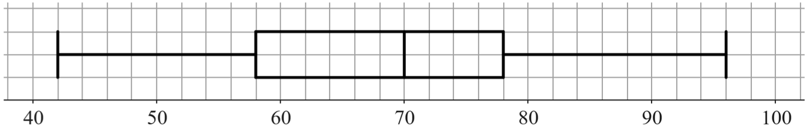
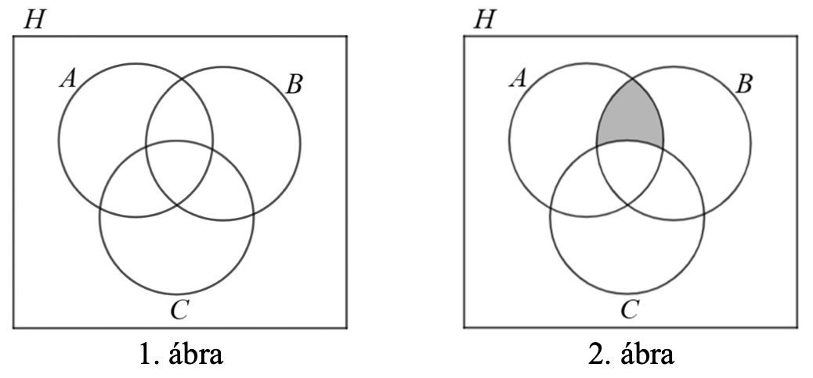
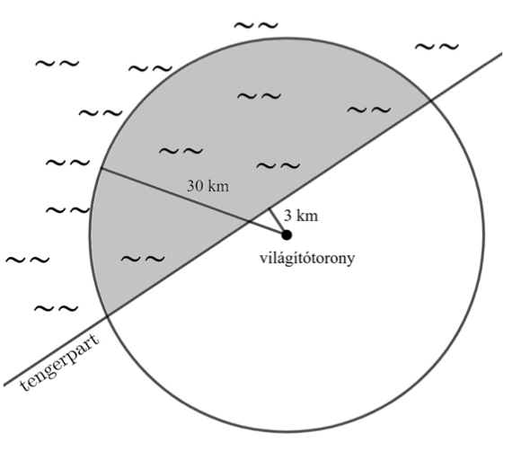

---

[Vissza](../matematika.md)

---

[érettségi feladatok 2026 tavasz](https://dload-oktatas.educatio.hu/erettsegi/feladatok_2026tavasz_kozep/k_mat_26maj_fl.pdf)

## 1.feladat
Adott az $A = {2; 4}$ halmaz.  
Adjon meg egy olyan $B$ halmazt, amelyre teljesül, hogy $A \cup B = {1; 2; 3; 4; 5}$.

$B = 1;2;3;4;5;6.$

## 3. feladat
Egy derékszögű háromszög átfogója $50 cm$, az egyik befogója $14 cm$ hosszú. Határozza meg a másik befogó hosszát!

$a = 14cm$  
$b = ?$  
$c = 50cm$

$a^{2} + b^{2} = c^{2}$

$$
\begin{aligned}
14^{2} + b^{2} = 50^{2} \\
196 + b^{2} = 2500 && / - 196 \\
b^{2} = 2304 && / \sqrt{} \\
b = 48
\end{aligned}
$$

## 4.feladat
Hány átlója van egy konvex $11$-szögnek?

$\text{átlók száma} = \frac{n \cdot (n - 3)}{2}$

$\frac{11 \cdot (11 - 3)}{2} = \frac{88}{2} = 44$

## 6.feladat
Egy végzős osztály diákjainak matematikaérettségi eredményeiről készült az alábbi dobozdiagram. A diagram alapján adja meg a diákok eredményeinek maximumát, mediánját, alsó kvartilisét és terjedelmét!

- maximum: 96
- medián: 70
- alsó kvatrilis: 58
- terjedelem: 54

## 7.feladat
Határozza meg az alábbi egyenletben az $n$ értékét!

$\frac{(2^{2})^{4}}{8} = 2^{n}$

$$
\begin{aligned}
\frac{(4)^{4}}{8} = 2^{n} \\
\frac{256}{8} = 2^{n} \\
32 = 2^{n}
\end{aligned}
$$

$$
\begin{aligned}
2^{1} = 1 \\
2^{2} = 4 \\
2^{3} = 8 \\
2^{4} = 16 \\
2^{5} = 32
\end{aligned}
$$

$2^{5} = 2^{n} = 5 $

## 10. feladat
Adja meg azt a két egész számot, amelyeknek a különbsége $6$, az abszolútértékük pedig egyenlő!

$-3;3$

## 11.feladat
Hány háromjegyű, különböző számjegyekből álló páratlan természetes szám alkotható az  
$1, 2, 3, 4$ számjegyekből? Válaszát indokolja!

3,2,2

## 13. (a,b) feladat
- `a`: Oldja meg az alábbi egyenletet a valós számok halmazán!
    - $(x+3)^{2} + 2(x+3) = 80$

$(a + b)^{2} = a^{2} + 2ab + b^{2} = (x + 3)^{2} = x^{2} + 6x + 3^{2} = x^{2} + 6x + 9$  

$2(x + 3) = 2x + 6$  

$$
\begin{aligned}
x^{2}+6x+9+2x+6 = 80 && / + \\
x^{2} + 8x + 15 = 80 / -80 \\
x^{2} + 8x -65 = 0 \\
\\
a = 1 \\
b = 8 \\
c = (-65) \\
\\
x_{1,2} = \frac{-b \pm \sqrt{b^{2} - 4ac}}{2a} \\
\frac{(-8) \pm \sqrt{8^{2} - 4 \cdot 1 \cdot (-65)}}{2 \cdot 1} \\
\frac{(-8) \pm \sqrt{324}}{2} \\
\\
x_{1} = \frac{-8 + \sqrt{324}}{2} = \frac{10}{2} = 5 \\
x_{2} = \frac{-8 - \sqrt{324}}{2} = \frac{-26}{2} = -13
\end{aligned}
$$

- `b`: Két pozitív szám összege $15$. Ha a kisebb szám háromszorosához hozzáadjuk a nagyobb szám kétszeresét, akkor ugyanazt az értéket kapjuk, mintha a nagyobb szám háromszorosából kivonjuk a kisebb szám kétszeresét.
    - Határozza meg ezt a két számot!

$$
\begin{aligned}
x = \text{kisebb szám} \\
y = \text{nagyobb szám} \\
x + y = 15 \\
\\
3x + 2y = 3y - 2x && / +2x \\
5x + 2y = 3y && / -2y \\
5x = y \\
\\
y = 5x \\
x + 5x = 15 \\
6x = 15 && / :6 \\
x = 2.5 \\
\\
y = 5 \cdot 2.5 = 12.5 \\
\\
\text{tehát a két keresett szám: } x = 2.5 \text{ és } y = 12.5
\end{aligned}
$$

## 14. (a,b,d) feladat
Legyen a $H$ alaphalmaz az $50$-nél kisebb pozitív egész számok halmaza.  
Legyenek $A$, $B$ és $C$ a $H$ alábbi részhalmazai:
- $A = {2\text{-vel osztható számok}}$,
- $B = {3\text{-mal osztható számok}}$,
- $C = {5\text{-tel osztható számok}}$.

- `a`: Jelölje az 1. ábrán satírozással a $C / (A \cup B)$ halmazt, és sorolja fel az elemeit!
    - csak a $C$ halmazt kell besatírozni az $A$ és $B$ halmaz kivételével
- `b`: Írja fel halmazműveletek segítségével a 2. ábrán satírozással jelölt halmazt!
    - $(A \cap B) / C$
- `d`: Van-e olyan háromjegyű pozitív egész szám, amelyik csupa azonos számjegyből áll, és 2-vel, 3-mal és 5-tel is osztható? Ha van ilyen szám, akkor adjon meg egyet, ha nincs ilyen, akkor pedig bizonyítsa be, hogy nincs!
    - Nem, nincs.

## 15. (összes, kivéve a 'd') feladat
Adott az $f: R \rightarrow R, f(x) = (x-1)^{2} - 4$ függvény.
- `a`: Határozza meg az alábbi állítások logikai értékét (igaz vagy hamis)! Válaszait itt nem kell indokolnia.
    - I. Az $f$ függvény minimumhelye az 1.
        - IGAZ
    - II. Az $f$ függvény szigorúan monoton nő.
        - HAMIS
    - III. Az $f$ függvény egy kölcsönösen egyértelmű megfeleltetés.
        - HAMIS
- `b`: Határozza meg az $f$ zérushelyeit!
    - $(x-1)^{2}-4 = 0$
    - $(x-1)^{2} = 4$
- `c`: Válassza ki az alábbi lehetőségek közül az $f$ értékkészletét!
    - $A)[1;\infty[$,
    - $B)[4;\infty[$,
    - $C)[-4;\infty[$,     Ez a helyes válasz
    - $D)R$

## 16. (a,b,c,d) feladat
Nagyobb hazai tavainkon a viharjelzési időszak április 1-én 0 órától október 31-én 24 óráig tart. A 2025-ös viharjelzési időszakban a statisztikák szerint a Balaton középső medencéjére 147 alkalommal adtak ki elsőfokú viharjelzést, amelyek összesen 1319 órán át voltak érvényben, míg 115 alkalommal adtak ki másodfokú viharjelzést, amelyek öszszesen 668 órán át voltak érvényben.
- `a`: A 2025-ös viharjelzési időszak teljes időtartamának hány százalékában volt érvényben valamilyen (első- vagy másodfokú) viharjelzés a Balaton középső medencéjében? (Az április, a június és a szeptember 30, a másik négy érintett hónap 31 napos.)
- `b`: Határozza meg, hogy átlagosan mennyi ideig volt érvényben egy másodfokú viharjelzés ebben az időszakban! Válaszát órában és percben (óra:perc alakban), egész percre kerekítve adja meg!

Egy világítótorony árnyéka 19 méter hosszú, amikor a Nap sugarai $70^{\circ}$-os szögben érik a Földet.
- `c`: Milyen magas a világítótorony?

Az Ír-tengerhez közeli Bidston Lighthouse nevű vilá-
gítótorony a tengerparttól 3 km-re található a száraz-
föld belseje felé (a valaha működő világítótornyok kö-
zül ez található a legmesszebb a tengertől). A világí-
tótorony fénye jó látási viszonyok között kb. 30 km-ig
látható.

- `d`: Határozza meg annak a területnek a nagyságát a
tengeren, ahonnan – jó látási viszonyok között –
egy, a tengerparttól 3 km-re található világítótorony fénye látható! (A Föld görbületétől tekintsünk el. A tengerpartot – jó közelítéssel – tekinthetjük egyenesnek. Lásd az ábrát.)

## 17 (a,b,d) feladat
A 2000-es években Magyarországon csökkent a nagypályás, felnőtt korosztályú férfi futballcsapatok száma. A falusi futball megerősítéséért indult 2022-ben egy civil kezdeményezés.  
A táblázat a nagypályás országos bajnokságokban szereplő felnőtt korosztályú férfi futballcsapatok számát mutatja 2000 és 2025 között (év végi adatok).

| Év | Csapatok száma |
| :-: | :-: |
| 2000 | 2272 |
| 2005 | 2135 |
| 2010 | 2009 |
| 2015 | 1960 |
| 2020 | 1774 |
| 2025 | 1554 |

- `a`: A kezdeményezők egy diagramon szeretnék szemléltetni a csapatok számának időbeli változását, hogy felhívják a figyelmet a jelenségre. Az alábbi diagramtípusok közül melyik a legalkalmasabb erre a célra?
    - A) kördiagram,
    - B) oszlopdiagram, Ez a Helyes megoldás
    - C) dobozdiagram
- `b`: A 2000-es adathoz viszonyítva hány százalékkal csökkent a csapatok száma 2025-re?
    - $2272 - 1554 = 718$
    - $\frac{718}{2272} \cdot 100 = \frac{359}{1136} \cdot 100 = 0.316 \cdot 100 = 31.6\%$

Ha a civil kezdeményezés erőfeszítései eredményt hoznak, akkor a jövőben a futballcsapatok száma újra növekedésnek indulhat.

- `d`: Hány négyzetméter területű háló szükséges egy szabványos futballkapuhoz, ha a kaput egy olyan téglatestnek tekintjük, amelynek harmadik éle 1,5 méter hosszú?
    - $a: \text{szélesség} = 7.32m$
    - $b: \text{magasság} = 2.44m$
    - $c: \text{mélysége} = 1.5m$
        - Hátulra kell: $7.32 \cdot 2.44 = 17.86m^{2}$
        - Tetejére kell : $7.32 \cdot 1.5 = 10.98m^{2}$
        - Két oldalra kell: $2 \cdot (1.5 \cdot 2.44) = 7.32m^{2}$
        - Összesen: $17.86 + 10.98 + 7.32 = 36.16m^{2}$ háló kell.

Egy labdarúgó-mérkőzésen egy csapatban 11 kezdőjátékos van, és mérkőzés közben legfeljebb 5 játékost lehet közülük lecserélni. (A lecserélt játékosok száma tehát 0, 1, 2, 3, 4 vagy 5 lehet.)

## 18. (a,b) feladat
Egy légitársaságnál a (téglatest alakú) szabványos kézipoggyász méretei:  
$55cm \cdot 40cm \cdot 23cm$.
- `a`: Hány literesnek tekinti ezt a kézipoggyászt a légitársaság, ha tíz literre kerekítve adják meg az értéket?
    - Térfogat: $55 \cdot 40 \cdot 23 = 50600cm^{3}$
    - $1 \text{ liter} = 1dm^{3} = 1000cm^{3}: 50.6 \text{ liter}$
- `b`: Igazolja, hogy egy 75 cm hosszú esernyő még átlósan sem fér el egy ilyen szabványos kézipoggyászban!
    - $d = \sqrt{a^2 + b^{2} + c^{2}}$
    - $d = \sqrt{55^{2} + 40^{2} + 23^{2}} = \sqrt{3025 + 1600 + 529} = \sqrt{5154} = 71.79cm$
    - Az esernyő nem fér bele a bőröndbe, mert $3.21cm$-el nagyobb helyet foglal.

---

[Vissza](../matematika.md)

---
