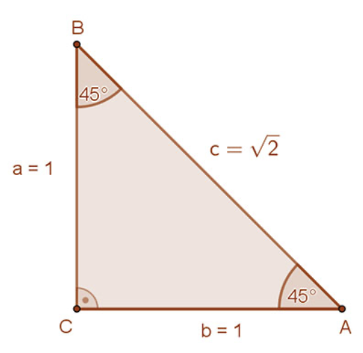
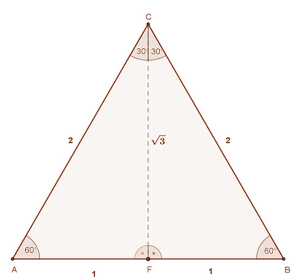

---

[Vissza](../matematika.md)

---

# Nevezetes szögfüggvények
Nevezetes szögeknek szoktuk mondani a \\30^{\circ}$-os, a $45^{\circ}$-os és a $60^{\circ}\\-os szögeket.  
Ezen szögek szögfüggvényeinek pontos értékét az alábbiakban lehet meghatározni.

1. A $45^{\circ}$-os szög szögfüggvényeinek meghatározásához tekintsük az ábrán az egységnyi befogójú derékszögű háromszöget. Ennek hegyesszögei $45^{\circ}$-osak. Átfogóját Pitagorász tétele segítségével kapjuk: $BA = c = \sqrt{2}$.  

A szögfüggvényeinek  definíciója szerint:  
 $tg45^{\circ} = ctg^{\circ} = 1 \text{ és } sin45^{\circ} = cos45^{\circ} = \frac{1}{\sqrt{2}}$.

Ez utóbbi esetben a számlálót és a nevezőt $\sqrt{2}$​-vel szorova kapjuk:  
$sin45^{\circ} = cos45^{\circ} = \frac{\sqrt{2}}{2}$

2. A $30^{\circ}$-os és $60^{\circ}$-os szögek szögfüggvényeinek meghatározásához egy 2 egység oldalú szabályos háromszögre van szükségünk. Húzzuk meg ennek egyik szögfelezőjét. (A mellékelt ábrán CF szakasz). Ez egyben oldalfelező merőleges is. A mellékelt ábra jelöléseit használva a CF felezőmerőleges szakasz  hossza Pitagorász tételének felhasználásával: $CF=​\sqrt{3}$ .  

A szögfüggvények definíciója szerint:

$sin30^{\circ} = \frac{1}{2}$, $cos30^{\circ} = \frac{\sqrt{3}}{2}$, $tg30^{\circ} = \frac{\sqrt{3}}{2}$ és $ctg30^{\circ} = \sqrt{3}$  
$sin60^{\circ} = \frac{\sqrt{3}}{2}$, $cos60^{\circ} = \frac{1}{2}$, $tg60^{\circ} = \sqrt{3}$ és $ctg60^{\circ} = \frac{\sqrt{3}}{3}$

3. Összefoglaló táblázat:

|  | $30^{\circ}$ | $45^{\circ}$ | $60^{\circ}$ |
| :---: | :---: | :---: | :---: |
| sin |  $\frac{1}{2}$  |  $\frac{\sqrt{2}}{2}$  |  $\frac{\sqrt{3}}{2}$  |
| cos |  $\frac{\sqrt{3}}{2}$  |  $\frac{\sqrt{2}}{2}$  |  $\frac{1}{2}$  |
| tg |  $\frac{\sqrt{3}}{3}$  |  $1$  |  $\sqrt{3}$  |
| ctg |  $\sqrt{3}$  |  $1$  |  $\frac{\sqrt{3}}{3}$  |

## Vektorok

---

[Vissza](../matematika.md)

---
