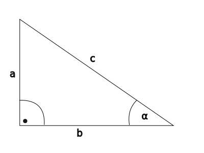

---

[Vissza](../matematika.md)

---

# TRIGONOMETRIA

|  |  |  |  |
| :-- | :-- | :-- | :-- |
| $\alpha$ | $30^{\circ}$ | $45^{\circ}$ | $60^{\circ}$ |
| $sin\alpha$ | $\frac{1}{2}$ | $\sqrt{\frac{2}{2}}$ | $\sqrt{\frac{3}{2}}$ |
| $cos\alpha$ |$\sqrt{\frac{3}{2}}$ | $\sqrt{\frac{2}{2}}$ | $\frac{1}{2}$ |
| $tg\alpha$ |$\frac{1}{\sqrt{3}}$ | $1$ | $\sqrt{3}$ |
| $ctg\alpha$ |$\sqrt{3}$ | $1$ | $\frac{1}{\sqrt{3}}$ |

## Háromszög részei:
- `a` az **$\alpha$**-val szemközti befogó.
- `b` az **$\alpha$**-val szomszédos befogó
- `c` az átfogó

## Definíciók
### Szinusz
- A `szinusz` egy derékszögű háromszögben a szöggel szemközti befogó és az átfogó aránya. (hegycsúcsok magasságának a kiszámításához a mai napig használják).
    - $sin(\alpha)$ Megadja: szemközti befogó / átfogó $= \frac{a}{c}$ 
### Koszinusz
- A `koszinusz` a derékszögű háromszögben a szög melletti befogó és az átfogó aránya.
    - $cos(\alpha)$ megadja: szomszédos befogó / átfogó $= \frac{b}{c}$
### Tangens
- A `tangens` a befogókról szól: a szöggel szemközti és a szög melletti befogók arányát írja le.
    - $tan(\alpha)$ megadja: szemközti befogó / szomszédos befogó $=\frac{a}{b}$
### Kotangens
- A `kotangens` a tangens reciproka, vagyis a két befogó arányát fordítva adja meg.
    - $cot(\alpha)$ megadja: szomszédos befogó / szemközti befogó $=\frac{b}{a}$
## Mikor melyiket használjuk?
### Ha egy szög és az átfogó ismert $\implies$ szinusz vagy koszinusz
- `Szinusz`: ha a `szemközti befogó`t keresed:
    - $a = c \cdot sin(\alpha)$
- `Koszinusz`: ha a `szomszédos befogó`t keresed:
    - $b = c \cdot cos(\alpha)$
#### Tipikus feladatok:
- magasság számítása (pl. hegy, torony, antenna)
- létra dőlésszöge és hossza
- ferde sík feladatok
### Ha egy szög és egy befogó ismert $\implies$ tangens vagy kotangens
- `Tangens`: ha a `szemközti befogó`t akarod a szomszédosból
    - $a = b \cdot tan(\alpha)$
- `Kotangens`: ha a `szomszédos befogó`t akarod a szemköztiből
    - $b = a \cdot cot(\alpha)$
#### Tipikus feladatok:
- távolság–magasság összefüggések
- lejtők, rámpák, tetők dőlésszöge
- kamerák, reflektorok látószöge
### Ha két befogó ismert $\implies$ tangens vagy kotangens adja a szöget
- `Tangens`:
    - $\alpha = \arctan(\frac{a}{b})$
- `Kotangens`:
    - $\alpha = arccot \left (\frac{b}{a}\right)$
#### Tipikus feladatok:
- dőlésszög meghatározása
- emelkedők, lejtők meredeksége
- kamerák, antennák beállítása
### Ha egy befogó és az átfogó ismert $\implies$ szinusz vagy koszinusz adja a szöget
- `Szinusz`:
    - $\alpha = \arcsin(\frac{a}{c})$
- `Koszinusz`:
    - $\alpha = \arccos(\frac{b}{c})$
#### Tipikus feladatok:
- háromszög szögeinek meghatározása
- fizikai feladatok (erők felbontása)
- optikai szögek, beesési szögek
## Összefoglaló
- Szinusz $\implies$ szemközti / átfogó
- Koszinusz $\implies$ szomszédos / átfogó
- Tangens $\implies$ szemközti / szomszédos
- Kotangens $\implies$ szomszédos / szemközti

Ha átfogó van $\implies$ sin/cos  
Ha befogó van $\implies$ tan/cot  
Ha szöget keresel $\implies$ arcsin/arccos/arctan/arccot

- [Összes trigonometriai alak](./osszes-trigonometriai-alak.md)
- [Négy trigonometriai alap tétel](./negy-trigonometriai-alap-tetel.md)

## Feladatok / megoldások
1. feladat  
Egy derékszögű háromszög egyik befogója $a = 12\text{ cm}$, a hozzá tartozó szög pedig $\alpha = 35^\circ$.  
Számítsd ki a másik befogót.
- $a = 12 \text{cm}$
- $\alpha = 35^\circ$
- $b = ?$
    - $b = a \cdot cot(\alpha) = 12 \cdot cot(35) = 17.13777608\text{cm}$
2. feladat  
Egy létra $4\text{m}$ hosszú, és $70^\circ$-os szöget zár be a talajjal.  
Milyen magasra ér fel a falon?
- $c = 4\text{m}$
- $\alpha = 70^\circ$
- $a = ?$
    - $a = c \cdot sin(\alpha) = 4 \cdot sin(70) = 3.758770483\text{m}$
3. feladat  
Egy domb tetejéről egy autó $8^\circ$-os depressziószög alatt látszik. A domb magassága $30\text{m}$.  
Milyen messze van az autó a domb lábától?
- $\alpha = 8^\circ$
- $a = 30\text{m}$
- $b = ?$
    - $b = a \cdot cot(\alpha) = 30 \cdot cot(8) = 213.4610917\text{m}$
4. feladat  
Egy torony tetejéről egy templom tornya $12^\circ$-os emelkedési szög alatt látszik. A két torony közti vízszintes távolság $150\text{m}$.
Milyen magas a templom tornya, ha a megfigyelő torony $40\text{m}$ magas?
- $\alpha = 12^\circ$
- $b = 150\text{m}$
- $a = ?$
- $Saját_{magasság} = 40\text{m}$
    - $a = b \cdot tan(\alpha) = 150 \cdot tan(12) = 31.88348425m$
    - $Saját_{magasság} + a = 40 + 31.88348425 = 71.88348425m$

5. feladat  
Egy hajó $25^\circ$-os emelkedési szög alatt lát egy szikla tetejét. A hajó $180\text{m}$-re van a szikla lábától.  
Milyen magas a szikla?
- $\alpha = 25^\circ$
- $b = 180\text{m}$
- $a = ?$
    - $a = b \cdot tan(\alpha) = 180 \cdot tan(25) = 83.93537847\text{m}$

---

6. feladat  
Egy háromszög két oldala:
$a = 18\text{ cm}$, $b = 25\text{ cm}$, és a közbezárt szög $\gamma = 47^\circ$.  
Számítsd ki a harmadik oldalt (koszinusztétel).
- $a = 18\text{ cm}$
- $b = 25\text{ cm}$
- $\gamma = 47^\circ$
- $c = ?$
    - $c^{2} = a^{2} + b^{2} - 2ab \cdot cos(\alpha) = 18^{2} + 25^{2} - 2 \cdot 18 \cdot 25 \cdot cos{47} = \sqrt{335.2014759} = 18.30850829\text{cm}$

7. feladat  
Egy háromszögben:
$a = 12\text{ cm}$, $b = 15\text{ cm}$, $c = 17\text{ cm}$.  
Számítsd ki a legnagyobb szöget (koszinusztétel + trigonometria).
- $a = 12\text{ cm}$
- $b = 15\text{ cm}$
- $c = 17\text{ cm}$
    - $cos(\gamma) = \frac{a^{2} + b^{2} - c^{2}}{2ab} = \frac{12^{2} + 15^{2} - 17^{2}}{2 \cdot 12 \cdot 15} = \frac{144 + 225 - 289}{2 \cdot 12 \cdot 15} = \frac{80}{360} = \frac{2}{9} = 0.2222$
    - $\gamma = arccos(0.2222) \approx 77.16^\circ$

8. feladat  
Egy rádiótorony $60\text{m}$ magas. A torony tetejéről egy drótkötél a talaj egy pontjához csatlakozik úgy, hogy a kötél $40^\circ$-os szöget zár be a talajjal.  
Milyen hosszú a drótkötél?
- $a = 60\text{m}$
- $\alpha = 40^\circ$
- $c = ?$
    - $sin(\alpha) = \frac{a}{c} \implies c = \frac{a}{sin(\alpha)} = \frac{60}{sin(40)} = 93.34342961\text{m}$

9. Feladat  
Egy repülőgép $5^\circ$-os emelkedési szöggel emelkedik. Mekkora magasságot ér el $2\text{km}$ vízszintes megtétele után?
- $\alpha = 5^{\circ}$
- $b = 2\text{km}$
- $a = ?$
    - $a = b \cdot tan(\alpha) = 2 \cdot 5 = 0.1749773271{km}$
    - $a \approx 175\text{m}$

10. feladat  
Egy hegycsúcsot két különböző pontból figyelünk.  
Az első pontból a csúcs emelkedési szöge $18^\circ$, a második pontból (ami $300\text{m}$-el közelebb van a hegyhez) $25^\circ$.  
Milyen magas a hegy?

Mivel két pont van, ezért két háromszögről beszélünk:
- első hely távolabb van: kisebb szög $18^{\circ}$
- második hely közelebb van: nagyobb szög $25^{\circ}$

Jelölések bevezetése:
- $h = \text{hegy magassága}$
- $x_{1} = \text{első megfigyelési pont vízszintes távolsága}$
- $x_{2} = \text{második megfigyelési pont vízszintes távolsága}$
- mivel a második pont közelebb van: $x_{2} = x_{1} - 300m$

Két derékszögű háromszög trigonometriai egyenletei:
- Mindkét háromszögben a hegy magassága a szemközti befogó, a vízszintes távolság a szomszédos befogó.
    - Első pont: $tan(18^\circ) = \frac{h}{x_{1}}$
    - Második pont: $tan(25^\circ) = \frac{h}{x_{2}}$

Magasság kifejezése:
- Első pont: $h = x_{1} \cdot tan(18^\circ)$
- Második pont: $h = x_{2} \cdot tan(25^\circ)$
    - Mindkét pont ugyanazt a magasságot írja le, tehát a két $h$ egyenlő, ezért:
        - $x_{1} \cdot tan(18^\circ) = x_{2} \cdot tan(25^\circ)$

Behelyettesítés:
- $x_{1} \cdot tan(18^\circ) = (x_{1} - 300) tan(25^\circ)$

Zárójel kibontás:
- $x_{1} \cdot tan(18^\circ) = x_{1} \cdot tan(25^\circ) - 300 \cdot tan(25^\circ)$

Átrendezés, hogy az 'x'-es tagok egy oldalt legynek:
- $x_1 \tan(18^\circ) - x_1 \tan(25^\circ) = -300 \tan(25^\circ)$
- Kivonjuk: $x_1(\tan(18^\circ) - \tan(25^\circ)) = -300 \tan(25^\circ)$
- mindkét oldalt $-1$-el szorzunk: $x_1(\tan(25^\circ) - \tan(18^\circ)) = 300 \tan(25^\circ)$

Kifejezzük $x_{1}-et$, majd számolunk:
- $x_1 = \frac{300 \tan(25^\circ)}{\tan(25^\circ) - \tan(18^\circ)}$
    - $\tan(25^\circ) \approx 0.46631$
    - $\tan(18^\circ) \approx 0.32492$
- $x_1 = \frac{300 \cdot 0.46631}{0.46631 - 0.32492}$
- $x_1 = \frac{139.8922974}{0.1413879619} \approx 989.421557$

Végül a hegy magasságának kiszámítása:
- $h = x_1 \tan(18^\circ)$
- $h = 989.421557 \cdot 0.32492 \approx 321.4825517\text{m}$

---

[Vissza](../matematika.md)

---