---

[Vissza](./ev-vegi-vizsga.md)

---

- A francia gazdaság a XVIII. században egyre gyorsuló ütemben fejlődött. A népesség 22 millióról 26-28 millióra növekedett. Kiépültek a bankok, virágoztak a manufaktúrák a hagyományos luxusiparban, majd a felzárkózó bányászatban és vasiparban is. A leggyorsabban fejlődött Párizs, amely milliós nagyvárossá vált.
- A francia társadalom még a régi feudális keretek között élt, de egyre jelentősebb csoportjai kapcsolódtak be a vállalkozásokba és polgárosodtak. A nagypolgárság vagyona – melyet adóbérletek és államkölcsönök révén gyarapított – már meghaladta az arisztokráciáét. A francia ipar nagy része továbbra is kisipari jellegű maradt, így jelentős volt a fejlődéssel nehezen lépést tartó kispolgárság aránya. Az üzemekben dolgozó bérmunkások száma gyorsan nőtt, gyarapítva a városi szegénység sorait.
- Az ország lakóinak döntő többségét (több mint 80 százalékát) még mindig a parasztság adta. Franciaországban ekkor már nem létezett a klasszikus jobbágyság. A parasztok a földek használatáért haszonbérrel és egyes helyeken terményszolgáltatással tartoztak a földek tulajdonosainak (nemeseknek, polgároknak). A parasztság szűkebb, az árutermelésbe bekapcsolódó része meggazdagodott, míg zöme szűkösen élt, és nehezen fizette meg a magas állami adókat.

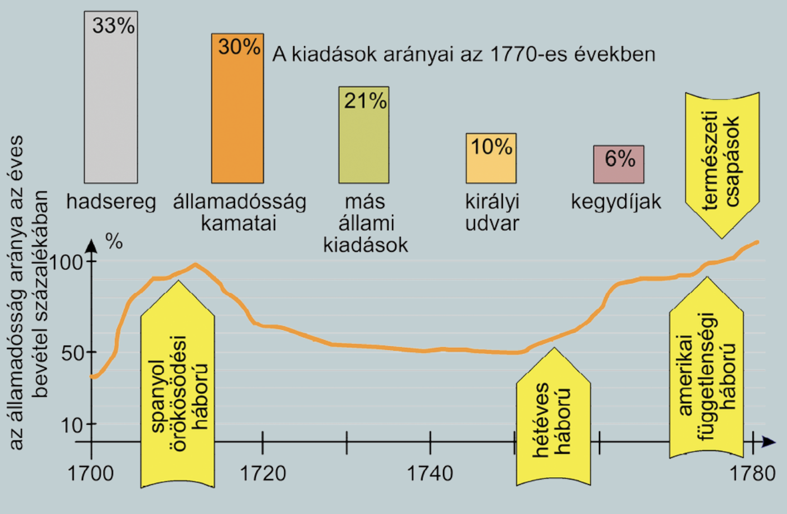

    
A forradalom kitörése és az Emberi és polgári jogok nyilatkozata.

---

    
Az államcsőd

---

- A francia abszolutizmus XVI. Lajos (1774–1792) uralkodása idején sem tudott kilábalni a pénzügyi válságból. A kiadásokat (hadsereg, udvartartás, járadékok) nem a bevételekhez igazították, mivel az a kiváltságos csoportok érdekeit sértette volna. A bevételeket sem lehetett növelni, mert a parasztság terhei már amúgy is magasak voltak, a nemesség és az egyház megadóztatásának terveit pedig megtorpedózták a királyi udvarban.
- 1788-ban az állam pénzügyi csődbe került: nem tudták fizetni az államadósság kamatait és a hadsereget. Ugyanakkor a hatalomnak szembe kellett néznie a súlyosbodó gazdasági válsággal és több egymást követő rossz termésű év hatásaival. A parasztság és a városi szegénység életkörülményei gyorsan romlottak, felütötte fejét körükben az éhínség. XVI. Lajos nem tehetett mást, 1789 májusára összehívta a rendi gyűlést.

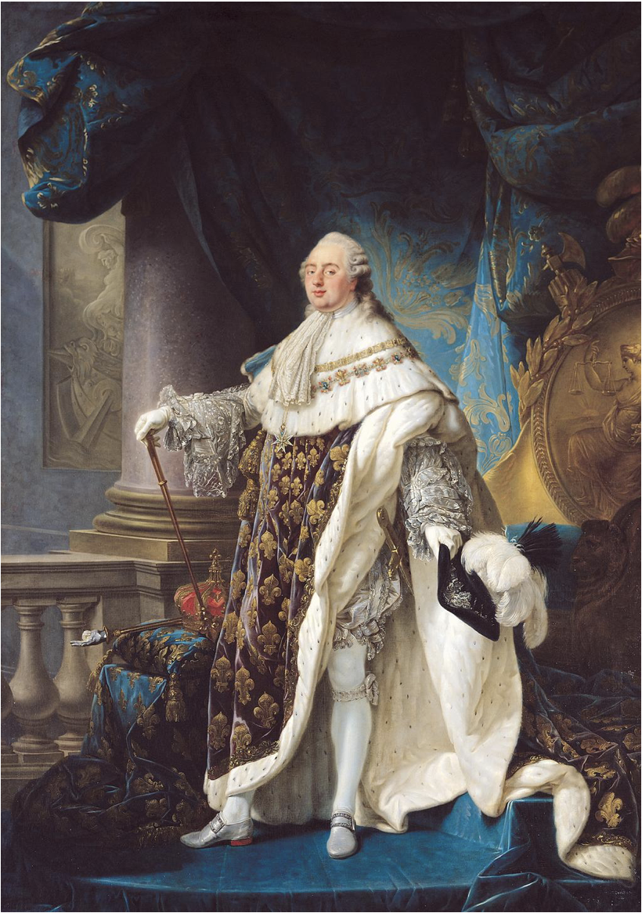
> XVI. Lajos (1754–1793). Jóakaratú, de határozatlan uralkodó volt, aki a politika helyett inkább töltötte az idejét asztalosműhelyében

- A XVIII. században még komoly problémákat okoztak a rossz termésű évek, mert nem léteztek nagyobb tartalékok. A népesség, főleg a városi szegénység, ilyen esetekben a szó szoros értelmében éhezett. A forradalmat megelőző években a természet is beleszólt az eseményekbe. Az izlandi vulkánok kitörései nyomán nagy mennyiségű hamu került a légkörbe, így az időjárás átmenetileg hidegebbre fordult. A vetés kifagyott, nyáron is hullott a hó, a termés Nyugat-Európában jelentősen csökkent.

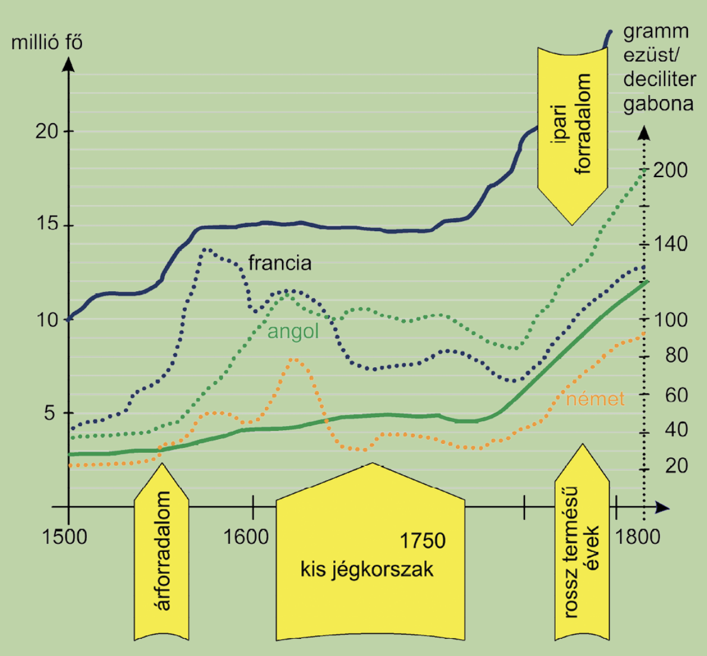

---

---

    
A forradalom kitörése

---

- A rendi gyűlés összehívásakor a felvilágosodás szelleme már áthatotta a francia vezető réteg zömét, az egyház tekintélye megrendült. Az abszolút hatalom eszmei támasza gyakorlatilag megszűnt, míg az alkotmányosság igénye a természetjog alapján egyre nyilvánvalóbbá vált a kortársak számára.
- A gyűlés összehívása után máris jelentkeztek az érdekellentétek. A harmadik rend arra hivatkozva, hogy a társadalom több mint 95 százalékát képviseli, annyi követet kívánt küldeni, mint az első két rend összesen. Az 1789 májusában Versailles-ban összeülő rendi gyűlésen az ülésezési rend feletti vita miatt az érdemi munka meg sem indult. A harmadik rend képviselői magukat a nemzet képviselőinek nyilvánítva Nemzetgyűléssé alakultak. Az alsópapság és a nemesség egy része is csatlakozott hozzájuk. Nem sokkal ez után (1789. június végén) a képviselők egy új alkotmány létrehozására tettek fogadalmat: a Nemzetgyűlés Alkotmányozó Nemzetgyűléssé alakult.
- Az uralkodó a forrongó Párizs körül növelte csapatai létszámát, ami azonban félelmet váltott ki az emberekből. Ezt a félelmet az egyre aktívabban politizáló közép- és kispolgárok (ügyvédek, újságírók) a tömeg előtti szónoklatokkal, röplapokkal agresszióvá változtatták. XVI. Lajos nem vonta vissza a csapatokat. A párizsi tömeg pedig lázas fegyverkezésbe fogott, hogy megvédje magát a katonaságtól.
- 1789. július 14-én a fegyver után kutató tömeg a Bastille-hoz, az ekkor börtönnek használt középkori erődhöz vonult. A néhány fős őrség tárgyalt a hangadókkal, amikor lövés dördült. Erre a sokaság megostromolta az erődöt, és a védőket lemészárolta. A védők fejét lándzsára tűzve vonuló tömeghez egyre több katonai egység csatlakozott. Kitört a forradalom.

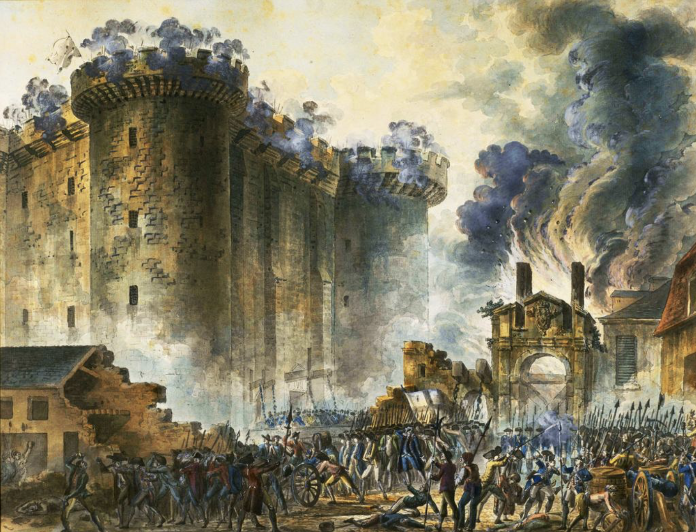

- A polgárság az összeomló hatalom helyére új polgármestert választott, és a vagyon, a rend védelmére létrehozta a nemzetőrséget.
- XVI. Lajos az események hatására engedett: visszarendelte a csapatokat, Párizsba ment, elismerte az új hatalmat és vezetőiket. Jelképesen a mellére tűzték az új nemzeti jelképet, a háromszínű kokárdát. Sokan azt hitték, a lázongásoknak vége, azonban tévedtek, a forradalom csak ekkor kezdődött.

---

---

    
A feudális kiváltságok felszámolása

---

- A párizsi forradalom hatására a vidék városaiban is végigsöpört a forradalom. A parasztság körében félelem lett úrrá, attól tartottak, a hatalom megtorlása következik a városi forradalmak miatt. Rémhírek kaptak szárnyra a nemesség bosszújáról. A félelem erőszakhoz vezetett, rátörtek a nemesi udvarházakra és kastélyokra. A történetírásba 1789 nyara „a nagy félelem időszakaként” került be.
- A helyzet radikalizálódása miatt az Alkotmányozó Nemzetgyűlésben az alkotmányos monarchiát támogató nemesek a közteherviselés bevezetését, a földek után járó hűbéri terhek megválthatóságát és minden személyi szolgáltatás eltörlését indítványozták. Fellépésük és a vidékről érkező hírek hatására az egyház és a városok is lemondtak kiváltságaikról. Franciaországban megszűntek a feudális előjogok (1789. augusztus 4.).
- Rövidesen (1789. augusztus 26.) az Emberi és polgári jogok nyilatkozatában foglalták össze a törvényhozás céljait és elveit: polgári szabadságjogok, jogegyenlőség, a tulajdon sérthetetlensége, népfelség, képviseleti rendszer. Ez az új alkotmány előkészítésének fontos lépését jelentette.

> A régi rendszer a pénzügyi csőd miatt bukott meg, de ezt a problémát az új alkotmányos rendszernek is kezelnie kellett. A kiváltságok megszűnésével a probléma nem oldódott meg. Az adók nem folytak be, a bizonytalan helyzetben az államnak senki nem hitelezett, pedig az államadósságokat és a végrehajtó hatalom tagjait fizetni kellett. A törvényhozás előtt az egyház hatalmas vagyonának kiárusítása kínálkozott megoldásként (1789. október).
>
> Az állam magára vállalta az egyházak fenntartását, és kamatozó utalványokat, assignatákat bocsátottak ki, melyeket később egyházi javak vásárlására lehetett fordítani. Az assignaták rövidesen átvették a pénz szerepét, és átmenetileg orvosolták a pénzügyi válságot. Mivel az újabb hiányokat ismételt kibocsátással oldották meg, az assignaták értéke egyre csökkent. A pénz elértéktelenedése (infláció) tovább rontotta a városi tömegek helyzetét, így radikalizmusuk nem csillapodott.

---

---

    
Az 1791-es alkotmány

---

- Az Alkotmányozó Nemzetgyűlés 1791-re megalkotta az új alkotmányt, amelyben érvényesültek a korszak alkotmányos elvárásai (a polgári szabadságjogok biztosítása, a hatalmi ágak megosztása, cenzusos választási rendszer). A törvényhozó testület megbízatását (mandátumát) két évben állapították meg. Választott bíróságokat hoztak létre.
- A végrehajtó hatalom felelős volt a törvényhozásnak. Az államfő a király maradt, ő nevezte ki a minisztereket, de rendelkezései csak miniszteri ellenjegyzéssel voltak törvényesek. A király korlátozott vétójogot kapott (egy alkalommal visszaküldhette a neki nem tetsző törvényjavaslatokat a törvényhozásnak, de másodszorra már jóvá kellett hagynia azokat). A törvényhozást nem oszlathatta fel, és a képviselők sértetlenséget élveztek (mentelmi jog).
- Új, az egész országban egységes közigazgatást vezettek be: az önkormányzattal rendelkező megyéket.
- Az államot nem választották el az egyháztól, sőt az egyház vagyonának kiárusításával – mivel az egyház fenntartási költségeit az állam fizette – a viszony szorosabb lett. Az egyház és az új hatalom viszonya fokozatosan romlott: az állam nem tudta teljesíteni vállalt finanszírozási kötelezettségét, majd feloszlatták a szerzetesrendeket.

> Az egyház és a törvényhozás közötti viszony az egyház világi alkotmányának elfogadása után (1791 júliusa) romlott meg. A törvényhozás jogot formált az egyház belső ügyeinek meghatározására: a hierarchiát hozzáigazították a megyerendszerhez, a plébánosokat, püspököket a választópolgárok választhatták. Minden egyházi személyt köteleztek arra, hogy felesküdjön az új alkotmányra. A papság jelentős része ellenállt – válaszul a hatalom erőszakot alkalmazott. A kibontakozó ellentét a változások híveit egyre inkább egyházellenessé tette, míg a régi rend hívei a vallás és a vallásos világrend védelme érdekében léphettek fel, s így nagyobb tömegeket tudtak mozgósítani.

---

---

    
Politikai irányzatok

---

- Franciaországban ekkor már viszonylag jól körülhatárolható politikai célokkal rendelkező csoportokat tudunk megkülönböztetni, melyek politikai klubokat hoztak létre. A klubok nem voltak pártok, de jórészt azok szerepét töltötték be. Tagságuk politikai vitákat tartott, melyek jelentősen befolyásolták a közvéleményt. Az egyes klubok összetétele – amit részben a tagdíj határozott meg – változott is.

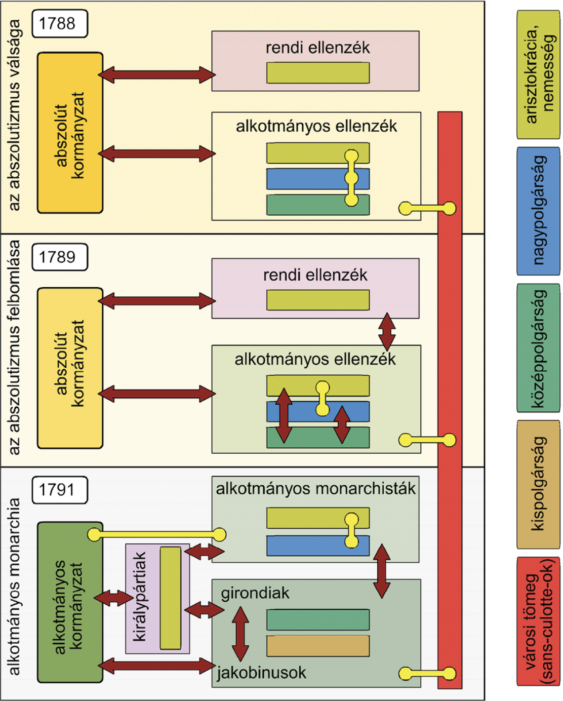

- A régi rend híveit összefoglalóan királypártiaknak nevezzük. E csoport zöme arisztokrata és nemes volt. Az alkotmányos monarchistákat a változásokat támogató arisztokrácia és a nemesség, valamint a nagypolgárság alkotta. Ez az irányzat azt szerette volna, ha az abszolutizmus nagyobb megrázkódtatások nélkül átalakul alkotmányos királysággá. A királyi hatalommal szemben álló radikálisok főleg a közép- és kispolgárság soraiból kerültek ki. Mérsékelt csoportjukat, amely ragaszkodott az új polgári törvényességhez, girondiaknak (Gironde megye után), míg radikálisabb, a hatalom megszerzését a törvények felrúgásával is elfogadhatónak tartó csoportjukat jakobinusoknak (a kolostor neve után, ahol üléseztek) nevezzük.

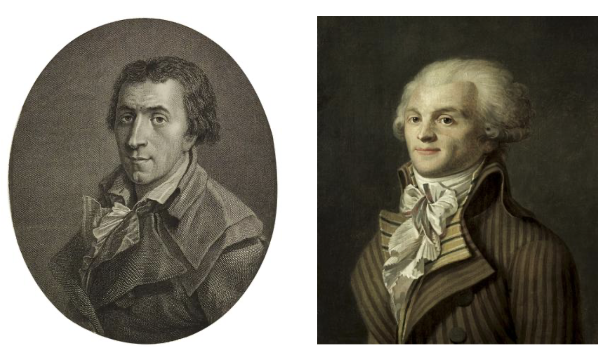

> Brissot (1754–1793) és Robespierre (1758–1794). Mind-ketten kispolgári-értelmiségi származásúak és foglalkozásúak voltak, s a jogegyenlőség és a francia nemzet kiépítéséért tevékenykedtek. Útjaik azonban elváltak, és szembekerültek egymással. Brissot a girondiak, Robespierre a jakobinusok vezetője lett

---

---

    
Az alkotmányos monarchia bukása

---

- Az uralkodó nemcsak az őt korlátozó törvényhozással szemben volt bizalmatlan, hanem az alkotmányos monarchistákkal szemben is, pedig ez volt az egyetlen erő, amely a helyzet további radikalizálódását meg tudta volna akadályozni. XVI. Lajos inkább az európai feudális hatalmak beavatkozásától remélte az őt korlátozó alkotmány eltörlését és régi hatalmának visszaállítását. Mivel az uralkodó többször ellenszegült a törvényhozásnak (pl. az egyházzal kapcsolatos intézkedések során), a kormányát alkotó alkotmányos monarchisták befolyása is csökkent.
- Az új választások (1791 októbere) eredményeként összeülő új törvényhozásban teret nyertek a girondiak. A belpolitikai harc a háború kérdése miatt robbant ki. (A király és a girondiak – más-más okból – támogatták, az alkotmányos monarchisták és a jakobinusok ellenezték a feudális hatalmakkal szembeni háborút.) Végül Franciaország hadat üzent a Habsburg Birodalomnak (1792. április 20.). Az uralkodó vétóival akadályozta a katonai felkészülést. A párizsi tömegek szemében a király és a királyság az ellenséggel azonosult. Közben Poroszország a Habsburg Birodalom mellé állt, és a támadásra készülő porosz és osztrák sereg főparancsnoka kiáltványában megtorlással fenyegette meg Párizst, amennyiben a királynak baja esik (Koblenz, 1792. július). Ez a végletekig a király ellen hangolta a tömeget. A jakobinus többségű párizsi községtanács (kommün) a párizsi tömegre támaszkodva fellázadt, a királyt letartóztatták (1792. augusztus 10.).

> 1792. augusztusában a porosz és az osztrák hadsereg támadásba lendült Osztrák Németalföld (a mai Belgium) felől, és győzedelmesen tört előre. Párizs népe harcra készült. A felzaklatott párizsi tömeg az irányítást e napokban gyakorlatilag kézben tartó jakobinusok vezetésével belső ellenséget keresett. A várost járva ezrével fogdostak össze gyanúsnak ítélt személyeket, arisztokratákat, papokat és jól öltözött polgárokat, majd a védtelen embereket jórészt legyilkolták (1792 szeptembere). A terror megfélemlítette a forradalom ellenségeit, de megkezdődött a forradalomból való kiábrándulás is.

- A Párizs felé közeledő ellenséget Valmynál a forradalmi ezredek megállították (1792. szeptember 20.).
- Még a háborús készülődés és a tömegmozgalmak időszakában került sor az újabb választásokra, így a választójog kiterjesztése ellenére (a 21 éven felüli francia férfiak szavazhattak) kevesen mentek el szavazni. Ezért a Valmynál aratott győzelem napján összeülő új törvényhozás összetétele nem felelt meg a társadalom tényleges erőviszonyainak: a radikálisok jelentősen előretörtek. Az új törvényhozás rövidesen kikiáltotta a köztársaságot.

---

---

    
Politikai küzdelmek és a király kivégzése

---

- Az alkotmányos monarchisták nem jutottak be a törvényhozásba, így a jobboldalt (a kifejezés ekkor született) a girondiak, a baloldalt a jakobinusok alkották. A két politikai erő képviselői hasonló társadalmi csoportból érkeztek, nézeteik azonban különböztek egymástól. A girondiak ragaszkodtak a forradalom által kivívott politikai és gazdasági szabadsághoz. A jakobinusok – a tömegek támogatását keresve – viszont hajlandónak mutatkoztak azok korlátozására, például az árak és a bérek szabályozására. A képviselők zöme egyik csoporthoz sem tartozott, és a párizsi közhangulat által meghatározott erőviszonyoknak engedve szavazott. (E csoport neve mocsár volt.) Mivel a király fogoly volt, a törvényhozás irányította közvetlenül a végrehajtó hatalmat is, bizottságain (amelyek közül legfontosabbá a Közjóléti Bizottság vált) és biztosain keresztül. Így a végrehajtó hatalom mindig a törvényhozás többségének a kezében volt.

> A jobboldal és a baloldal fogalma onnan ered, hogy a forradalom idején a törvényhozásban az elnöktől jobbra foglaltak helyet a királypártiak, balra pedig a reformok sürgetői. A kifejezés tartalma időben és térben azóta is folyamatosan változik. Ezt a francia forradalom tanulmányozása során is láthatjuk, hiszen mások vannak a jobb-, illetve a baloldalon a forradalom egyes időszakaiban.

- 1792 őszén a girondiak és a jakobinusok közötti politikai harc fő témája a király sorsa volt. XVI. Lajost, akit csak Capet Lajosnak neveztek, perbe fogták. A párizsi tömeg a király halálát követelte. Robespierre és a jakobinusok e várakozásnak megfelelve síkra szálltak a király elítélése mellett. A girondiak kezdetben ellenálltak, majd engedtek. Végül a királyt – kis szavazattöbbséggel – halálra ítélték, és nyilvánosan, nyaktilóval (guillotine) kivégezték (1793. január 21.).

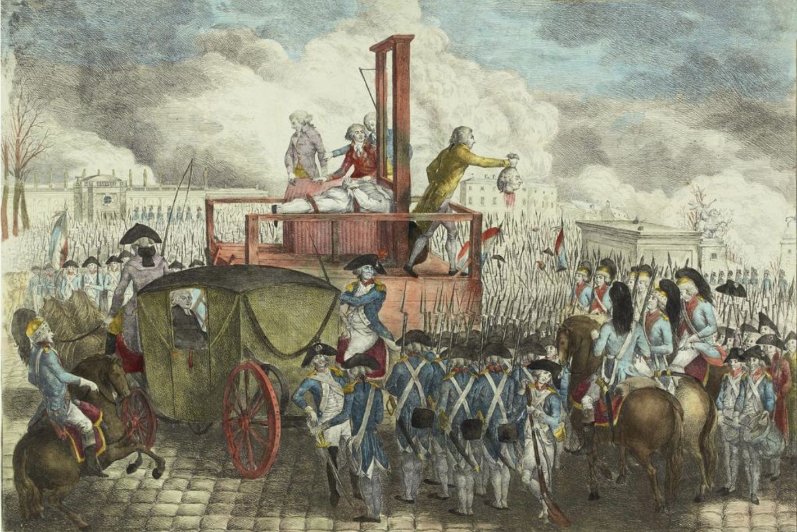

> A király kivégzése. A királyt rövidesen követte a vérpadon a királyné (1793 októbere), és később a börtönben meghalt a kisfia is

- A francia seregek győzelmesen haladtak előre a Rajna mentén, s jelentős vereséget mértek az osztrák és a porosz erőkre. A törvényhozás többsége folytatni kívánta a régi francia királyok (pl. XIV. Lajos) hódításait. A jelszó most is a természetes határok (Rajna, Alpok, Pireneusok) biztosítása volt, de felfogásukban a hódítás a szabadság kiterjesztéséhez is kapcsolódott. A katonákat a nemzet iránti lelkesedés, a nacionalizmus is hevítette. A forradalomban megszületett nemzet pedig olyan közösség, melyhez vagyoni és társadalmi helyzettől, vallástól függetlenül minden francia tartozik.

> A francia nemzet a forradalom gyermeke volt, és kizárta magából ellenségeit (pl. a királypárti emigránsokat, lázadókat), de befogadta a forradalomhoz csatlakozó bretonokat, provanszálokat vagy elzászi németeket. Jogokat adott, de megkövetelte a francia nyelv átvételét. Így vált a forradalom – beolvasztva akár erőszakkal is a francia földön élő nemzetiségek jelentős részét – az egységes francia nemzet létrehozójává.

- A forradalmi Franciaország sikerei kiváltották az angolok félelmét, és Európa feudális hatalmait is nagyobb erőfeszítésekre sarkallták. Anglia, Poroszország és Ausztria vezetésével franciaellenes koalíció (szövetség) jött létre (1793). A szinte minden irányból meginduló támadást a francia seregek nem tudták feltartóztatni. Ugyanakkor az újoncozás elrendelése a parasztságot a kormány ellen fordította. (Az egyház elleni támadások és a feudális terhek megváltásának kötelezettsége miatt a parasztság amúgy is elégedetlen volt.) Több helyen felkelés tört ki (pl. Vendée).

- A válságos helyzetben a jakobinusok rendkívüli, a törvényességet átlépő intézkedéseket követeltek. Miután a girondiak erre nem voltak hajlandóak, a jakobinusok a párizsi tömeget felhasználva letartóztatták a girondi képviselőket, és átvették a hatalmat. A legfőbb végrehajtó szerv, a Közjóléti Bizottság élére radikális jakobinusok (Robespierre, Saint-Just, Marat) kerültek (1793. június).

---

---

---

A jakobinus diktatúra.

---

    
A jakobinusok diktatúrája

---

- A jakobinusok elrendelték a népfelkelést, vagyis az általános hadkötelezettséget. A hadianyag biztosítása érdekében engedélyezték az áruk elkobzását. Hogy a városi tömegek körülményei ne romoljanak tovább, bevezették az assignaták kényszerárfolyamát és maximálták az árakat. A vidéket forradalmi csapatok járták, és újoncokat, élelmiszert, nyersanyagokat gyűjtöttek.
- Az intézkedések kiszélesítették a parasztság felkelését, a girondiak elfogása pedig a vidéki városok felkelését robbantotta ki (Lyon, Bordeaux stb.) – a vidék nem akarta elfogadni Párizs uralmát. A zendülések elfojtása érdekében a jakobinusok megszavaztatták a törvényhozással a gyanúsakról szóló törvényt (1793 szeptembere). Ezután a forradalmi törvényszékek és a törvényhozás biztosai bárkit a halálba küldhettek.
- Véres terrorral, tízezrek kivégzésével vérbe fojtották a felkeléseket, és a közel milliósra növelt hadsereggel visszaverték a koalíció támadását (Fleurus, 1794. június). Az eredmények értékeléséhez azonban tudni kell, hogy sokszor éppen a kemény intézkedések miatti ellenállás letörése igényelt nagy erőfeszítéseket.
- A jakobinus irányítású Közjóléti Bizottság az ellenállók tízezrei mellett halálba küldte a törvényhozás jakobinusokkal szemben álló politikusait is (pl. a girondiakat). A hatalom egyre kisebb csoport kezébe került. Végül a hatalom csúcsán levő jakobinusok már egymásban látták a fő ellenséget. Először Robespierre a mérsékeltekkel szövetkezve leszámolt a terror féktelen híveivel, a „veszettekkel” (1794. március), majd Robespierre-ék nyaktiló alá küldték a mérsékelteket is (1794. április). A terror megállíthatatlanná vált: minden kivégzés újabb személyekre terelte a gyanút. Egy rendelkezés szerint a forradalmi törvényszékek a vádlott nyilvános kihallgatása, védelem és a bizonyítékok ismertetése nélkül is ítélkezhettek, ha meggyőződésük szerint a vádlott bűnös volt. Már mindenki rettegett. Amikor Robespierre újabb képviselőt vádolt meg a törvényhozásban, a megrémült képviselők heves vita után letartóztatták őt és híveit. A rémuralomból kiábrándult tömeg nem állt a jakobinus vezetők mellé, és a törvényhozás másnap kivégeztette őket (1794. július 28.).

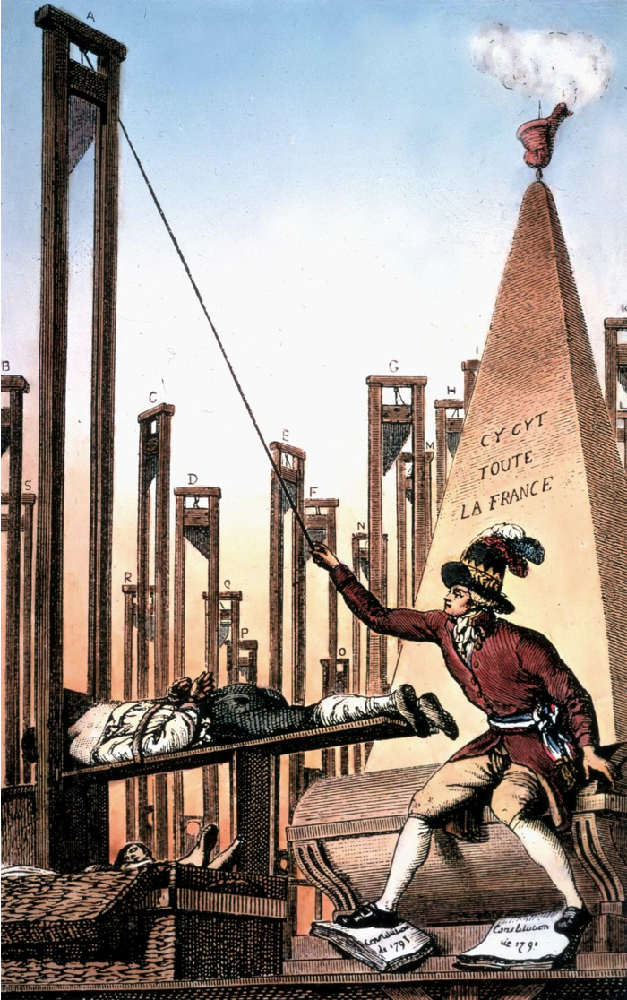

> Angol karikatúra a Franciaországot nyaktilók alá küldő Robespierre-ről. A terror a személyes bosszú és a hatalom megtartásának eszközévé vált

---

    
A direktórium

---

- A törvényhozás felszámolta a diktatúra kivételes törvényeit (a gyanúsak elítélése, árak maximálása stb.) és korlátozta a Közjóléti Bizottság jogkörét. A katonai sikereket kihasználva békét kötöttek a koalíció tagjaival (1795), jórészt megőrizve a természetes határokat.
- A szélsőséges képviselőktől (jakobinusok) megszabadult törvényhozás új alkotmányt dolgozott ki (1795). Fő cél volt a diktatúra elkerülése, a tulajdonosok uralmát biztosító, szilárd (konszolidált) rendszer kialakítása, a szélsőségesek (királypártiak és jakobinusok) távoltartása a hatalomtól. Az új alkotmány az 1791-es alkotmány elveihez tért vissza (pl. hatalommegosztás), de az államforma köztársaság maradt. A törvényhozást kétkamarássá változtatták (Ötszázak Tanácsa és Vének Tanácsa), a végrehajtó hatalmat ötfős Direktórium gyakorolta, melynek egyik tagja helyett minden évben újat választottak.

> A jakobinusok bukása a tömeggyilkosságok, a guillotine-nal végrehajtott nyilvános kivégzések, az átpolitizált mindennapok végét is jelentette. Az emberek az élet élvezete felé fordultak: társaságba jártak, szórakoztak. Ám a társadalom nem minden rétege engedhette meg magának a gondtalan időtöltést. Kiéleződött a vagyonos polgárság és a szegények közötti ellentét.

---

---

---

    
Napóleon birodalma: a polgári berendezkedés exportja

---

    
Napóleon – a hatalom megragadása

---

- A Direktórium konszolidációt akart, de hiába javult a gazdasági helyzet és rendeződtek a tulajdonviszonyok, az éveken át egymás ellen harcoló politikai csoportok és társadalmi erők egyik napról a másikra nem adták fel terveiket. Nehéz volt fenntartani az alkotmányos kereteket, mivel azokat kihasználva hol a jobb-, hol a baloldali szélsőségesek kerültek túlsúlyba az évente tartott választásokon. Megnőtt a hadsereg, és főleg a katonai vezetők szerepe, tekintélye. Közülük a legnépszerűbbé Bonaparte Napóleon (1769–1821) vált, aki a köztársaság háborúiban nagy győzelmeket aratott. A hadseregre támaszkodva megszerezte a hatalmat. A Direktórium több tagja is az erős végrehajtó hatalomban látta a kiutat. Emiatt támogatták Napóleon államcsínyét (1799. november 9.).

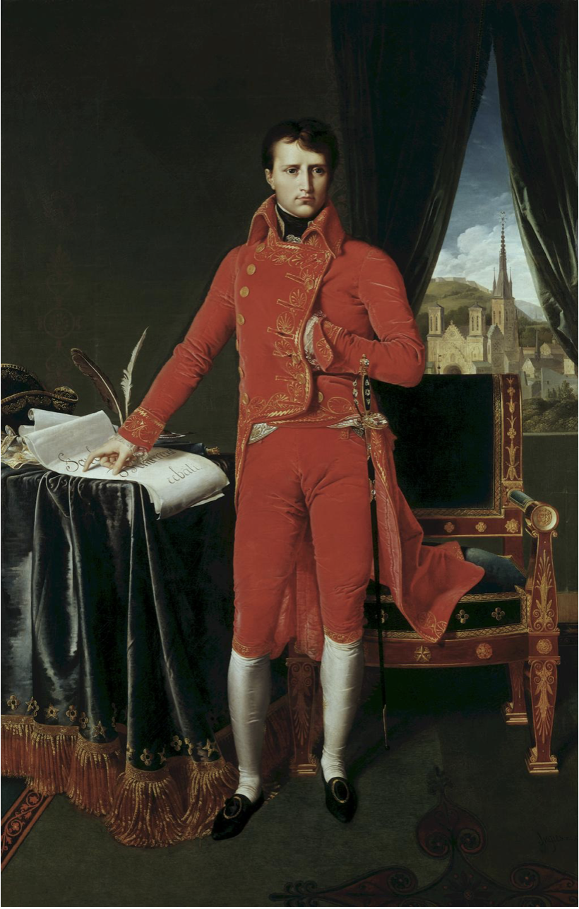

> Napóleon (1769–1821), az első konzul. Korzikai kisnemesi családból származott, hét testvére volt. Korzikát nem sokkal születése előtt vásárolta meg Franciaország Genovától, s Napóleon ifjúkorában tanult meg franciául. Később jó kapcsolatban állt Robespierre öccsével, így a jakobinusok bukása majdnem katonai karrierje végét jelentette

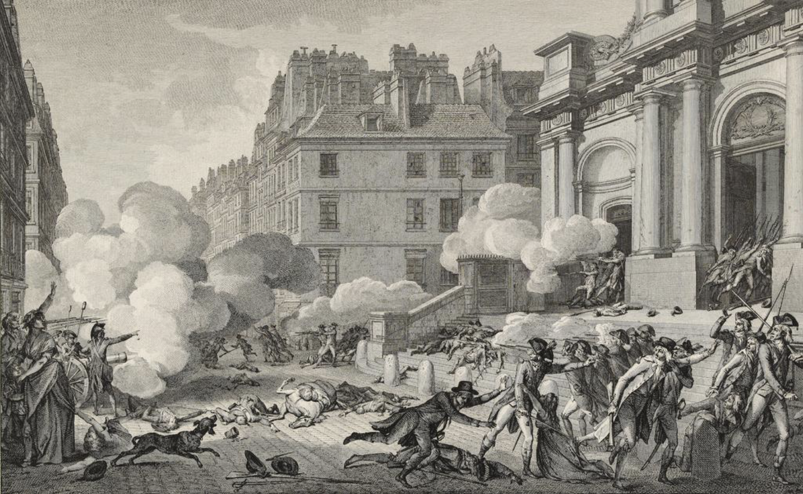

> Napóleon tüzérség bevetésével, kartáccsal veri szét a párizsi királypárti lázadást 1795-ben

---

---

    
A konzulátus rendszere

---

- Napóleon a törvényhozással új alkotmányt dolgoztatott ki, mely gyakorlatilag biztosította számára a teljhatalmat, de igyekezett elfedni a diktatúrát. Napóleon két konzultársával állt a végrehajtó hatalom élén. Mint első konzul társainál szélesebb jogkörrel rendelkezett.
- Napóleon hatalmát a társadalom többsége (polgárság, parasztság) elfogadta, mert már belefáradtak az egyre véresebb politikai küzdelmekbe. Belső békét, nyugalmat és stabilitást vártak a hatalomtól, amiért cserébe hajlandóak voltak az érdekeiket képviselő hatalom javára lemondani a politikában való részvételről és bizonyos jogaikról.
- Napóleon a polgári viszonyok megszilárdítására használta fel hatalmát. Elismerte és törvényesítette a forradalom alatt végbement tulajdonváltást. Létrehozta a Francia Nemzeti Bankot (1800), és megszilárdította a Direktórium alatt létrehozott új valutát, a frankot. A parancsára kiadott polgári törvénykönyv (Code Civil, 1804) biztosította a polgári társadalom működését. Kialakította az állami egyetemek és középiskolák rendszerét. A pápasággal konkordátumot (egyezményt) kötött, ami rendezte az egyház helyzetét. Véglegessé vált az állam és az egyház szétválasztása. Az egyház lemondott a forradalom idején eladott földjeiről, de a papok állami fizetést kaptak. A püspököket az első konzul nevezte ki, s vallási hatalmukban a pápa erősítette meg őket.

---

---

    
A császárság

---

- Napóleon 1804 decemberében császárrá koronáztatta magát. Lehullott a konzulátus köztársasági máza, új, címkórságban szenvedő arisztokrácia alakult ki. A polgári berendezkedés azonban maradt.

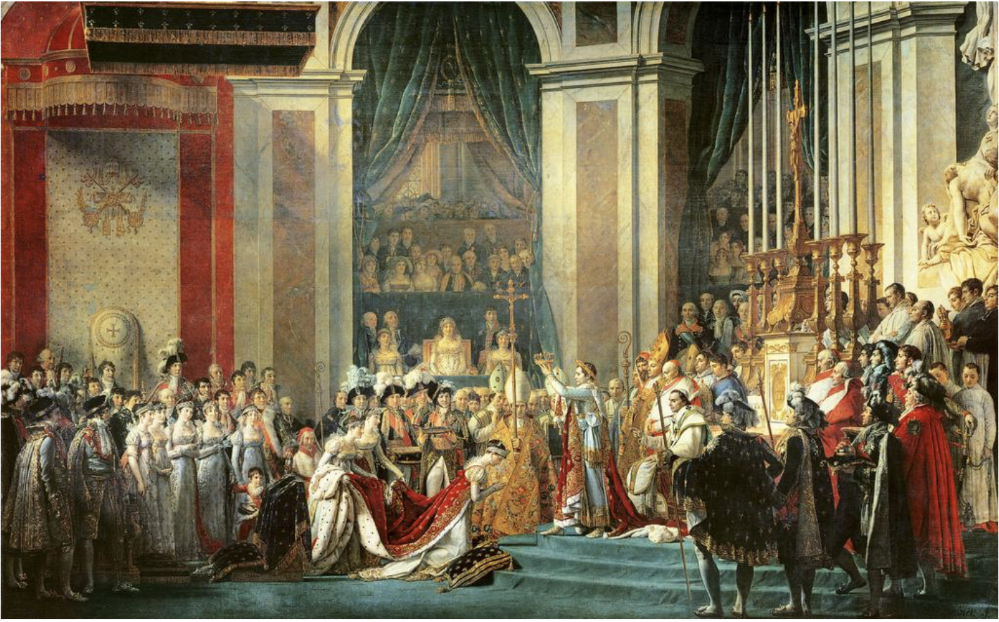

> Napóleon császárrá koronázása 1804-ben

- Napóleon európai hegemóniára (hatalmi fölényre, egyeduralomra) tört. A britekkel szemben Berlinben meghirdette a kontinentális zárlatot (1806), mely kizárta az angol kereskedelmet az európai kontinens kikötőiből. Ez azonban sikertelennek bizonyult. Az angolok a gyarmatokon és Latin-Amerikában kárpótolták magukat, Európába pedig a csempészek hoztak brit árukat.
- A császár folytatta szakadatlan háborúit, nem törődve országa kimerülésével. Dinasztiát akart alapítani, hogy hatalmát örökletessé tegye. Az osztrákokat ismételten legyőzve Napóleon kikényszerítette, hogy Ferenc osztrák császár hozzáadja a leányát, Mária Lujzát (1809). Az európai uralkodók Napóleonban a felkapaszkodott hadvezért, a forradalom emberét látták, és nem fogadták el egyenlő partnernek. Hatalmát csak sorozatos háborúkkal tudta biztosítani. Így amíg győztesen került ki a hadjárataiból, rengeteg vér és szenvedés árán, de fenntartotta hatalmát.

> Napóleon győzelmei következtében 1806-ban Ausztria uralkodója, Ferenc lemondott a német-római császári címről, és ezzel megszűnt a Német-római Császárság. Már ezt megelőzően (1804-ben) Ferenc felvette az osztrák császári címet, így a Habsburgok – a magyar királyi cím mellett – a továbbiakban ezt használták.

---

---

    
Napóleon bukása

---

- Franciaországot kimerítették a forradalom és a folytonos háborúk véráldozatai. Ebben a helyzetben Napóleon a kontinentális zárlat megszegése miatt háborút indított Oroszország ellen (1812). A császár hatalmas (kb. 600 ezres) hadsereggel támadott. Az oroszok hátráltak, és a felégetett föld taktikáját követték. Csak Moszkva közelében, Borogyinónál vállaltak csatát. Itt Napóleon még győzött, és bevonult Moszkvába, de az orosz cár nem kért békét. Az oroszok felgyújtották Moszkvát, ami lehetetlenné tette, hogy a francia csapatok ott teleljenek. A visszavonuló franciák a Berezina folyónál átkelés közben döntő vereséget szenvedtek.
- Napóleon veresége újra csatasorba állította az európai nagyhatalmakat. A koalíciós erőkkel szemben a császár fiatal korosztályokból felállított serege Lipcsénél vereséget szenvedett (1813). A „népek csatájában” több mint százezren estek el. A következő évben a szövetségesek elfoglalták Párizst, Napóleont pedig tábornokai lemondatták a trónról, ezzel 1814-ben véget ért Napóleon császársága. A szövetségesek Elba szigetére (Tirrén-tenger) száműzték, ám innen még visszatért. A kimerült országnak azonban nem volt esélye: 1815-ben Waterloonál bekövetkezett a döntő vereség. Napóleont az atlanti-óceáni brit gyarmatra, a távoli Szent Ilona-szigetére száműzték, s itt halt meg (1821).

---

---

