---

[Vissza](./ev-vegi-vizsga.md)

---

    
Liberalizmus, nacionalizmus és konzervativizmus

---

- Liberalizmus: jogegyenlőség és alkotmányosság.
- Nacionalizmus: nemzetépítés és nemzetállam.
- Konzervativizmus: szerves reform és a forradalom elutasítása.

    
Liberalizmus, nacionalizmus és konzervativizmus

---

- Tételek:
    - Liberalizmus: jogegyenlőség és alkotmányosság.
    - Nacionalizmus: nemzetépítés és nemzetállam.
    - Konzervativizmus: szerves reform és a forradalom elutasítása.

---

    
A BÉCSI KONGRESSZUS ÉS A SZENT SZÖVETSÉG

---

- A Napóleont legyőző nagyhatalmak vezetői – a diplomácia történetében új fejezetet nyitva – Bécsben konferenciát tartottak (1814–1815). Kettős cél vezette őket: a napóleoni háborúk után rendezni kellett a hatalmi viszonyokat (területi kérdések, a régi uralkodóházak hatalmának helyreállítása), és gátat kellett szabni a forradalmaknak.
- Franciaország vereségét követően Oroszország jelentősen megerősödött. Az angol diplomácia – a kontinentális hatalmak támogatásával – meg akarta akadályozni Oroszország túlzott térnyerését, de ez csak részben sikerült, mert a cári birodalom újabb területekhez jutott.

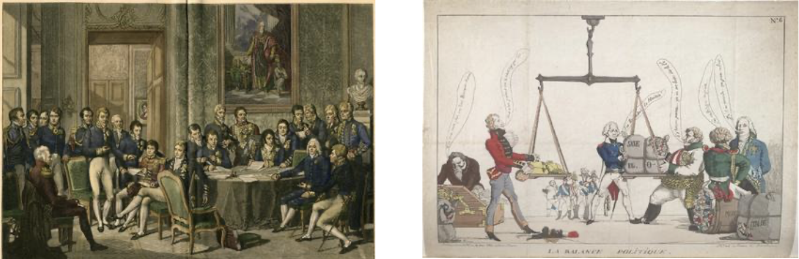
> Festmény és karikatúra a bécsi kongresszusról

> Oroszország a korábbi felosztásokhoz képest újabb területeket hasított ki Lengyelországból (Varsó és környéke), és Oroszország kezén maradt az 1812-ben bekebelezett Finnország és Besszarábia is.
>
> A konferencia támogatta, hogy a Habsburg Birodalom megszerezze Velencét és Lombardiát, Poroszország pedig Vesztfáliát és a Ruhr-vidéket. Az így megerősített Habsburg Birodalom és Poroszország ellensúlya lehetett Oroszországnak. Hasonló okokból nem törték meg a vesztes Franciaországot sem, de az általa veszélyeztetett területeket megerősítették: Hollandiához csatolták Belgiumot, a Szárd Királysághoz pedig Genovát. Nagy-Britannia a helyzetet kihasználva növelte gyarmati hatalmát (Indiában és Fokföldön), és újabb stratégiai pontokat szerzett meg a Földközi-tengeren Gibraltár mellé (Málta, Jón-szigetek).

- A bécsi kongresszust követően három feudális nagyhatalom, Oroszország, Ausztria és Poroszország Párizsban megkötötte az ún. Szent Szövetséget (1815), amely elsősorban a forradalmi és nemzeti mozgalmak ellen irányult. Kölcsönös segítségben és együttműködésben állapodtak meg, ha valamelyikük területén „lázadás” törne ki, sőt fegyveres beavatkozást (intervenciót) helyeztek kilátásba. A Szent Szövetséghez később a legtöbb európai állam csatlakozott, de Nagy-Britannia nem.
- A változásokat meggátló hatalmak a következő évtizedekben rendszeressé tették kongresszusaikat (diplomáciai találkozóikat), ahol egyeztették a forradalmak elleni fellépésüket. A rendszeres találkozók az új eszméket hirdető és megvalósítani akaró mozgalmak megfékezésén túl közöttük is megakadályozták a nagyobb konfliktusokat.

---

    
A LIBERALIZMUS, A SZABADELVŰSÉG

---

- A XIX. század első felében a felvilágosodás és a francia forradalom hatására egyre szélesebb körben elterjedt az alkotmányos berendezkedés és a polgári szabadságjogok igénye. A szabadságeszmény képviselőit összefoglalóan liberálisoknak, az eszmét liberalizmusnak, magyarul szabadelvűségnek nevezték.

> A liberalizmus a latin ’liber’ (= szabad) szóra vezethető vissza. Politikai irányzat elnevezésére először 1812-ben használták: a spanyol reformerek nevezték magukat liberálisoknak, majd az 1820-as évekre általánossá vált a fogalom.

- A liberalizmus a XIX. század első felében polgári szabadságjogokat, vagyis szólás- és sajtószabadságot és gyülekezési jogot követelő irányzat volt, amely a képviselet alapján működő alkotmányos polgári rendszer megvalósítására törekedett. A liberalizmus elhatárolta magát egyrészt a kiváltságokon alapuló zsarnoki hatalomtól, másrészt a jakobinus jellegű népuralomtól.
- A liberalizmus államformaként elfogadta az alkotmányos monarchiát éppúgy, mint az alkotmányosan működő köztársaságot. Alkotmányosságon azt értették, hogy a végrehajtó hatalmat a törvényhozás ellenőrzi, melynek képviselőit a nép választja meg, cenzusos választójog alapján.
- Mivel a XIX. század első felében Európa jelentős részére még az egyenlőtlenségen alapuló feudális társadalmak és államok jellemzőek, a liberalizmus a korszakban forradalmi irányzatnak számított.

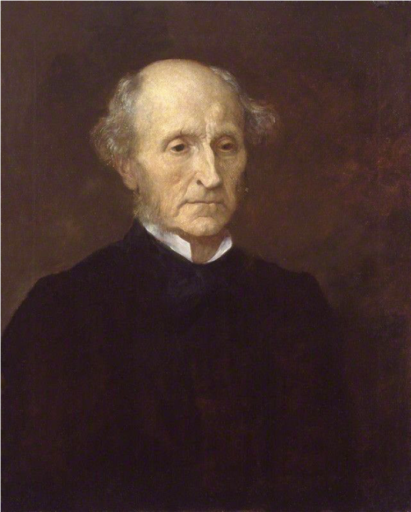
> John Stuart Mill (1806–1873) angol filozófus, a liberalizmus egyik ideológusa. Korát megelőzve a női egyenjogúság követelését is megfogalmazta

- A XIX. század első felében forradalmak sora söpört végig Európában (1820, 1830, 1848). Ezek egy része ugyan elbukott, de a származás alapján élvezett kiváltságokon alapuló feudális rendszerek lassan megszűntek, vagy az alkotmányosság egyre több elemét voltak kénytelenek bevezetni. Ugyanakkor új eszme- és politikai áramlatok jelentek meg, melyek a jogegyenlőség helyett a vagyoni egyenlőség különböző formáit tűzték zászlójukra. Így Európa nagy részén kialakultak az alkotmányos rendszerek, és az azokat támogató pártok elfogadták a jogegyenlőség elvét. Ezért a XIX. század végére a liberalizmus elvesztette forradalmiságát, és a XX. század első harmadában mint politikai erő teret veszített.

---

    
A NACIONALIZMUS, A NEMZETI ÉRZÉS

---

- A kiváltságokon alapuló társadalmat elutasító liberalizmussal együtt jelentkezett – és részben képviselőiben is azonos volt – a korszak másik meghatározó eszméje, a nacionalizmus. A nacionalizmus a nemzeti összetartozást hangsúlyozta, és azt fontosabbnak tartotta a társadalmi és a vallási különbségeknél. A nemzeti közösség a jogegyenlőségen alapul, ezért a nacionalizmus szintén elutasította a születési kiváltságokat. A XIX. század első felében forradalmi eszmének tekinthető.

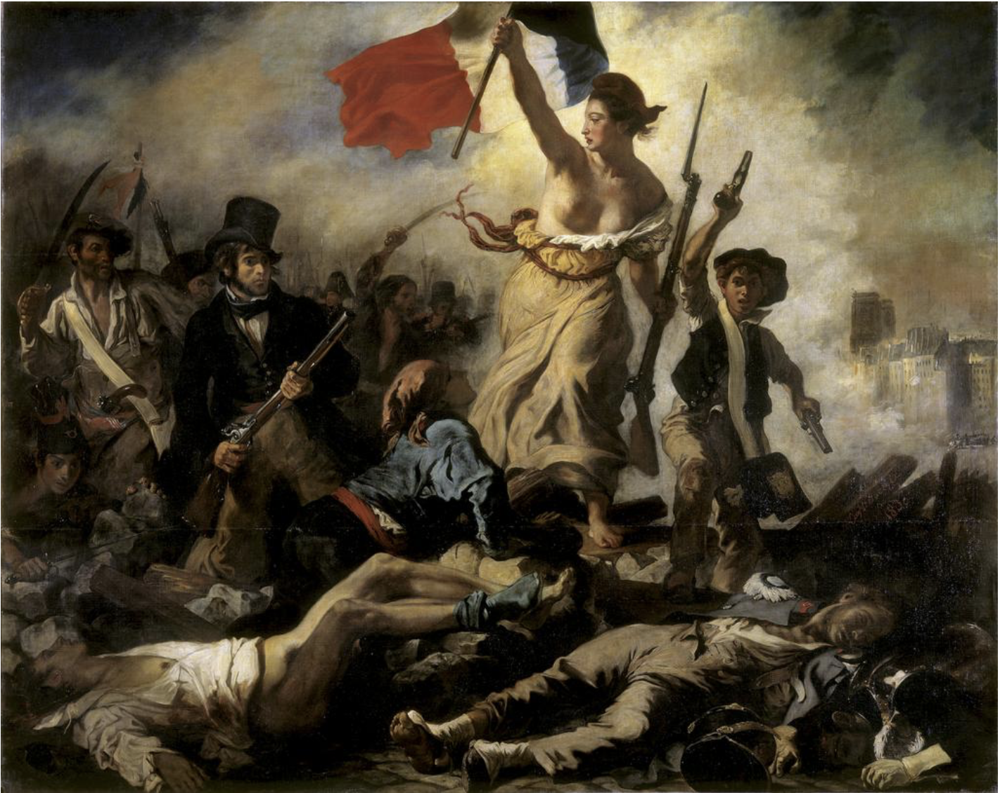
> Delacroix: A szabadság győzelemre vezeti a népet. A festmény a szabadság és a nemzeti eszme összefonódásának klasszikus megjelenítése

> A szülőföldhöz, a nyelvi közösséghez való kötődés természetesen létezett már a korábbi századokban is. Sokáig azonban az emberek önmeghatározásában hangsúlyosabb volt a vallási kötődés (pl. keresztény vagyok) és a társadalmi jogállás (pl. nemes, polgár vagy jobbágy vagyok).

- A polgári (tehát jogegyenlőségen alapuló) nemzeti közösség eszméje, mint láttuk, a francia forradalomban született meg, és a XIX. század első felében egész Európára kiterjedt. Térhódításában jelentős szerepet játszottak a napóleoni háborúk, egyrészt a nemzeteszme terjesztésével, másrészt a francia hódítás ellen fellépő nemzeti mozgalmak révén.
- Felértékelődtek a közösségi azonosságtudatot kifejező és erősítő tényezők, mint az anyanyelv, a nemzeti hagyományok és a nemzeti történelem. A múltban a nemzeti nagyságot keresték, ezért azt romantikus módon, idealizálva mutatták be.
- A nemzethez való kötődés alapvetően érzelmi jellegű, ezért a nacionalizmus a XIX. században fontos szerepet játszott az emberek politikai célú mozgósításában. A nemzettel való teljes érzelmi azonosulást segítették a nemzeti jelképek, amelyek a korszakban születtek meg, vagy ekkor váltak korábban más jelentésű jelképekből a nemzeti hovatartozás kifejezőivé. Közülük legismertebbek a nemzeti lobogó, a címer, a kokárda és a nemzeti himnusz.

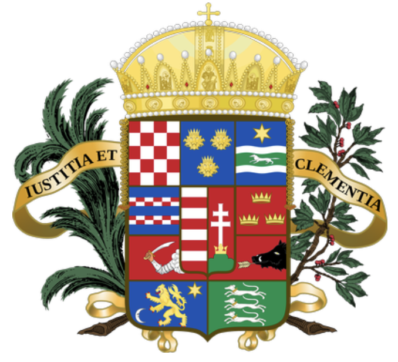
> Mária Terézia magyar királyi címere a Ratio Educationis címlapján

> A nacionalizmus számára fontos volt a nemzet eredetének meghatározása. A nemzeti büszkeség lényeges elemévé vált a nemzeti közösség történelme. Minél fényesebb, erősebb, hatalmasabb elődöket, birodalmakat tudhattak elődeiknek, annál nagyobb büszkeség töltötte el a megszülető nemzet tagjait. A történelmet, melyben a nemzeti kötődés korábban kevésbé játszott kiemelt szerepet, nemzeti szempontból tekintették át. Azoknál a népeknél, melyeknél egy országot, egy dinasztiát viszonylag könnyen azonosítani lehetett az új polgári nemzettel, ez nem okozott problémát. A franciák például a Francia Királyság történelmével azonosultak. (Persze itt is gondot jelentett, hogy vajon Nagy Károly a francia vagy a német történelem része-e.) Azok a népek, melyeknek korábban nem volt államuk (pl. soknemzetiségű birodalmakban éltek), most „megteremtették” vagy kiszínezték nemzeti történelmüket, hogy erőt merítsenek a „dicső múltból”.

- A nemzeti eszme fő célja a nemzet felemelése volt. Ezt leginkább a nemzetállam valósíthatja meg, melynek létrehozására törekedtek. Közép- és Dél-Európa nemzetei számára a példát a francia nemzetállam adta. A nemzeti eszme a korszakban szembetalálta magát a feudális nagyhatalmakkal, melyek sok népet, nemzetet fogtak össze, és politikájukat leginkább a birodalmak élén álló dinasztiák érdekei határozták meg. Így a nemzeti eszme gyakran összefonódott a társadalmi és politikai változást akaró liberalizmussal.
- A nacionalizmus számára kezdettől fogva problémát jelentett, hogy a nemzetállam létrehozása más nemzeti közösségek céljait és vágyait keresztezte. Így volt ez még a mintának tekintett és egységesnek tűnő Franciaország esetében is. Nemzeti ellentétekről Franciaországnál azért nem fogunk tanulni, mert a francia abszolutizmus már a nemzeteszme megszületése előtt beolvasztotta a franciák közé az ország területén élő népek többségét (pl. a Dél-Franciaországban élő provanszálokat). Másrészt a francia forradalom a jogkiterjesztésért cserébe megkövetelte polgáraitól, hogy franciák legyenek, s keményen fellépett azokkal szemben (pl. bretonok), akik ezt másképpen gondolták (ellenforradalmárnak bélyegezte őket).

> Nem volt ez másképpen a Brit-szigeteken sem. Wales és Skócia kelta lakossága jórészt elvesztette eredeti nyelvét, s a folyamat nem automatikus beolvadás révén jött létre. Skóciában, egy XVIII. századi angolellenes felkelés leverését követően (1746) betiltották a kelta skót nyelvet, a skót viseletet, és a rendelkezésnek véres erőszakkal szerzett érvényt az angol katonaság.

- Közép- és Kelet-Európában azonban a nacionalizmus elterjedése idején soknemzetiségű birodalmak léteztek. Az itteni népek nemzetté válásuk során gyakran szembekerültek egymással egy-egy terület vagy akár egy hagyomány miatt (pl. melyik nemzethez tartozott Hunyadi János).
- Előfordult, hogy a liberalizmus és a nacionalizmus bizonyos helyzetekben egymással ellentétes eszmét jelentett. A kortársak többsége, ha választani kellett, ugyan fontosnak tartotta a szabadságot, de ezt csak nemzete felemelkedésén keresztül tudta igazán megélni.

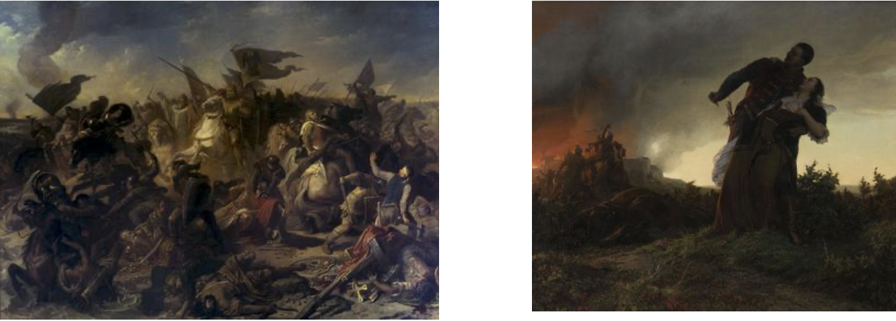
> Német történelmi festmény a magyarok legyőzéséről Augsburgnál (Michael Echter, 1860) és Székely Bertalan: Dobozi Mihály és hitvese (1861) című festménye. A XIX. században egész Európában sorra születtek a reprezentatív történelmi festmények

---

    
A KONZERVATIVIZMUS

---

- A francia forradalom ellenhatásaként fogalmazódott meg és vált eszmeáramlattá a konzervativizmus. A forradalmi terror, a régi értékek sokszor válogatás nélküli lerombolása, a vallásellenesség, a nagy áldozatokat követelő felesleges erőkifejtések következményeit látva a konzervatívok elutasították a forradalmi változások szükségességét. Általában elhatárolódtak a politikai fanatizmustól vagy vallási türelmetlenségtől. Nem hittek abban, hogy elvont eszmék alapján érdemes beavatkozni a társadalmak életébe, fejlődésébe. Tagadták a felvilágosodás és a liberalizmus azon gondolatát, hogy az emberek megváltoztathatók, és meg is kell őket változtatni. Az előzményekre, hagyományokra építő, fokozatos, s így a kiigazításokra is lehetőséget adó, az emberek által követhető szerves fejlődést, a reformokat állították szembe a forradalommal.
- A konzervativizmus első ideológusai (pl. a brit Burke) a francia forradalomról írt műveikben vázolták fel az új eszmerendszer alapgondolatait. A kiépülő alkotmányos rendszerekben a konzervativizmus is tiszteletben tartotta a polgári szabadságjogokat, ezért a liberalizmus alternatívájává vált.

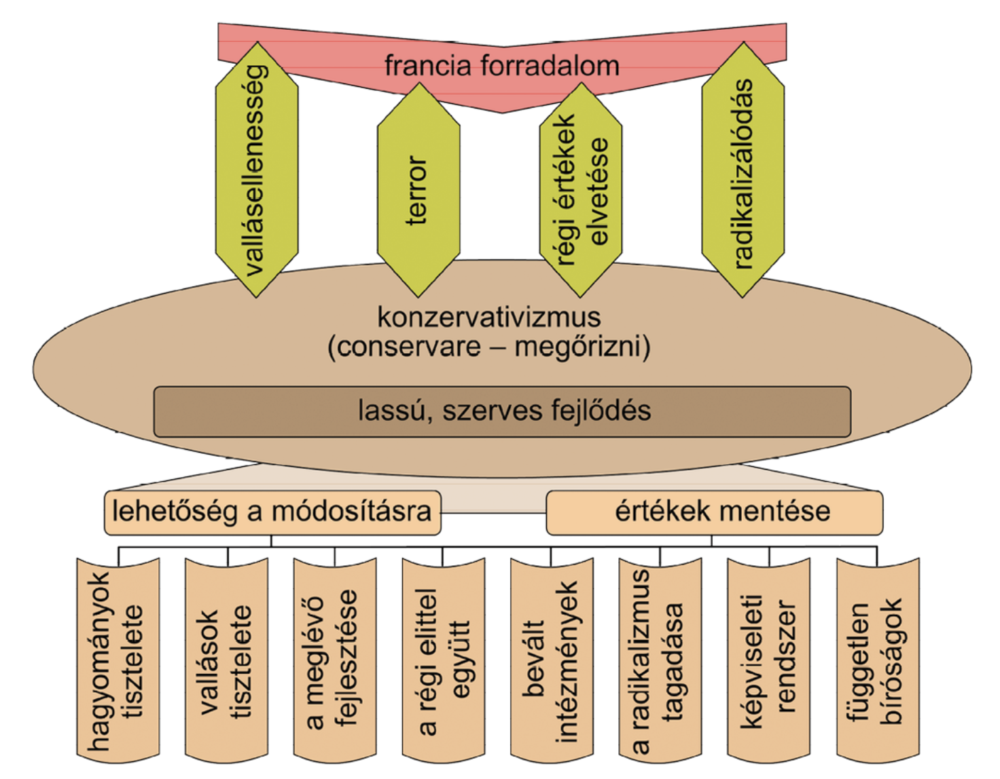
> A konzervativizmus leegyszerűsített ábrája

- A konzervativizmus, a XIX. század többi eszmeáramlatához hasonlóan, korántsem volt egységes. A konzervatív gondolkodók és híveik több alkalommal éles vitába keveredtek egymással. Ugyanakkor az irányzatra jellemző alapvető kérdésekben mégis hasonló álláspontot foglaltak el.

> A fogalom a latin ’conservare’ igéből származik (jelentése: megőrizni, megmenteni), mint néhány más szavunk is (pl. konzerv). A konzervativizmus ideológiai irányzatként nem azonos a sokszor szintén konzervatívnak nevezett – minden változást elutasító, a régihez mereven ragaszkodó – magatartással. A változatlanság hívei a feudális berendezkedés megtartásáért, a feudális dinasztiák birodalmának fennmaradásáért harcoltak a XIX. század első felében.
>
> Esősorban ehhez a csoporthoz számíthatjuk a bécsi kongresszustól az 1848-ig tartó európai történelem egyik legtehetségesebb diplomatáját, Klemens von Metternichet (1773–1859). Az osztrák császárságot szolgálva a forradalmi és nemzeti mozgalmakkal folytatott harcban telt az élete. Bár szándéka volt reformokat végrehajtani, ezeket nem tette meg, s 1848-ban a bécsi forradalom elől futva kellett menekülnie.

---

---

---

    
Az ipari forradalom hullámai

---

- Tételek:
    - Az első hullám: textilipar, bányászat, kohászat.
    - A közlekedés forradalma.
    - A gyár
    - Az ipari forradalmak társadalmi és környezeti hatásai.

---

    
AZ IPARI FORRADALOM FOGALMA

---

- Az 1780-as években Angliában kibontakozó gazdasági fellendülést, amely az iparszervezési és technikai újításoknak köszönhető, és folytonossá tette a gazdaság bővülését, ipari forradalomnak nevezzük. A gazdaság bővülése azóta is tart, de a történettudomány az ipari forradalom első szakaszát a gépeknek gépekkel történő előállításával lezártnak tekinti (pl. a mozdony sok alkatrészét már esztergagéppel állították elő). Ez Angliában 1850 körül következett be. Az ipari forradalom Angliából kiindulva a XIX. század második felében nyugatról kelet felé haladva átformálta egész Európát.

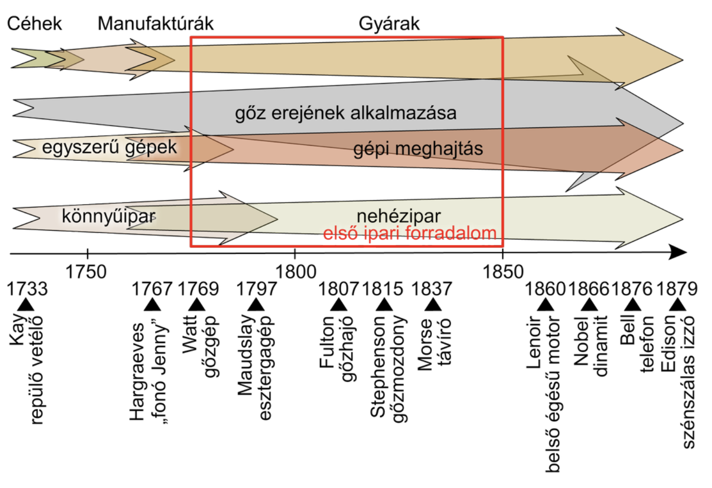
> Az ipari forradalom fogalma

> Az angol gazdaság és társadalom átalakulását az 1820-as években – a francia forradalmat követően – nevezték el ipari forradalomnak, és az elnevezés az 1880-as évektől vált általánossá. A kifejezés nem pontos. A gazdasági fejlődés felgyorsulása ugyanis szerves folytatása volt a már korábban megindult átalakulásnak (tehát nem volt forradalom), és lezárulását is csak önkényesen határozhatjuk meg, mivel a fejlődés nem állt meg.

---

    
AZ IPARI FELLENDÜLÉS

- Az iparban a XVII. században a céhes kereteket kikerülő s paraszti kiegészítő munkát alkalmazó felvásárlási-kiadási rendszer, majd a bérmunkásokat foglalkoztató központosított üzem, a manufaktúra terjedt el (lásd a 2. témát). A legnagyobb hasznot a gyarmati piacok bővülésével párhuzamosan a textilipar hozta. Emiatt ebben az iparágban bontakozott ki először a technikai fejlődés, a termelés növelése érdekében. Az egyszerű mechanikus gépeket a textíliák készítésének két alapvető folyamatában, a fonásban és a szövésben egymás után vezették be. A szövőgépek fejlődése megkívánta a fonás korszerűsítését, ami nagyobb mennyiségű fonalat eredményezett, amelynek feldolgozására a szövést ismét fejleszteni kellett.

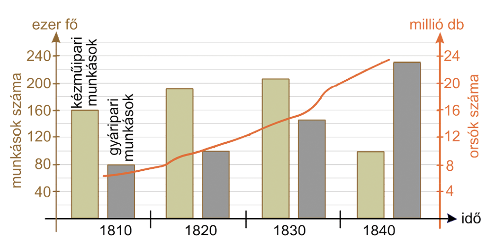
> A textilipar fejlődése Angliában. Az iparban dolgozók több mint negyedét a textilipar foglalkoztatta

> Az újításokat mesteremberek találták ki, akik többnyire maguk is az iparágban dolgoztak. (A találmányok megszületését segítette, hogy Angliában már létezett szabadalmi törvény.) Az egyszerű gépeket a korszak egyetlen jelentős erőforrásához, a vízikerékhez kapcsolták. A munkafolyamatot gépesítették, ugyanakkor a hagyományos erőforrás korlátozottan állt rendelkezésre.
>
> 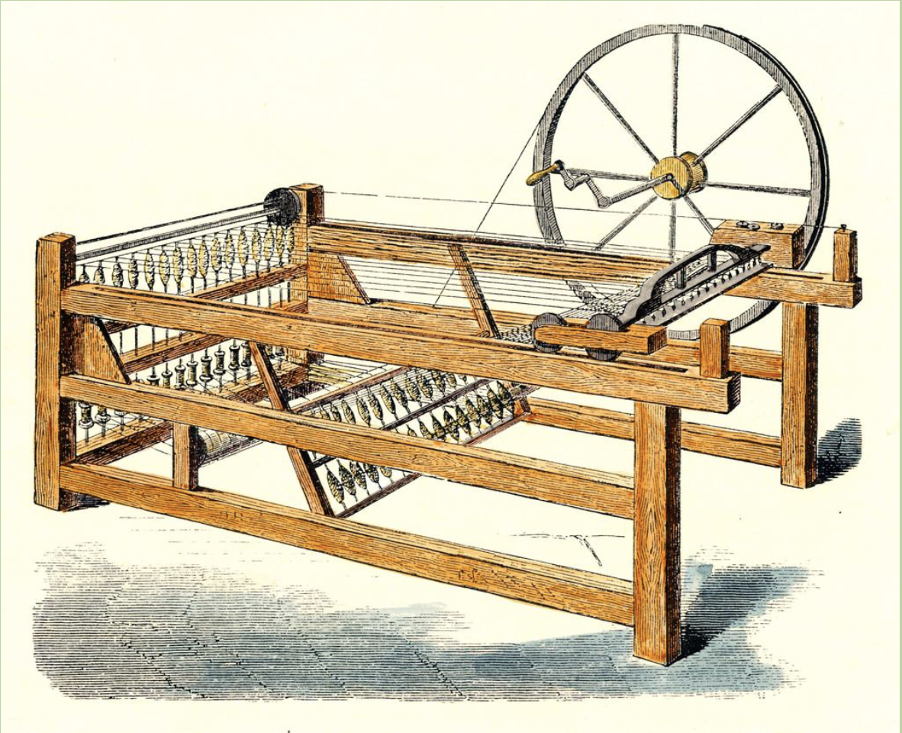
> James Hargreaves „fonó Jenny”-je 1764-ből

---

    
A GŐZGÉP ÉS HATÁSAI

---

- A szén alkalmazását Angliában egyrészt a jó természeti adottságok (felszínhez közeli gazdag szénmezők), másrészt a kényszer, a faállomány jelentős megfogyatkozása eredményezte a XVIII. században. A felszín közeli szenet azonban hamar kitermelték, és a mélyebb rétegekhez csak a felszín alatti vizek kiszivattyúzásával férhettek hozzá. A víz kiemelése a bányákból már a XVIII. század elejétől gőzszivattyúkkal történt, amelyeket fokozatosan tökéletesítettek. A gőzgépet James Watt fejlesztette a gazdaság minden ágában használható gépi erőforrássá (1769).

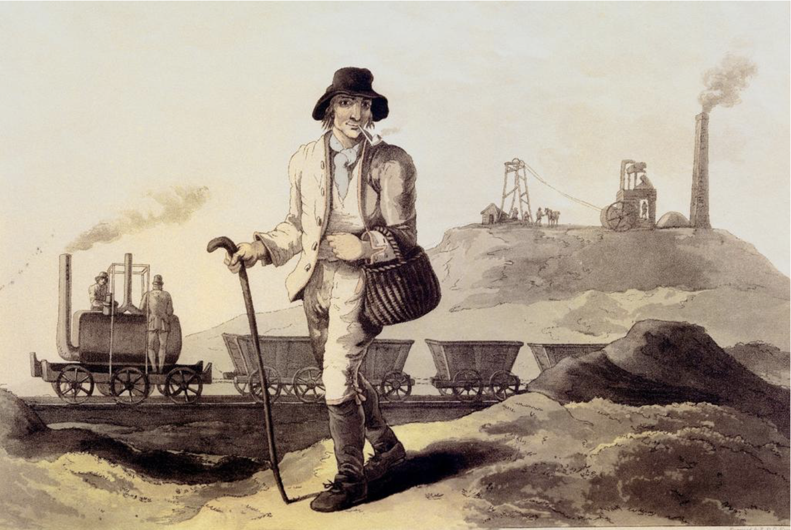
> Angol szénbánya az ipari forradalom kezdetén. A képen kétfajta gőzgép is látható: az egyiket vízszivattyúzásra használták, a másikkal a szén szállítását végezték

> James Watt dugattyús gőzgépet talált ki. Ennek lényege, hogy az energiát egy hengerben mozgó dugattyú adja, amelynek mozgását az ellentétes irányokból a hengerbe vezetett gőz biztosítja. Watt az erőátvitelt is tökéletesítette. Így a gőzgép biztonságosan és gyorsan dolgozott, és mérete is jelentősen csökkenthető volt.

- A hatékony erőgépet a textilipari alkalmazás (1781) során tökéletesítették. Megnyílt az út a széles körű ipari felhasználás előtt: fúrókat, fűrészeket, esztergákat hajtottak meg vele. A gőzgép lehetővé tette, hogy egy üzemben több gép, több munkás dolgozzon. Megjelentek a gépekkel termelő nagyüzemek, a gyárak.
- Amikor a gőzgépet a bányászatban használt sínekre tették, kész volt a korszak forradalmian új járműve: a gőzmozdony.

---

    
A KÖZLEKEDÉS FORRADALMA

---

A termelés bővülésével párhuzamosan a kortársak Nyugat-Európában mindent megtettek a közlekedés fejlesztése érdekében. Tisztában voltak azzal, hogy a piac bővítésének (a nyersanyagok beszerzésének, az áruk piacra juttatásának és új területek bekapcsolásának) alapvető feltétele a közlekedés fejlesztése. Jelentős csatornaépítésekre került sor, s a postahálózat kiépítésével a szárazföldi személyszállítás is fejlődött (postakocsik). Nagy árumennyiséget és sok embert azonban szárazföldön továbbra sem tudtak szállítani. Éppen ezért, bár a gőzhajózás előbb megszületett (Fulton, 1807), a gőzmozdony és a vasút hozta meg a közlekedés forradalmát. A sok fejlesztő közül a gőzmozdony (és a gőzmozdonyos vasúti vontatás) „feltalálását” egy angol mérnökhöz, George Stephensonhoz kötjük (1825).

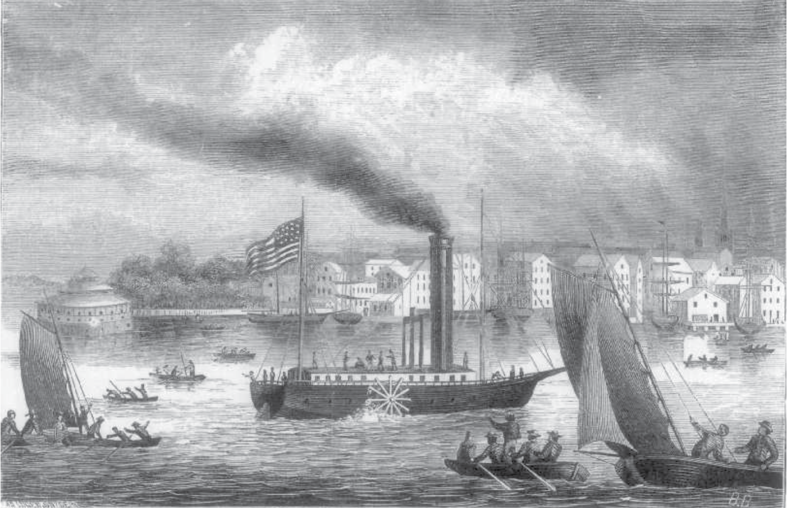
> Fulton gőzhajója. A gőzgép a hajó két oldalára szerelt lapátkerekeket hajtotta meg

- Az első vasútvonal sikeres üzeme után Nagy-Britanniában – és rövidesen a kontinensen is – óriási lendületet vett a vasútépítés, a vállalkozók jelentős tőkét fektettek az üzletágba. A vasút újabb és újabb területeket kapcsolt be a kereskedelem körforgásába. A vasútépítés beruházásigénye – a korábbi útépítésekhez mérten – óriási volt, emiatt a vasút a gazdaság húzóágazata lett. Minden iparágra fejlesztően hatott, de természetszerűleg a nehézipart, elsősorban a bányászatot, a vaskohászatot és a gépgyártást lendítette fel. Az ipari forradalom első hulláma rövidesen az Amerikai Egyesült Államokban is kibontakozott (pl. vasútépítés).

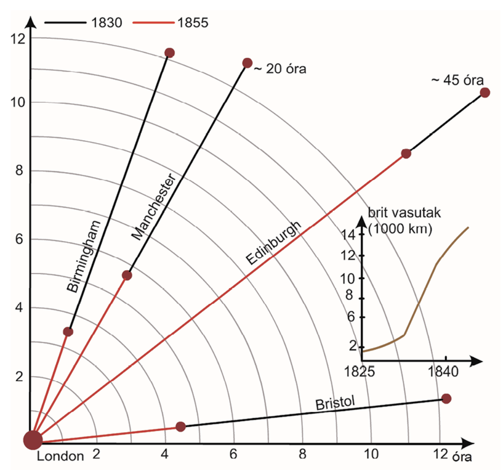
> Az utazási idő változása

---

    
A DEMOGRÁFIAI ROBBANÁS

---

- Nagy-Britanniában a mezőgazdaság fejlődése a lakosságszám rohamos gyarapodásával járt. A népességnövekedés üteme az ipari forradalom alatt tovább gyorsult. A folyamatot demográfiai robbanásnak nevezzük. A demográfiai robbanás oka az életkörülmények (élelmezés), a higiéniai viszonyok javulása és az orvostudomány fejlődése (pl. járványok elleni oltások bevezetése). A demográfiai robbanás feltétele, s ugyanakkor következménye is az ipari forradalomnak, és ahhoz hasonlóan a folyamat nyugatról kelet felé terjedt el a korszakban.
- A XIX. századi demográfiai robbanás – a korábbi népességnövekedéshez hasonlóan – a halálozási arány csökkenésével indult meg. A folyamat azonban a korábbiaktól eltérően alakult, mivel most a népességnövekedés mérséklődését is a gazdasági fejlődés váltotta ki. A higiénia és az életkörülmények javulásával párhuzamosan a születések száma egy-két nemzedék múlva csökkenni kezdett. A gyermekhalandóság csökkenésével ugyanis a családok kevesebb gyermek vállalásával is biztosítani tudták a nemzedékek folytatását. A népességnövekedés mérséklődésében jelentős szerepet játszott a mezőgazdasági népesség fogyása is, hiszen számos tényező miatt (pl. a gyerekek munkaerőt jelentettek) a születésszám a falvakban magasabb volt, mint a városokban.

---

    
VÁROSIASODÁS

---

- A népességrobbanás és a mezőgazdasági népesség elvándorlása óriási népességmozgást (migráció) indított el. (A mezőgazdaság ugyanis egyre kevesebb embernek nyújtott megélhetést, mert egyre kevesebb munkáskézre volt szükség a gépesítés miatt.) Országon belül a falvakból és a kisebb városokból a nagyobb ipari városokba költöztek az emberek. Emellett tömegek vándoroltak ki, elsősorban Amerikába. A népességrobbanás kelet felé haladt Európában, s ezzel párhuzamosan a kivándorlási hullámba is egyre keletebbi területek kapcsolódtak be.
- Akik nem vándoroltak ki, azok a városokban telepedtek le. Évtizedek alatt százezres, milliós városok jöttek létre a gazdaságilag fejlődő területeken. Ilyen volt például a textiliparáról híres angliai Manchester. A fejlettebb nyugati országokban a városlakók már a népesség nagyobb részét tették ki. Különösen a nagyvárosok népességszáma emelkedett. Amerika keleti parti városainak, például New Yorknak a lakosságát pedig a bevándorlók százezrei duzzasztották fel.
- A nagyvárosok sajátos életformát és életkörülményeket biztosítottak. Hatalmas embertömeg ellátását, közlekedését kellett megoldani, és javítani kellett a higiéniai viszonyokat. Szükség volt lakások ezreinek felépítésére, tiszta ivóvízre és szennyvízcsatornákra és a hatalmas mennyiségű városi szemét elszállítására.
- Ez nem ment egyik napról a másikra, így a szegények tömegei nyomornegyedekbe kényszerültek. A városok növekedésével és az új funkciók megjelenésével sajátos arculatú városrészek jöttek létre (kereskedelmi, üzleti, ipari negyedek). Átalakult a hagyományos városszerkezet. A méretek növekedésével párhuzamosan felerősödött a nagyvárosok negyedeinek feladatkör szerinti elkülönülése. Ez együtt járt a lakosság társadalmi, néhol etnikai elkülönülésével, amit szegregációnak nevezünk. Az egykori városmagok igazgatási és kereskedelmi központokká váltak (city), melyeket ipari és lakónegyedek vettek körül. A lakóhely és a munkahely elkülönülése hatalmas embertömegek napi mozgását igényelte, mely a tömegközlekedés kialakulásához vezetett (villamos, autóbusz, majd földalatti).

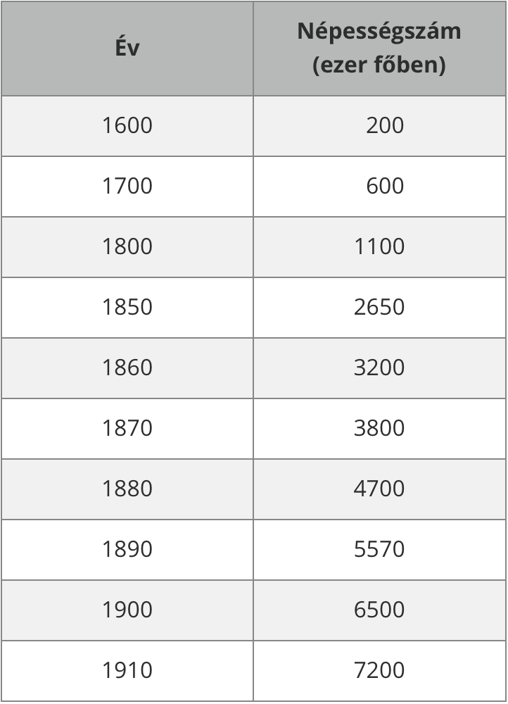
> London népességének alakulása (ezer főben) 

---

    
AZ IPARI FORRADALOM ÚJABB HULLÁMA

---

- Az ipari forradalom a XIX. század második felében átformálta egész Európát és az Amerikai Egyesült Államokat. A folyamatos gazdasági és technikai haladás a század végéhez közeledve újabb erőteljes fellendüléshez vezetett.
- A fejlődés motorja ekkor már a nehézipar (vasipar, gépgyártás, vegyipar). A fejlesztések egyre szorosabban kötődtek a tudományos eredményekhez (elektrotechnika, vegyészet stb.), amelyek új eljárások, új energiahordozók, új erőgépek és anyagok alkalmazását tették lehetővé. Az iparban és a bankvilágban felhalmozott hatalmas tőkék segítségével lehetőség nyílt az újítások ipari alkalmazására. A gazdaság újabb, jelentős társadalmi és életmódbeli változásokat hozó nekilendülését szokás második ipari forradalomnak nevezni.

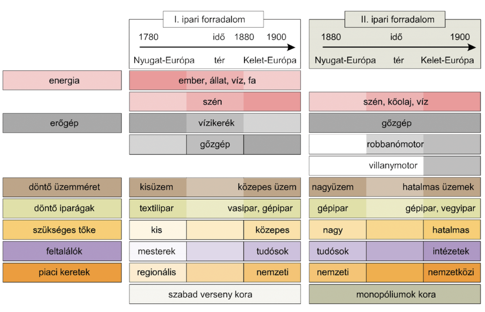
> Az „első” és a „második” ipari forradalom

---

    
AZ IPAR

---

- A XIX. század végének alapvető energiaforrását még mindig a szén jelentette, és alapanyagként elsősorban a vasat használták. A vasat azonban egyre több helyen váltotta fel az acél, melyet új, hatékonyabban működő kohókban állítottak elő (Bessemer, Thomas, Martin). A hatékonyságot az üzemméretek folyamatos növelésével is fokozták.
- Ebben az időben a gőzgépekből hatalmas teljesítményeket hoztak ki: a mozdonyok 100 km/órás sebességgel robogtak, a gőzhajók néhány nap alatt átszelték az óceánt. A korszak új energiaforrása a kőolaj, új erőgépe a belső égésű motor (Otto, Daimler, Benz). A kőolaj megjelenése ösztönzést adott a vegyiparnak (kőolaj-finomítás), a robbanómotor a közlekedés fejlődésének. A XX. század elejére az autógyártás már nagyipari méreteket öltött, s megkezdődött a repülés fejlesztése (az amerikai Wright testvérek, 1903).
- A gépkocsi a XX. század elején még csak kevesek számára volt elérhető, de a század második évtizedében már megjelent a tömegtermelése, ami új termelési módszerek és eljárások kialakulásához vezetett. Amerikában a Henry Ford alapította cég valósította meg elsőként a tömegtermelés új, termelékenyebb formáját, a szalagrendszert. A szalagrendszer jól mutatja a második ipari forradalom jellemzőit: létrehozása hatalmas tőkét igényelt, bevezetése a kisgépek nélkül lehetetlen lett volna, a munkához szükséges fényt izzólámpák szolgáltatták, a rendszer termelékenysége révén olcsóbbá váltak az áruk, ezáltal bővült a piac, vagyis további termelésre sarkallt.

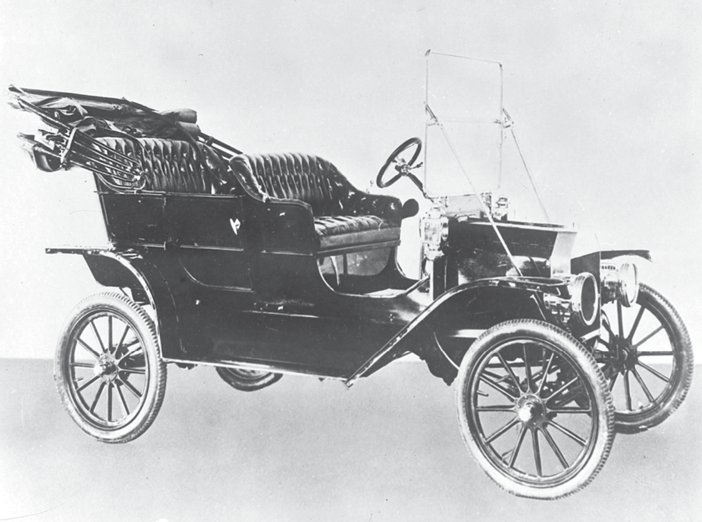
> A T-modell, mely a Ford gyárat nagyvállalattá tette (1908). Az autót jórészt a makói születésű Galamb József tervezte. A modellből a gyártás befejezéséig (1927) több mint 15 millió darabot adtak el

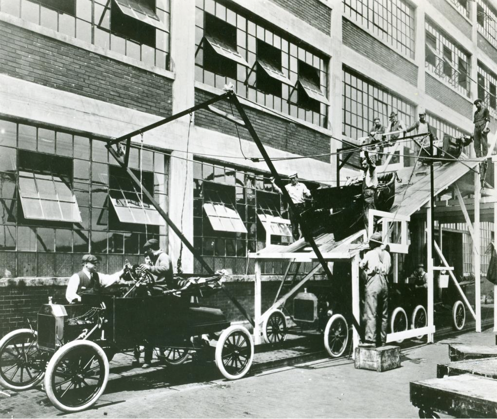
> Termelés futószalaggal. Először a kohászatban és az autógyártásban alkalmazták. Henry Ford véleménye a bérekről: „A megfelelő bér nem a legalacsonyabb összeg, amiért egy ember még hajlandó dolgozni, hanem az a legmagasabb összeg, amit a vásárló még tartósan meg tud fizetni.”

- A XX. század elején teret hódított az elektromosság. A villamos árammal megoldották a világítás − Thomas Edison találmánya, a szénszálas izzólámpa (1879) révén − és az energia olcsó továbbításának kérdését. A hatékony és szakaszosan működtethető villanymotorok jól beváltak különféle üzemek erőforrásaként, de alkalmasak voltak kis méretű gépek meghajtására (pl. kézi fúrógép) is. Az elektromosság tette lehetővé a hírközlés gyors ütemű fejlődését (Bell – telefon, Marconi – drót nélküli távíró).

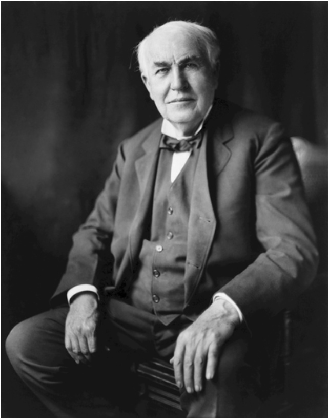
> Thomas Alva Edison (1847–1931) amerikai feltaláló és üzletember. A technikai fejlődés lázában égő korszak kiemelkedő alkotója, több mint ezer találmány fűződik a nevéhez a mikrofontól a fonográfon, a filmkészítésen át az izzólámpáig. Találmányaihoz kapcsolódva vállalkozásokat hívott életre

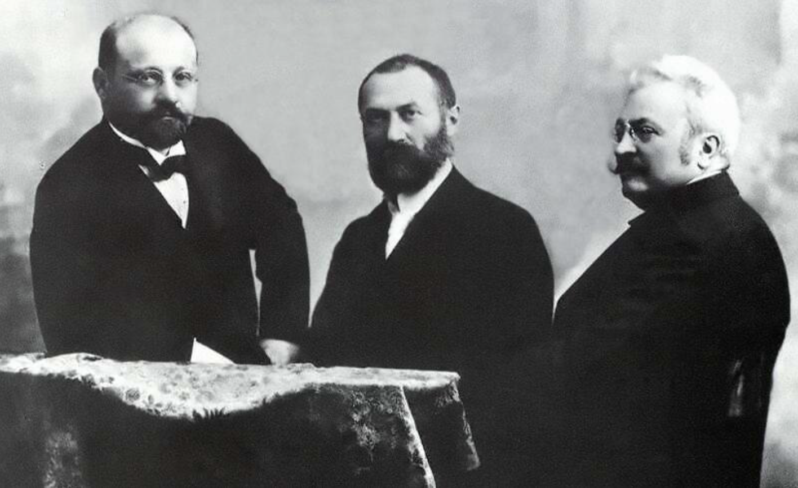
> Déri Miksa, Bláthy Ottó és Zipernowsky Károly a Ganz gyár mérnökei. Nevükhöz fűződik a első ipari alkalmazásra alkalmas transzformátor elkészítése. Ez lehetővé tette, hogy az elektromos áramot nagyobb távolságra is elszállítsák. 1885-ben szabadalmaztatták

- A korszak találmányai fejlesztőleg hatottak egymásra. Az elektromos áram alkalmazása a világítás révén biztosította a három műszakos termelést és a futószalagok működését, a belső égésű motor feltalálása az autó gyártását stb. A dinamit feltalálása (Nobel, 1866) a bányászatot, a vegyipart és a hadiipart egyszerre forradalmasította. S mindezek együtt a tömegtermelés következtében a fogyasztás növelését eredményezték.

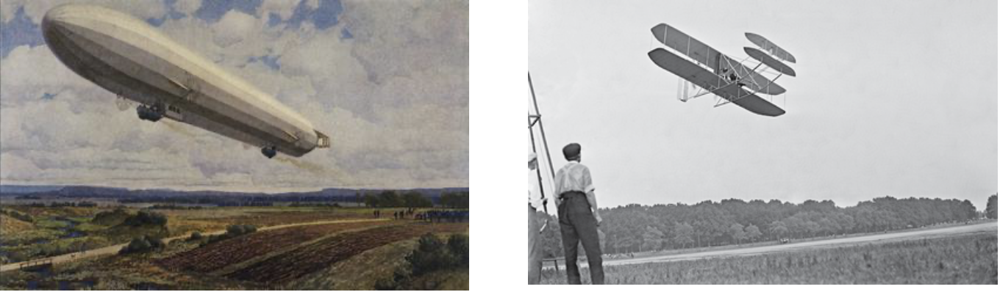
> A repülés két útja: a léghajó, a német Zeppelin találmánya (1900), és az amerikai Wright-testvérek repülőgépe (1903)

---

    
ÚJ IPARSZERVEZÉSI MÓDSZEREK

---

- Az ipar a XIX. század hetvenes évei előtt jórészt a szabad verseny keretei között fejlődött. A versenyben a gyengék kiestek és a hatékonyak megerősödtek, ezáltal a gazdaság növekedett. A gazdasági harcnak voltak áldozatai: a verseny vesztesei tönkrementek, és folyamatosan jelen volt a munkanélküliség. Az utcára került emberek csak lassan tudtak a gazdaság bővülése révén kialakuló új munkahelyeken elhelyezkedni. A közgazdaság-tudomány szabad versenyes kapitalizmusnak nevezi ezt a korszakot.
- A második ipari forradalom beruházásai hatalmas tőkéket igényeltek. Ezek úgy jöttek létre, hogy a versenyben erősebbek egyre több vállalkozást olvasztottak magukba (a tőke koncentrációja), vagy a bankok is betársultak a vállalatokba (finánctőke). A nagyvállalatok ugyanakkor – a versenyt is korlátozva – szövetségre léptek egymással, monopóliumokat hoztak létre. A kapitalizmus ezen korszakát a monopóliumok korának (monopolkapitalizmusnak) nevezzük.

> A monopóliumok sokfélék lehettek: a legegyszerűbb formában csupán a piacot osztották fel és az árakat egyeztették (kartell), de gyakori volt a vállalatok teljes összeolvadása (tröszt). A monopóliumok már kevésbé kötődtek a nemzeti piachoz. Ott fektettek be, ahol a legkedvezőbb feltételek kínálkoztak (nyersanyag, piac, olcsó munkaerő), így jelentős szerepet játszottak a tőkekivitelben.
>
> A monopóliumok élén sokszor régi, még többször újonnan felemelkedett családok álltak (Rockefellerek, Fordok, Kennedyk), akiknek a kezében hihetetlen nagy gazdasági, és így politikai hatalom is összpontosult.

---

    
A TÁRSADALOM ÉS A TERMÉSZET ÁTALAKULÁSA

---

- Míg a XIX. század első felében Nyugat-Európában a munkásság létszáma emelkedett, addig a század második felében a kereskedelem, a szolgáltató ágazatok és az oktatás bővülésével az alkalmazotti rétegek és a középosztály gyarapodása indult meg. A lakosságon belül a középosztály aránya már gyorsabban nőtt.
- Közép- és Kelet-Európában a két ipari forradalom közel egy időben jelentkezett, így a változások gyorsan zajlottak le. Ezért a régi és az új társadalomszerkezet egymás mellett, egymással összefonódva létezett (ún. torlódó társadalom). A földbirtokosok számtalan előjogot élveztek, a tőkés vállalkozók és a földbirtokosok, valamint a parasztok és a munkások között jellemzőek az átmeneti helyzetű rétegek.
- Az ember évezredek óta alakítja a természetet. Európában például a középkortól a kora újkorig is jelentős erdőségeket irtottak ki a szántóföldek érdekében. Az ipari forradalmak azonban a gazdaság robbanásszerű fejlődése mellett a környezeti terhelést is hasonló ütemben növelték. A korszakban az üzleti haszonért (profitért) folytatott versenyben nem törődtek a környezetet ért károkkal se a bányák nyitásánál, se a közlekedés kiépítésénél. A népesség növekedése, a városok terjeszkedése, a vízvezetékek kiépülése és más vívmányok elszennyezték a vizeket és a levegőt. Ugyanakkor a gazdaság fejlettsége és az emberek szemlélete még nem tette lehetővé a környezet megkímélését.

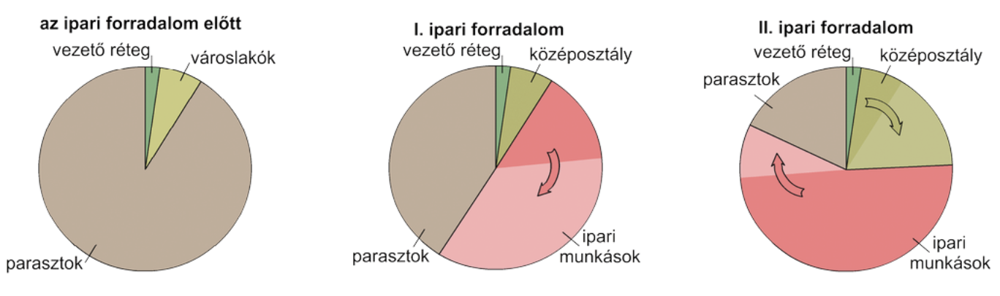
> A társadalmi tagozódás változásai Nyugat-Európában

---