---

[Vissza](./ev-vegi-vizsga.md)

---

    
A Rákóczi-szabadságharc

---

- Magyarország a Habsburg Birodalomban.
- A szabadságharc okai és céljai.
- A szabadságharc politikai és katonai fordulópontjai.
- A szatmári béke kompromisszuma.

    
Erdély betagozódása a habsburg birodalomba

---

- A meggyengült Erdélyt – a tizenöt éves háborúval ellentétben – nem vonták be a török elleni harcba. Ahogy a két nagyhatalom (a Habsburg és az Oszmán Birodalom) közötti egyensúly – amely létrehozta a különálló Erdélyt – megszűnt, az önálló fejedelemség sorsa is megpecsételődött. Buda bevételét követően Lotharingiai Károly hadai megszállták Erdélyt (1687). Apafi Mihály fejedelem kénytelen volt átadni a várakat és hadisarcot fizetni (balázsfalvi szerződés).
- Apafi halála után (1690) I. Lipót lett Erdély fejedelme. Oklevélben biztosította a fejedelemség hagyományainak, a felekezeti, a rendi és a tulajdonviszonyoknak a tiszteletben tartását (Diploma Leopoldinum, 1691). Erdélyt közigazgatásilag nem egyesítették Magyarországgal, mert ezt ekkor sem az uralkodó, sem az erdélyi rendek nem akarták. I. Lipót nem kívánta erősíteni a magyar rendeket, a rendek pedig féltek szabadságaik elvesztésétől. A korszakban ugyanis a magyarországi felekezeti és rendi jogok sokkal korlátozottabbak voltak az erdélyieknél. A jövőben a fejedelemséget az erdélyi arisztokraták közül kinevezett kormányzó (gubernátor) irányította a király nevében (a székhelye Nagyszeben volt). Az önálló erdélyi hadsereg megszűnt, a fejedelemségben a császári haderő alakulatai állomásoztak.

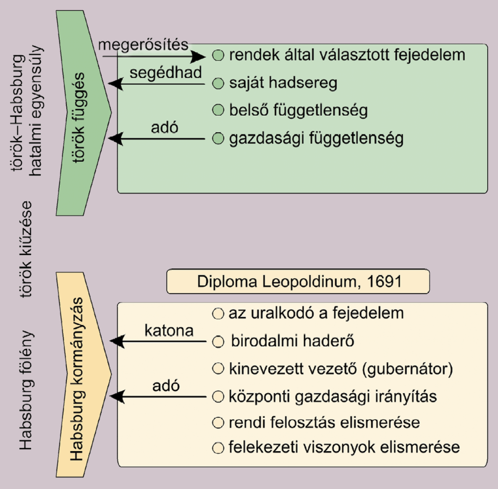
> A Diploma Leopoldinum sematikus ábrája

---

    
A határőrvidék

---

- Amikor a felszabadító háború már Belgrádtól délre zajlott, a szerbek (akiket a korban rácoknak neveztek) egy része fellázadt a törökök ellen, és a császáriak mellé állt. Amikor a törökök ismét előretörtek, a felkelt rácok közül sokan Magyarországra menekültek, Csernovics Arzén ipeki pátriárka vezetésével. I. Lipót (1657–1705), hogy helyzetüket rendezze, kiváltságlevelet adott számukra. Ennek értelmében a szerb pátriárka lett a birodalmon belüli ortodox vallásúak vezetője. Egyházuk független maradhatott, elöljáróikat maguk választhatták meg.
- A rácok többségét a török határ mentén (a Bácska és a Bánság déli részén) kialakított ún. Határőrvidéken telepítették le. A Határőrvidék területét közigazgatásilag nem csatolták vissza a vármegyékhez, nem kapták vissza az itteni földeket az egykori birtokosok örökösei. A határőrvidék közvetlenül az Udvari Haditanács igazgatása alá tartozott. A szerbek szabad parasztokként élhettek, de katonai szolgálatot kellett ellátniuk.
- A Határőrvidék létrehozása sértette a rendeket, hiszen ezzel nem állt helyre az ország egysége, és az itteni földeket is elvesztették. Sértette a magyar katonáskodó réteget is, akiket nem alkalmaztak a határőrvidék végváraiban. Lipót azonban így a rácokban a Habsburgokhoz feltétlenül hű katonaréteget hozott létre, melyet a magyar rendek ellen is felhasználhatott.
---

    
A rendek és az uralkodó

- A törököket Lipót csapatai űzték ki az országból, ezért a rendek és az uralkodó közötti egyensúly még inkább az uralkodó javára billent. A Buda visszafoglalása után megtartott országgyűlésen (Pozsony, 1687) a rendek lemondtak szabad királyválasztási jogukról és az Aranybulla ellenállási záradékáról.

> A szabad királyválasztásról történő lemondás jelentős lépés volt. A rendek már korábban is kimondták (1547-ben), hogy „örök időkre” alávetik magukat a Habsburgok „uralmának és hatalmának”, és a Habsburgok folyamatos uralkodása a XVI. század közepe óta gyakorlatilag soha nem került veszélybe. Az 1687-es törvény viszont pontosította, hogy az elsőszülött fiú lesz a magyar király, tehát a rendek a Habsburg-ház tagjai közötti választásról is lemondtak. Hangsúlyozni kell azonban, hogy a rendek a koronázást továbbra is a rendi jogok biztosítására tett esküvel kötötték össze.

- Az 1687-es országgyűlésen I. Lipót elismerte, hogy a felszabadított területek a Magyar Királyság részét képezik. Az udvar azonban a magyar rendiség visszaszorítása és a katolicizmus terjesztése mellett a hosszú háborúskodás miatti anyagi csőd kezelésére is törekedett. A volt hódoltság területét ezért nem kapcsolták vissza automatikusan a magyar vármegyékhez, hanem új szerzeménynek, fegyverrel meghódított földnek minősítették, s az Udvari Kamara irányítása alá helyezték. A magyar birtokosok őseik földjeit csak abban az esetben kaphatták vissza, ha az Újszerzeményi Bizottság (Neoacquistica Comissio, 1690–1709) előtt hitelesen, okmányokkal igazolták tulajdonukat, és megfizették a birtok értékének 10 százalékát kitevő fegyverváltságot.

> A fegyverváltság és a birtokhoz való jog igazolása természetesnek tűnik, hiszen a dinasztia hatalmas összegeket fordított a török elleni felszabadító háborúra, másrészt érthető, hogy csak a jogosultak kaphatták meg a birtokokat. Az adománylevelek azonban a másfél évszázados török uralom háborúi alatt elveszhettek. A másolatokat kiállító hiteles helyek egy része a háborúk során porig égett. A köz- és kisnemeseknek pedig nem volt pénzük a fegyverváltság kifizetésére.

A magyar nemesség érdekeit ezek az intézkedések sértették, mert csorbították a rendi jogokat (megyék mellőzése), és anyailag is előnytelen volt számukra. Olaj volt a tűzre, hogy a katolikus egyház teher nélkül kapta vissza birtokait, és az udvar a hadseregszállítókat jórészt magyarországi birtokokkal fizette ki. Igaz, a birtokadományokból az arra érdemesnek tartott magyar főurak is részesedtek.

A török háborúk végével a volt végvári vitézeket és más fegyvereseket szélnek eresztették, s e korábban kiváltságokat élvező társadalmi csoportokat jobbágyi sorba kívánták taszítani, akárcsak a kunokat és a jászokat. A háború által megnyomorított országban az adókat megemelték, de a garázdálkodó katonák ennek többszörösét beszedték, kizsarolták ellátásuk (porció) ürügyén. Mindez szinte az ország egészét szembeállította a Habsburg-dinasztiával.

---

    
Rákóczi Ferenc gyermekkora

---

> II. Rákóczi Ferenc (1676–1735) ősei között a magyar főnemesség legjelentősebb családjait és számos fejedelmet találunk. Az apai ág több kelet-magyarországi főnemesi család tagjait (pl. Báthoryak), az anyai ág nyugat-magyarországi családok tagjait foglalta magába. Miután édesapja, I. Rákóczi Ferenc korán elhunyt, Zrínyi Ilona házasságot kötött Thököly Imrével (1682). Nevelőapja mellett Rákóczi már gyermekként megismerte a kuruc hadakat. Édesanyja mellett volt, amikor a császáriak hosszan (több mint két évig) ostromolták Munkácsot. A vár feladása után elszakították a családjától. Egy csehországi jezsuita kolostorban nevelkedett, majd ifjúként térhetett vissza országrésznyi birtokaira.

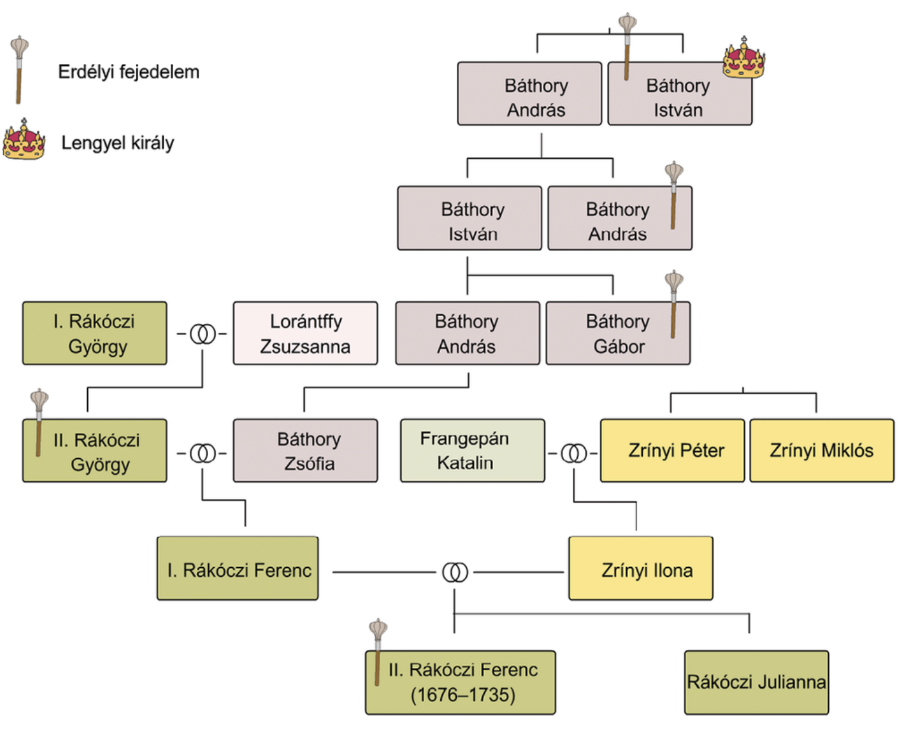
> II. Rákóczi Ferenc családfája

---

    
Az összeesküvés

---

- Az ifjú Rákóczi a Tokaj-Hegyalján (amely Rákóczi-birtok volt) kitörő kuruc felkelés elől (1697) Bécsbe menekült, nehogy az udvar előtt gyanúba keveredjék. Miután leverték a lázadást, hazatért. Birtokos szomszédja, Bercsényi Miklós felvidéki főnemes döbbentette rá a magyarországi Habsburg-uralom visszásságaira, és arra, hogy családi hagyományai miatt mit vár el tőle a nemesség és az ország.
- Bercsényivel szervezkedésbe kezdtek. Bár a lakosság jó része elégedetlen volt az uralkodóval, az ország erejét elégtelennek ítélték egy felkeléshez. Rákóczi a Habsburgok régi ellenségéhez, XIV. Lajos francia királyhoz fordult, leveleit azonban elfogták, s emiatt letartóztatták őt. Bécsújhely börtönéből (ahol nagybátyja, Zrínyi Péter is raboskodott a kivégzése előtt) kalandos módon menekült el a lengyelországi Brezánba.

---

    
A spanyol örökösödési háború (1701–1714)

---

- A harmincéves háborút követően XIV. Lajos Franciaországa folytatta a terjeszkedést a Rajna mentén. A franciákat a Habsburgok igyekeztek megállítani, ami több háborút eredményezett. A török miatt a Habsburgok kétfrontos háborúra kényszerültek, amit a franciák kihasználtak, s rendre hátba támadták a törökkel küzdő dunai monarchiát. A török meggyengülése és a Habsburg Birodalom hadseregének megerősödése azonban a XVII. század végén lehetővé tette, hogy a Habsburgok kiűzzék a törököket Magyarországról. Ezáltal erejük jelentősen megnőtt, és már a törökkel sem kellett oly mértékben számolniuk.
- Miután kihalt a spanyol Habsburg-ház (1700), XIV. Lajos és I. Lipót – a dunai Habsburg Birodalom (amelyet Ausztriának is neveztek) uralkodója, aki a császári címet is birtokolta – egyaránt a saját örökösét kívánta a spanyol trónra ültetni. A francia hegemónia veszélye miatt azonban ekkor a protestáns Anglia és Hollandia is a Habsburg-jelölt, Károly főherceg mögé állt.
- Kezdetben a francia seregek törtek előre, az osztrák és angol csapatok győzelme (Höchstädt, 1704) azonban megfordította a helyzetet. Hosszú, kiegyenlített küzdelem után a franciák kimerültek, és több csatában is vereséget szenvedtek.
- Az I. Lipót halála után trónra kerülő I. József rövid uralkodást követően meghalt (1711), így Ausztria uralkodója is Károly főherceg lett (német-római császárként VI., magyar királyként
III. Károly). A tengeri hatalmak (Anglia, Hollandia) azonban nem kívánták azt sem, hogy Ausztria és Spanyolország egy uralkodó alatt egyesüljön. Ezért a megszülető békében (Utrecht, 1713) XIV. Lajos unokáját ismerték el spanyol királynak, de Spanyolországot nem egyesíthette Franciaországgal.

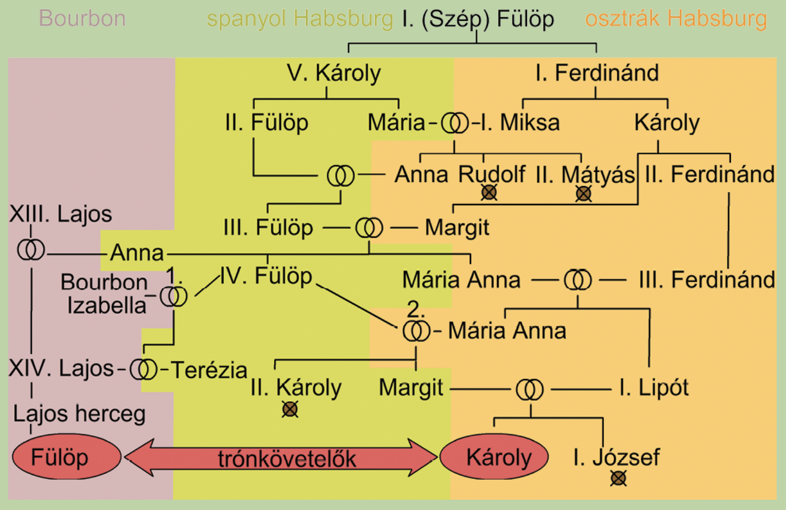
> A spanyol trón öröklése

- A Habsburgok egy évvel később kötöttek békét a franciákkal. A spanyol örökségből Ausztria megszerezte Spanyol Németalföldet, Milánót és Nápolyt, ugyanakkor Franciaország Elzászt.

---

    
A szabadságharc kitörése

- A magyarországi Habsburg-ellenes mozgalom lehetőségét a spanyol örökösödési háború teremtette meg, mivel az országból kivonták a császári hadsereg jelentős részét. Emiatt fogadta el Rákóczi a Brezánba érkező Tisza-vidéki felkelők felkérését: hazatért és a Habsburg-ellenes felkelés élére állt.
- Rákóczi tisztában volt azzal, hogy mozgalma, melynek célja a Habsburgoktól független Magyarország megteremtése volt, csak akkor lehet eredményes, ha egy táborban tudja tartani a nemességet és a jobbágyságot. A néphez intézett kiáltványaival sikerült megfékezni a parasztok túlkapásait és a nemességet meggyőzni arról, hogy nem parasztfelkelés élére állt. A katonának álló jobbágyoknak hajdúszabadságot ígért, a nemeseket pedig azzal nyerte meg, hogy a mozgalom zászlajára tűzte a rendi sérelmek orvoslását. A nemesség csatlakozását követően a kuruc hadak a nagyobb várak kivételével elfoglalták a Felvidéket és a Tiszántúlt.

> Rákóczi a csatlakozó jobbágyoknak (és közvetlen családtagjaiknak) mentességet ígért a földesúri szolgáltatások alól (vetési pátens, 1703). Ugyanakkor fellépett a nemesi udvarházakra törő felkelők ellen (gyulaji pátens, 1703), hiszen a szabadságharc sikere múlott azon, hogy a jobbágyság és a nemesség is csatlakozzon a mozgalomhoz. Az egyensúly fenntartása nem volt könnyű, s Rákóczinak mindvégig figyelnie kellett erre. Problémát okoztak a felekezeti ellentétek is. A katolikus fejedelem sikerrel szabott határt kálvinista katonái katolikusokkal szembeni erőszakos fellépéseinek, és a felekezeti ellentéteket háttérbe tudta szorítani.

- A korszakban az etnikai ellentétek még nem voltak jellemzőek. A magyarországi népek jelentős része felsorakozott a kuruc mozgalom mögött. A szerbek (rácok) azonban szembefordultak Rákóczival. Ennek hátterében elsősorban politikai okok húzódtak. I. Lipót mintegy százezer szerbet telepített le a török határ mentén, az újonnan szervezett Határőrvidéken, s kiváltságokat biztosított számukra. Itt a nemesek nem kapták vissza birtokaikat, a terület az Udvari Haditanács irányítása alatt állt. Ezért a szerbek a magyar mozgalommal szemben a kiváltságaikat féltették és védték.

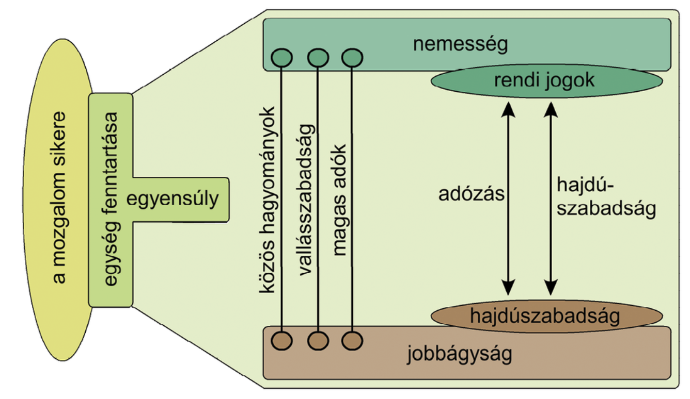
> Egyensúly a Rákóczi-szabadságharcban részt vevő társadalmi csoportok között

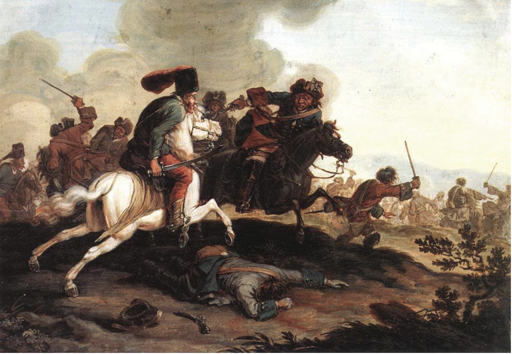
> A kuruc és a császári lovasság összecsapása

---

    
A kuruc hadsereg

---

- A kuruc hadsereg gyorsan megszerveződött. (Létszáma 1705 és 1708 között 75 000 fő körül mozgott.) A haderő magját a török kor háborúiban edződött egykori kurucok adták. Ennek megfelelően a sereg ellenállhatatlan volt a portyákban, a rajtaütésekben. Kevésbé volt alkalmas összehangolt fegyelmet kívánó nagyobb csaták megvívására; ezeket a kurucok rendszerint elveszítették (pl. Nagyszombat, 1704; Zsibó, 1705). A magyar katonaság harcértéke – ahogyan a töröké is – kisebb volt, mint a reguláris császári seregé. Rákóczi a fegyelem fokozásával, tisztképzéssel, a felszerelés fejlesztésével igyekezett javítani a helyzeten, alapvető változást azonban nem tudott elérni.

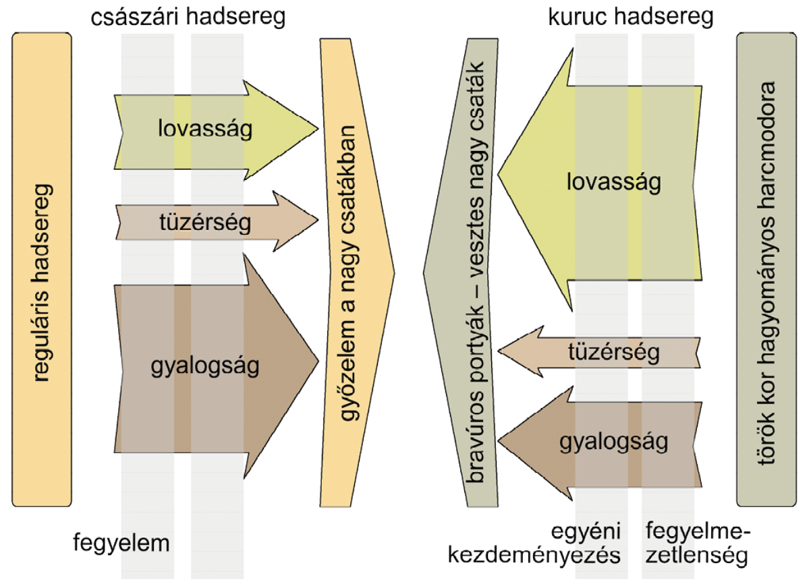
> A kuruc és a császári hadsereg közti különbségek

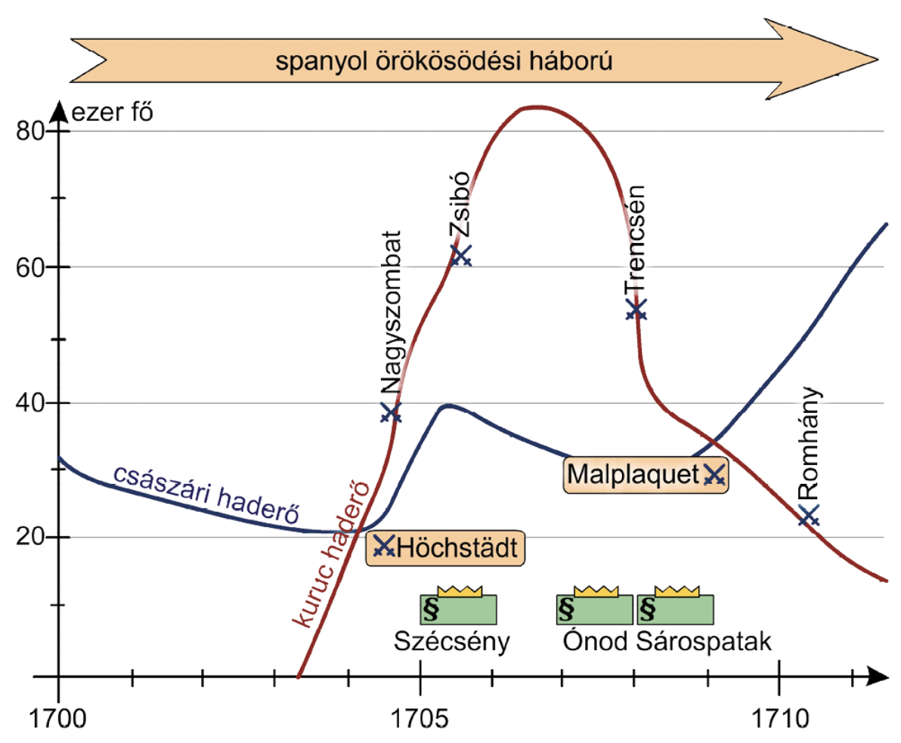
> A magyarországi kuruc és császári hadak létszámának alakulása

> A XVII. század során jelentősen fejlődtek az európai hadseregek. Az abszolutista uralkodók az állam megnövekedett bevételeit felhasználva állandó hadseregeket hoztak létre. Ezek a hadseregek (az időszakokra összetoborzott zsoldoshadseregekkel ellentétben) állandóan fegyverben voltak. A hadsereget toborzással töltötték fel. A katonákat kiképezték, kaszárnyákban laktak, egyenruhát és fizetést (zsoldot) kaptak. A szolgálati idő hosszú volt. Kialakult a hadsereg állandó szervezete, megjelentek a különböző rendfokozatú tisztek, a hadseregen belül a különböző fegyvernemek (pl. gyalogság, lovasság, tüzérség) összehangolták tevékenységüket. Ezt az új típusú hadsereget reguláris hadseregnek nevezzük. (A latin kifejezés jelentése: szabályszerű, rendezett.) A reguláris hadsereg Svédországban és Franciaországban jelent meg a XVII. század közepén, a Habsburg Birodalomban pedig a XVII. század végén.

- A Rákóczi-szabadságharc (1703–1711) szinte teljes időszakában számbeli fölényben lévő kuruc hadak ellenőrizték az ország jelentős részét, azonban a várakba szorult császáriak szinte szabadon átcsoportosíthatták erőiket. Így Erdély és a Dunántúl többször is gazdát cserélt, és a nagyobb várak többsége mindvégig császári kézen maradt.
- A szabadságharc sorsa alapvetően a nyugati hadszíntéren dőlt el. A franciák kezdeti előretörését az osztrák és angol haderő Höchstädtnél megállította (1704), de a császári erők még ezután is le voltak kötve nyugaton. A franciák jelentős vereségét (Malplaquet, 1709) követően azonban növelték Magyarországon a császári erők létszámát, ezáltal katonailag megpecsételődött a szabadságharc sorsa.

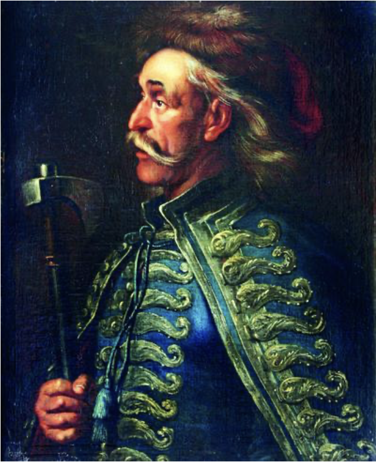
> Bottyán János, közismert nevén Vak Bottyán (1643–1709). Kisnemesi származású végvári vitéz, aki kardjával küzdötte fel magát a generálisságig. A legképzettebb és legeredményesebb kuruc hadvezér volt. Nevéhez fűződik a Dunántúl felszabadítása 1705-ben.

---

    
Kuruc országos gyűlések

- A magyarországi kuruc rendek először Szécsényben tartottak országos gyűlést (1705). Miután a béketárgyalások nem vezettek eredményre, ki kellett alakítani a felkelés szervezeti kereteit. A lengyel példát követve rendi szövetséget (konföderációt) kötöttek, s vezérlő fejedelemmé választották II. Rákóczi Ferencet.

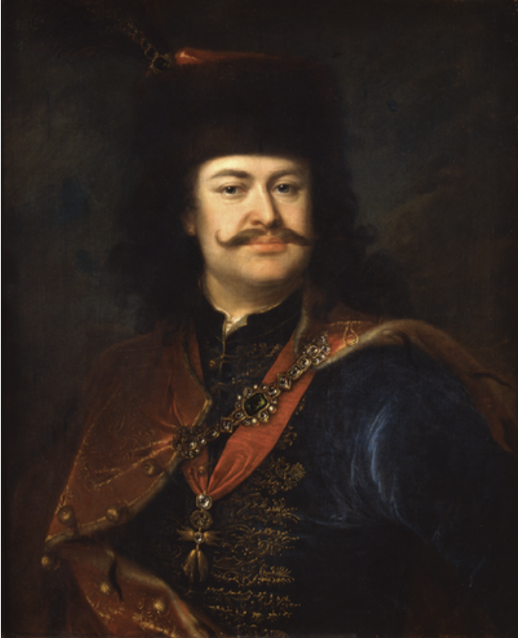
> II. Rákóczi Ferenc (1676–1735) portréja. Mányoki Ádám festette, már a szabadságharc bukása után, a Lengyelországban tartózkodó Rákócziról. A fejedelem nyakában az Aranygyapjas Rend jelvénye látható

- A  kuruc országos gyűléseket országgyűléseket nem a király hívta egybe, s nem is vett részt az ország összes rendje.
- A fejedelem támogatására és ellenőrzésére szenátust választottak. Felállították a kancelláriát. Létrehozták a Gazdasági Tanácsot, melynek fő feladata a hadsereg ellátásának biztosítása volt. A fegyverhiány enyhítése érdekében összehangolták a fegyvergyártást. A legnagyobb gondot a pénzszűke okozta, melyet nem tudtak megoldani. Mivel adót nem vetettek ki, a kibocsátott érmék (libertások) jórészt rézből készültek, így az értékük csekély volt.
- A szabadságharc egyre súlyosabb anyagi gondokkal küzdött, ugyanakkor a nemesség egy része megegyezésre törekedett, és sérelmezte a vitézlő rend (a végvári katonákból lett kurucok – lásd a 6. témát is) előretörését.
- Az ónodi országos gyűlésen (1707) Rákóczi a nehézségeket a Habsburg-dinasztia trónfosztásával akarta megoldani. E lépéstől remélte, hogy XIV. Lajos hivatalosan is elismeri őt és a kurucokat szövetségesének. A trónfosztással annyit elért, hogy a Lipótnál kompromisszumkészebb I. Józseffel (1705–1711) megszakadtak a tárgyalások. XIV. Lajos azonban a hadi helyzet romlása miatt továbbra sem ismerte el a fejedelmet, és még pénzsegélyei folyósítását is beszüntette. A pénzügyi helyzet javítása érdekében az ónodi országos gyűlés adót szavazott meg, amelynek megfizetését a nemességnek is vállalnia kellett.
- Trencsénnél a kuruc főerők vereséget szenvedtek a létszámra jóval kisebb császári seregtől (1708). A vereség súlyosságát növelte, hogy a kuruc fegyveresek jelentős része szétszéledt, és nem is harcolt tovább a vesztésre álló ügyért. A fejedelem a sárospataki országos gyűlésen (1708) a hajdúszabadság ígéretének megerősítésével próbálta a jobbágyságot mozgósítani, nem sok sikerrel.

---

    
A szatmári béke

---

- A császári hadsereg létszáma nőtt, a kuruc hadseregé apadt. A felkelés a kiindulási pontjára, Északkelet-Magyarországra szorult vissza. Az ország kimerült, pestisjárvány tört ki, egyre kevesebben kívánták a háború folytatását.

> Rákóczi még külső támogatásban bízott. 1707-ben Varsóban szerződést kötött I. (Nagy) Péter cárral, de tényleges segítséget nem kapott. Ebben az időszakban dúlt az északi háború: az oroszok, a lengyelek és a dánok Svédország visszaszorítására törekedtek. A kuruc mozgalmat a cár csak a svédek ellen kívánta felhasználni. Azért kezdett újabb tárgyalásokba, hogy a fejedelem segítségével elkerülje a török támadást. Nem állt érdekében, hogy a Habsburgok is ellenségei legyenek a svédekkel háborúzó Oroszországnak. Rákóczi azonban 1711 elején ismét Lengyelországba ment, hogy találkozzon a cárral.

- Rákóczi lengyelországi tartózkodása lehetőséget teremtett a fejedelem helyettese, Károlyi Sándor számára, hogy kezébe vegye a császáriakkal folyó tárgyalások irányítását és megegyezésre törekedjen. I. József és Savoyai Jenő (aki ekkor az Udvari Haditanács elnöke volt) a tartós rendezés érdekében engedményekre is hajlandónak mutatkozott. Savoyai Jenő átlátta a spanyol örökösödési háború tapasztalatán keresztül, hogy a birodalom nagyhatalmi politikája érdekében meg kell nyerni a magyarokat, mert különben minden újabb konfliktusnál a magyar rendek felkelésével kell számolniuk. Ezért Pálffy János személyében császárhű, labanc főurat neveztek ki a császári haderő élére, és megbízta a tárgyalások újbóli megindításával. Hosszú tárgyalássorozat következett, melyben a Károlyinak adott kegyelemtől eljutottak az amnesztiáig (közkegyelem) és a rendi jogok visszaállításáig.
- A szatmári béke (1711), melyet a Károlyiak nagykárolyi kastélyában írtak alá, a katonai vereség ellenére a kezdeti kuruc követelések közül jó néhányat teljesített. A császár ígéretet tett a rendi jogok és a szabad vallásgyakorlat biztosítására, és megszüntették az Újszerzeményi Bizottságot.
- A rendeknek azonban bele kellett nyugodniuk, hogy Magyarországon a Habsburgok uralkodnak (nem állították vissza a szabad királyválasztást és az ellenállási záradékot sem).

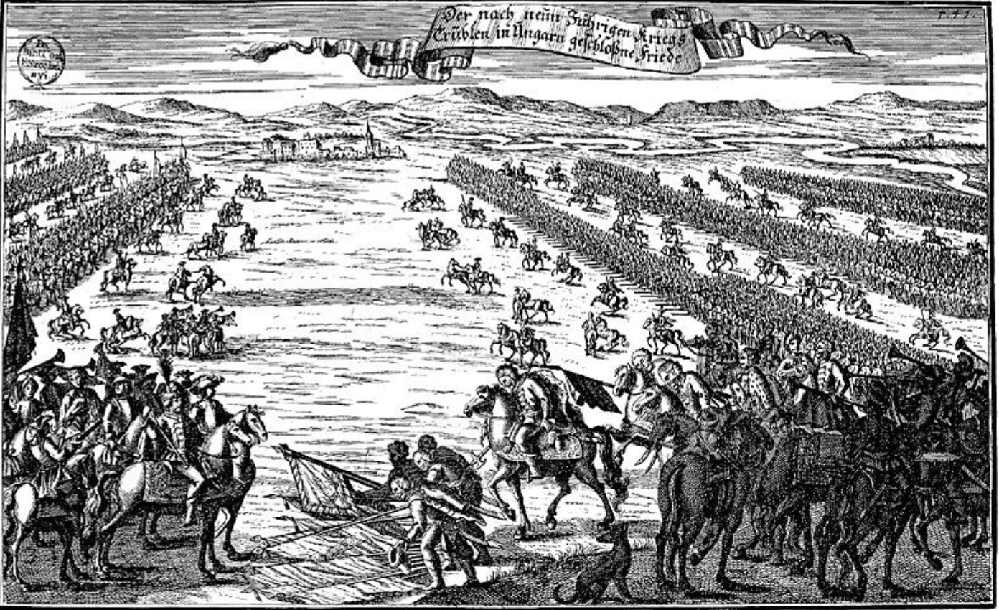
> A majtényi zászlóletétel. A kurucok zászlóikat a földbe szúrták a megadás jeleként, de a fegyvereiket megtarthatták

- A kuruc szabadságharc lehetővé tette, hogy Magyarország elkerülje a birodalom nyugati tartományainak a sorsát, ahol nyílt abszolutizmust vezettek be. Fennmaradt a rendi dualizmus. Nem véletlen, hogy a majtényi síkon a megmaradt kuruc hadak zeneszó mellett tették le zászlóikat (1711).

> A kurucok ellen folytatódó háború nehézségeit eltúlozva (pestisjárvány, kemény tél) Pálffynak el kellett fogadtatnia az udvarral a jelentős engedményeket. Eközben Károlyi egyrészt Rákóczit igyekezett a békének megnyerni, másrészt vissza kellett tartania a reményt vesztett tiszteket, hogy ne egyénenként – sokkal rosszabb feltételekkel – mentsék családjukat és vagyonukat. Így előnyös feltételeket tudott kiharcolni mind az egyének, mind az ország számára. Károlyi a szatmári gyűlésen elfogadtatta a kialkudott feltételeket.
>
> A szatmári béke megítélése többször változott a magyar közgondolkodásban, és ma is eltérő megítélések léteznek. A Habsburg-dinasztiával a későbbiekben is harcban álló országban sokan az egyezséget károsnak ítélték, Károlyi Sándort árulónak tekintették. Később voltak, akik elfogadták a kompromisszum értékeit, de kiemelték, hogy csak az uralkodó rétegeknek biztosított lehetőséget a kibontakozásra. Ma a szatmári békét reális megegyezésnek tartjuk. A török elleni hosszú felszabadító háború és a nyolcévi kuruc szabadságharc emberi és anyagi veszteségei után az ország a birodalom keretein belül, de jelentős önállóságot élvezve foghatott neki az újjáépítésnek. A szabadságharc nem volt eredménytelen.

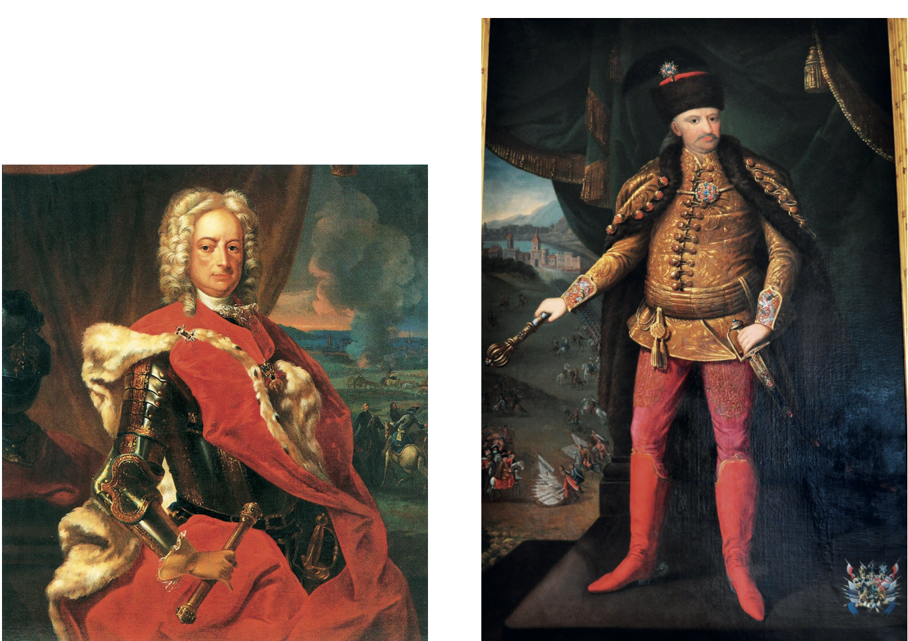
> Pálffy János labanc és Károlyi Sándor kuruc főúr, a szatmári egyezség megalkotói

---

---

    
Emigrációban

---

- Rákóczi nem kért kegyelmet, így elvesztette hatalmas birtokait. A mellette kitartó kis csoporttal Franciaországba távozott. Be kellett látnia azonban, hogy Franciaország nem akar háborút a Habsburgokkal. A kirobbanó osztrák–török háború (1716) hírére Törökországba utazott, de mire odaért, már megszületett a béke (1718). (Ekkor került vissza Magyarországhoz a Temesköz.)
- A Porta a Márvány-tenger menti Rodostóban (Isztambultól kb. 120 kilométerre nyugatra) jelölte ki a kuruc emigránsok lakhelyét. Életükről Mikes Kelemen leveleiből kaphatunk híradást. Rákóczi 1735-ben hunyt el. Hamvait a XX. század elején (1906) hazahozták, és a kassai dóm altemplomában helyezték el. A fejedelem idegenben töltött évei az országban reményt adtak, a Habsburg-udvart pedig arra sarkallták, hogy jelentős részben tartsa be a rendeknek tett ígéreteit, hiszen amíg Rákóczi élt, addig megvolt egy Habsburg-ellenes mozgalom újrakezdésének a lehetősége.

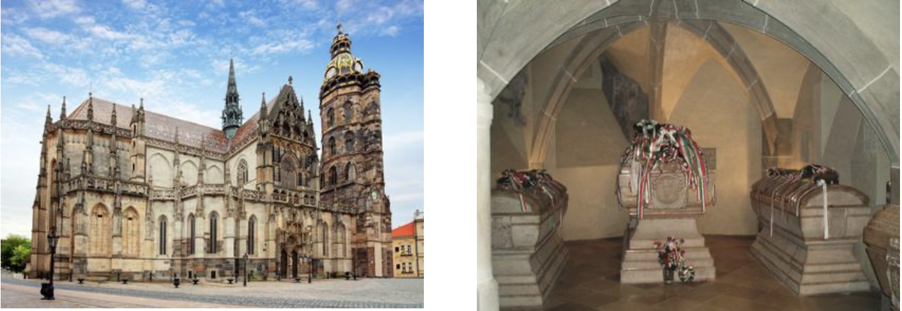
> A kassai Szent Erzsébet-székesegyház, melynek kriptájában 1906-ban eltemették a Rodostóból hazahozott hamvakat. Itt alussza örök álmát a fejedelem barátjával, Bercsényi Miklóssal, és édesanyjával, Zrínyi Ilonával együtt. Sírja a magyarok zarándokhelyévé vált

---

---

---

    
Magyarország újranépesülése és újranépesítése

---

- A belső vándorlás, a szervezett betelepítés és az öntevékeny betelepülés.
- A többnyelvű és többvallású ország.
- Gazdaság és életmód

---

    
AZ ELPUSZTULT ORSZÁG

---

- A török kor háborúit követően az ország jelentős része romokban hevert. A természetes és az épített környezet is leromlott. A hódoltságban és a végvári vonal mentén a települések jelentős része a népességgel együtt elpusztult.
- A környezet pusztulása messze eltörpül az emberveszteség mellett. A hadjáratok, majd az azokat követő éhínségek és járványok jelentősen megritkították a népességet. A Rákóczi-szabadságharc újabb harcokat és járványokat hozott – ebben az időszakban a pestis tömegével szedte áldozatait.
- A történeti demográfia képviselői vitáznak a pusztulás mértékén, de senki sem tagadja, hogy jelentős volt. A hosszú háborús időszakban kb. kétmillió ember halt meg. Így Magyarország népessége a XVIII. század elején 3,5-4 millió lehetett, ami azonos a Mátyás korabeli népességszámmal (XV. század), vagy annál néhány százezerrel kevesebb. Ezzel szemben Európa népessége a XVI–XVII. században 60%-kal nőtt. Magyarországon tehát elmaradt két évszázad népességszaporulata.

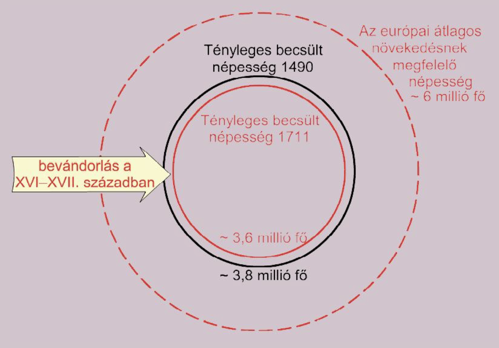
> A tényleges és az európai átlag alapján elvárható népességszám Magyarországon

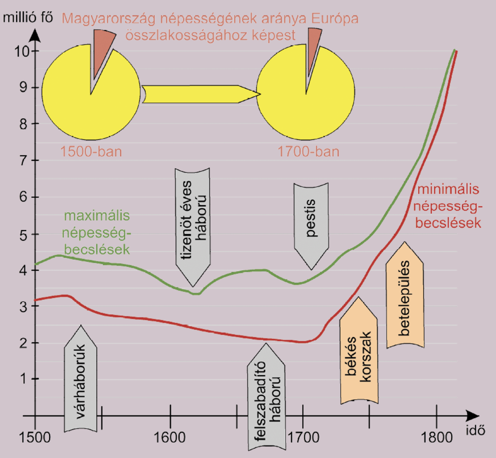
> Magyarország népessége 1500–1800 között

- A pusztulás mértéke nem volt földrajzilag egyenletes az ország területén. Leginkább a hadjáratoknak folyamatosan kitett, s legrégebben a harcok színteréül szolgáló vidékek néptelenedtek el. A Maros folyó és Pécs között képzeletben húzott egyenestől délre a korábbi lakosság szinte egésze elpusztult.
- A XVIII. század elejére az ország népsűrűsége – mely alatta maradt az európai átlagnak – nemcsak a hegyvidékeken (pl. Máramaros vármegye) lett alacsony, de a kitűnő termőföldekkel rendelkező Bánságban (Bánát) is. Ezzel szemben az ország nyugati, török által kevésbé érintett területein a népsűrűség jóval magasabb volt.

---

    
BETELEPÍTÉS ÉS BETELEPÜLÉS

---

- A demográfiai mélypont 1711-ben volt. A háborúk megszűntek, és hosszú ideig az ország területét döntően már nem érintették. Azonban a XVIII. században szinte mindennaposnak számítottak a járványok (pestis, vérhas, himlő), de már megkezdődött a védekezés. A hatóságok vesztegzárral, fertőtlenítéssel egyre eredményesebben próbáltak gátat szabni terjedésüknek. A pestis az 1780-as évek után többé nem jelentkezett hazánkban. A himlőt az Angliából átvett védőoltással szorították vissza (a XVIII. század végétől). Ám hamarosan megjelent a kolera (a XIX. század elején).
- A természetes szaporodás a magas születési arányszám ellenére nem nőtt jelentősen. Ennek oka, hogy a halálozások aránya is magas volt. A tartós békeidőszak és a termelés beindulása következtében a XVIII. század közepétől az éhezés kezdett visszaszorulni. Ebben szerepet játszott, hogy nagy mennyiségű, jó minőségű földet vettek ismét művelésbe. Így a népszaporulat jelentősen emelkedett. A század végére az ország népessége megkétszereződött (megközelítette a 10 millió főt). Ekkora növekedést azonban a népszaporulat önmagában nem tudott volna biztosítani; az eredményhez jelentős mértékben hozzájárult a bevándorlás.
- A más országokban élők számára Magyarországon a lakatlan területek termőföldjei jelentettek vonzerőt. A bevándorlás két módon valósult meg: szervezetten (betelepítés) és öntevékenyen (betelepülés). A szervezett betelepítést az udvar és a nagybirtokosok ösztönözték. Az udvart az adózók számának növelése és részben a katolikus hit terjesztése, a földbirtokosokat a munkáskezek hiánya vezette.
- A szervezett betelepítés döntően a Habsburg Birodalmon kívüli katolikus németek (összefoglaló néven svábok) behívását jelentette. Nem egy tömbben telepítették le őket, hanem elszórtan az elnéptelenedett területeken, például a Pilisben, Tolnában, Temesvár környékén.

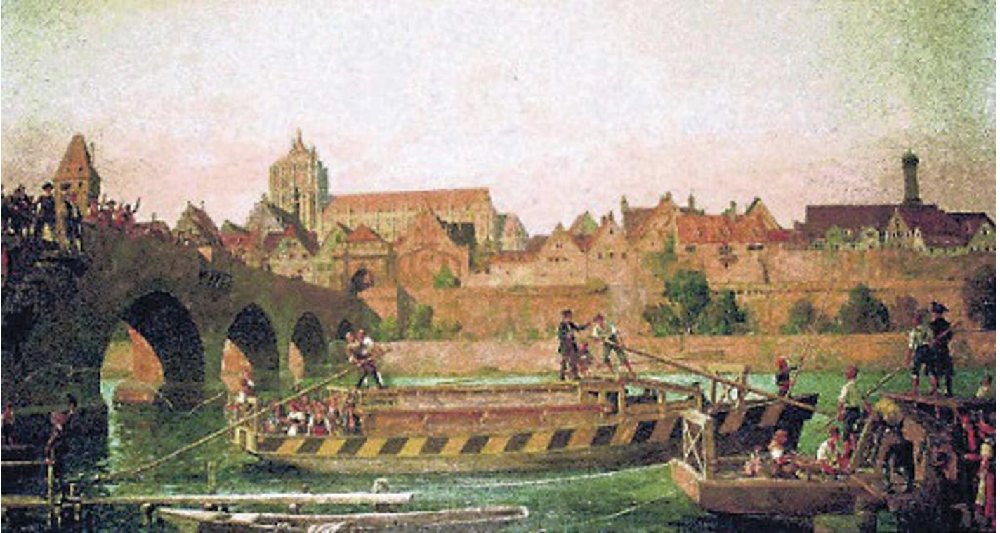
> "Ulmi hajón" érkező sváb telepesek. A Duna-parti német városban készített hajótípus (dereglye) 15–20 méter hosszú és 2–5 méter széles volt. A közepén fakunyhó állt. Kis merülése miatt a partot is megközelíthette

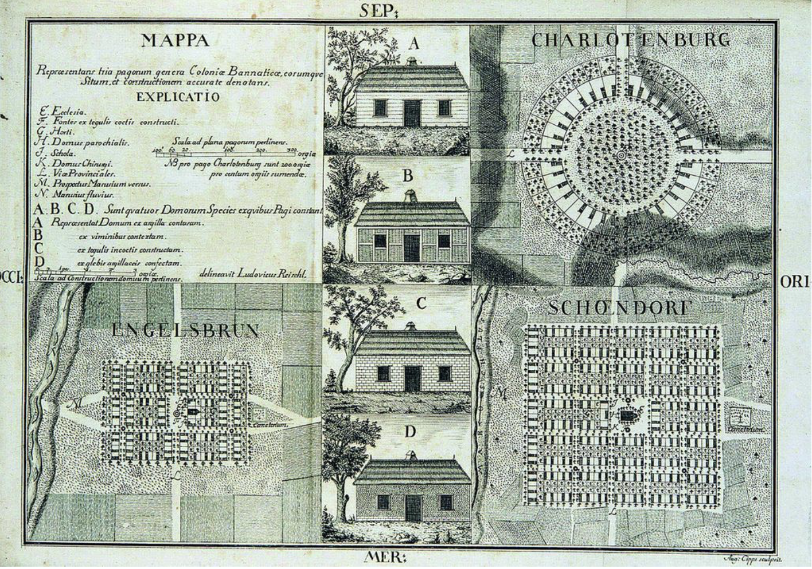
> A bánsági svábok számára épített falvak és lakóházak tervei. A Bánság a Maros, a Tisza, a Duna és az erdélyi hegyek által határolt terület. Németes neve Bánát, amelyet a magyarban is használunk

- A szabad földterületek az ország határai mentén élőket is csábították. A szomszédos népek bevándorlása szervezetlen, öntevékeny volt. A folyamatot nem az állam ösztönözte, hanem földesurak. A telepítésért pénzt, földet kapó vállalkozók vezetésével vagy a lehetőségről hírt kapva, saját elhatározásból keltek útra kisebb közösségek. A Felvidékre lengyelek (beolvadva a szlovákságba), Kárpátaljára ruszinok érkeztek. Havasalföldről és Moldvából nagy számban jöttek románok Erdélybe és a Bánátba. A románok (korabeli népnevükön oláhok) bevándorlási kedvét növelte, hogy a dunai fejedelemségekben a mértéktelen adóztatás következtében rendkívül rosszak voltak az életfeltételek. Még a Rákóczi-szabadságharc előtt települt a Balkánról nagyobb tömegű szerb népesség a Határőrvidékre.

---

    
BELSŐ VÁNDORLÁS

---

- A pusztítások elsősorban az ország déli és középső területeit érintették. Emiatt a népsűrűség a peremterületeken – a rosszabb minőségű termőföldek ellenére – magasabb volt, mint az Alföldön. Ez a különbség – a munkaerőhiánnyal küzdő földbirtokosok támogatásával – jelentős belső vándorlást (migráció) eredményezett. A peremterületek völgyeinek és hegyvidékeinek magyar, szlovák, ruszin és román lakossága megindult az ország belső területei felé. A külső és belső vándorlás összefüggött. A belső területekre távozó népesség helyére sokszor a határon túlról érkeztek bevándorlók, ami jelentős mértékben hozzájárult a térség újratelepüléséhez.

---

    
SOKNEMZETISÉGŰ, KEVERT LAKOSSÁGÚ ORSZÁG

---

- Magyarország egy évszázad alatt kiheverte a török kor népességveszteségét. Mivel a török időkben elsősorban a magyar lakosság száma csökkent, a bevándorlás következtében jelentősen megváltoztak az ország etnikai viszonyai. A becslések szerint a magyarság aránya a XV. századi 75-80%-ról a XVIII. századra 40-45%-ra esett vissza. Az ország soknemzetiségű lett.

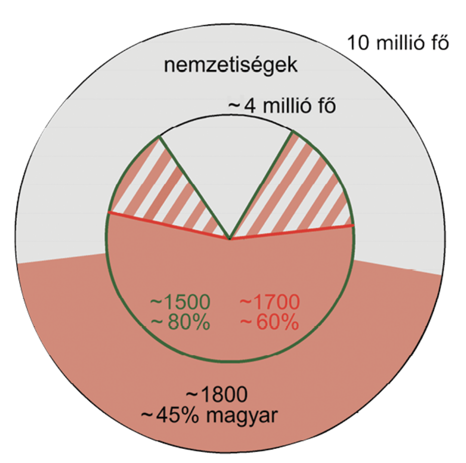

- A belső vándorlás jellemzője, hogy a peremterületek magyarsága az ország központi területeire költözött. Így az ország középső részén a magyarság megőrizte többségét. A magyarok és a nemzetiségek közötti etnikai határ beljebb került. Az etnikai határok azonban nem voltak élesek, hiszen peremterületeken (a Kárpátok övezetében) is maradtak magyar szigetek, és a nemzetiségek is részt vettek az Alföld újranépesítésében, de a svábok is szigetszerűen települtek le. Magyarország kevert nemzetiségűvé vált.

---

    
A NEMZETISÉGEK TÁRSADALMI ÉS POLITIKAI HELYZETE

---

Kérdések:
- A belső vándorlás, a szervezett betelepítés és az öntevékeny betelepülés.
- A többnyelvű és többvallású ország.
- Gazdaság és életmód

---

- A magyarországi nemzetiségek – a horvátokat kivéve – csonka társadalmat alkottak, vagyis nem volt nemességük. A vezető réteg szerepét – korlátozott mértékben – papságuk vagy a kis létszámú polgárságuk és értelmiségük vette át. Így a nemzetiségek a társadalom különböző rétegeiben eltérő arányt képviseltek, s társadalmi helyzetük miatt az ország vezetésében csekély szerepet játszottak.

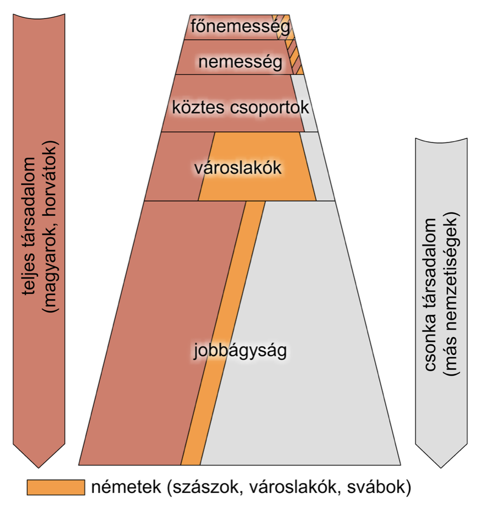
> A magyarországi társadalom rétegeinek nemzetiségi összetétele

- Korszakunkban az emberek identitásában (éntudatában, önazonosság-tudatában) a nemzeti kötődés még nem került az első helyre. Jelentősebb volt – mint láttuk – a társadalmi hovatartozás, a vagyoni és a jogi helyzet, a valláshoz tartozás. A XVIII. század közepétől azonban Magyarországon is megjelent, s egyre erősödött a nemzeti azonosságtudat (identitás). Kezdetben ez csak a társadalom felsőbb, műveltebb rétegeit érintette, s a következő században kezdett az alsóbb néprétegekre hatást gyakorolni.
- A nemzeti nyelv, a kultúra ápolása, a nemzeteszme alapjait képező nemzeti ideológiák kialakítása a XVIII. század közepétől egyre fontosabbá vált. A folyamat a társadalom felső rétegeiből indult ki. A zömében csonka társadalmú nemzetiségek életében, így a nemzeti identitás kialakításában is, az egyházak meghatározó szerepet játszottak.
- A nemzeti kultúra kialakítása és megtartása szempontjából azonban jelentős volt bármely kiváltsággal vagy nagy gazdasági erővel rendelkező társadalmi csoport, hiszen ezek érdekérvényesítő képessége is erős volt.

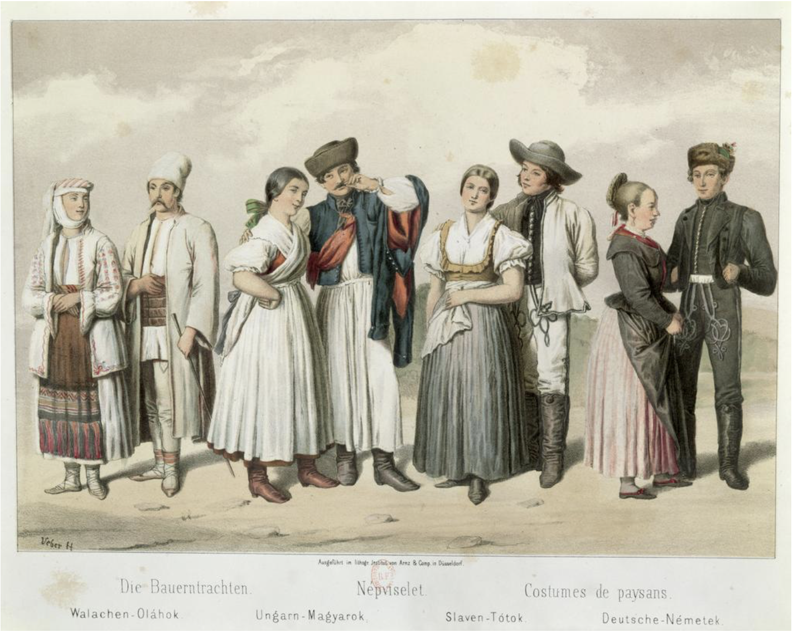
> Magyarországi népviseletek Weber Henrik XIX. századi magyar festő alkotásán: románok, magyarok, szlovákok és németek

---

    
NEMZETISÉGEK

---

- A svábok megérkezésével a magyarországi németek már három nagyobb csoportot alkottak. A legkorábban, már a XII. századtól érkező szászok (Erdély, Szepesség) városlakó polgárok és szabad, gazdálkodó parasztok voltak. Területi autonómiájuk segítette különállásukat, s ebben erősítette őket a német nyelvű evangélikus egyház, melyben vezető szerepet játszottak. A kereskedelemben és a kézműiparban elfoglalt fontos szerepük révén komoly gazdasági súlyt képviseltek. Az erdélyi szászok egy tömbben elkülönülve, míg a szepességiek Szepes vármegye településein éltek.
- Az ország egyéb területein lévő városokban élő németek különböző időszakokban érkeztek hazánkba. Evangélikus és katolikus vallásúak voltak, és az ország kereskedelmében, kézműiparában játszottak jelentős szerepet. Iskolázottságuk révén sokan közülük hivatalnoki állásokat töltöttek be.
- A XVIII. században érkező svábok paraszti társadalmat alkottak, zömük a katolikus felekezethez tartozott. Az országban szórtan települtek le.
- A zömében a Felvidéken élő szlovákok (régi magyar népnevükön tótok) szintén csonka társadalmat alkottak, többségük jobbágy volt. A XVIII. században a Felvidék nemessége – akiknek egy része beszélt szlovákul is – a magyar nemességhez tartozónak tekintette magát, s később a magyar nemzethez csatlakozott. A szlovákok kis része iparosként főleg javításokat végzett (drótos, üveges), és a kispolgársághoz tartozott. Ők „műhelyüket” a hátukon cipelve, a munka reményében bejárták az egész országot.

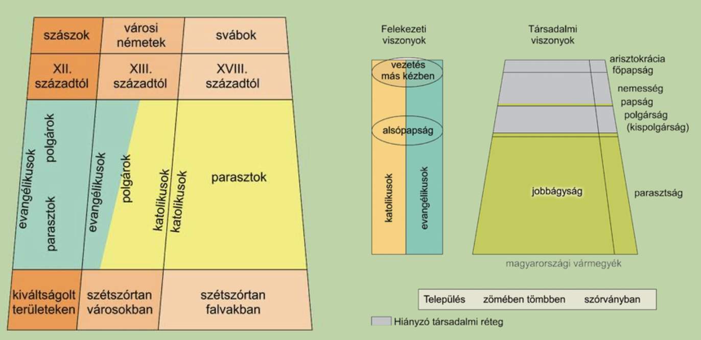
> A magyarországi németek és szlovákok rétegződése

- A Kárpátalja hegyvidékeit lakó ruszinok (kárpátukránok) a keleti szlávok egy csoportja. Szepes vármegyétől Máramaros megye déli határáig a hegyeket és a folyók felső völgyeit lakták évszázadok óta. A török idők pusztításai őket nem érintették, ezért településterületük az Alföld felé tolódott, s az Alföld messzi déli területein is kialakult néhány szigetszerű csoportjuk. Csonka társadalomban éltek. Csak a XVIII. század elején vette kezdetét papi vezető rétegük kialakulása, miután az ortodox (görögkeleti) ruszinok a görögkatolikus egyházhoz csatlakoztak. Többségük jobbágyként pásztorkodással foglalkozott, és nagy szegénységben élt a hegyvidékeken.
- A ruszin népnév a keleti szlávok viking eredetű elnevezéséből származik. Mivel identitásuk csak később erősödött meg, vannak, akik az ukránokkal azonosítják őket. Egységes nyelvük sem alakult ki még a XVIII. századra. Több néprajzi csoportot alkottak. Közülük legismertebbek a huculok, akik a XVI–XVIII. században vándoroltak Máramaros vidékére, és pásztorkodásukról, lótartásukról nevezetesek.
- A románok (régi magyar népnevük: oláh) – folytatva a török kori betelepülésüket – a XVIII. században többségbe kerültek Erdélyben. Térhódításuk főleg a magyar vármegyékben, részben a Szászföldön, s legkevésbé a Székelyföldön jellemző. Betelepülésüket elsősorban a munkáskezek hiánya tette kívánatossá. A földbirtokosok szívesebben telepítettek le birtokaikra román jobbágyokat, mint magyarokat, mert bár munkakultúrájuk kezdetlegesebb volt, kevésbé követeltek kedvezményeket.
- Nagyon sok vegyes lakosságú település alakult ki, ahol a románok kezdetben kisebbségben éltek. Azonban a magyarság népszaporulata kisebb volt a románságénál, így az arányok fokozatosan megváltoztak.
- Csonka társadalmukban a vezető réteget a görögkeleti (ortodox), majd görögkatolikus (ún. unitus = a katolikus egyházzal egyesült) papság képviselte. Többnyire közülük került ki értelmiségük is. Egyes területeken (Kővár vidéke, Hunyad vármegye) román anyanyelvű kisnemesek is éltek, mert az erdélyi fejedelmek románokat is nemesi rangra emeltek. A XVIII. század második felében Erdélyben is kialakítottak határőrvidéket, és az itt élő román jobbágyok egy része határőrré, vagyis szabad paraszttá vált. A XVIII. század végétől a Szászföldre betelepülő románság körében vékony kereskedőréteg alakult ki. A románok társadalmában azonban a túlnyomó többséget a jobbágyság jelentette.
- A zömében délen, a határőrvidékeken élő szerbek (régi magyar népnevük: rác) a Haditanács vezetése alatt álltak, így gyakorlatilag függetlenek voltak a magyar vezető rétegtől. A Határőrvidéken kívüli szerbek többsége jobbágy, kisebb része kereskedő volt. Erős volt ortodox nemzeti egyházuk. Az I. Lipóttól nyert kiváltságok alapján (uralkodói jóváhagyással) saját maguk választhatták egyházi vezetőiket, s egyházi kongresszust tarthattak. Így egyházuk elősegítette nemzeti fejlődésüket.
- A cigányok/romák a XIV. században jelentek meg Magyarországon. Kezdetben kevesen voltak, de a török korban – mint láttuk – létszámuk nőtt, mert a Balkánról nyugat felé vándorló csoportjaikat nem engedték be a Német-római Birodalom területére, így hazánkban maradtak. A XVIII. században folytatódott a bevándorlás a Balkán felől, de Magyarországon a cigányság lélekszáma alacsony maradt.

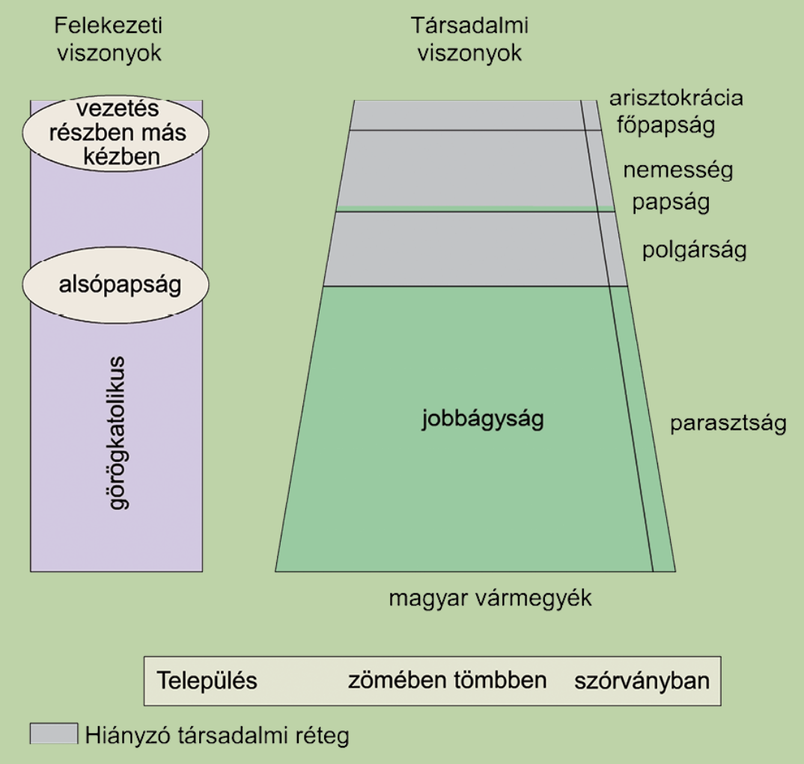
> A ruszinok társadalmi és felekezeti viszonyai

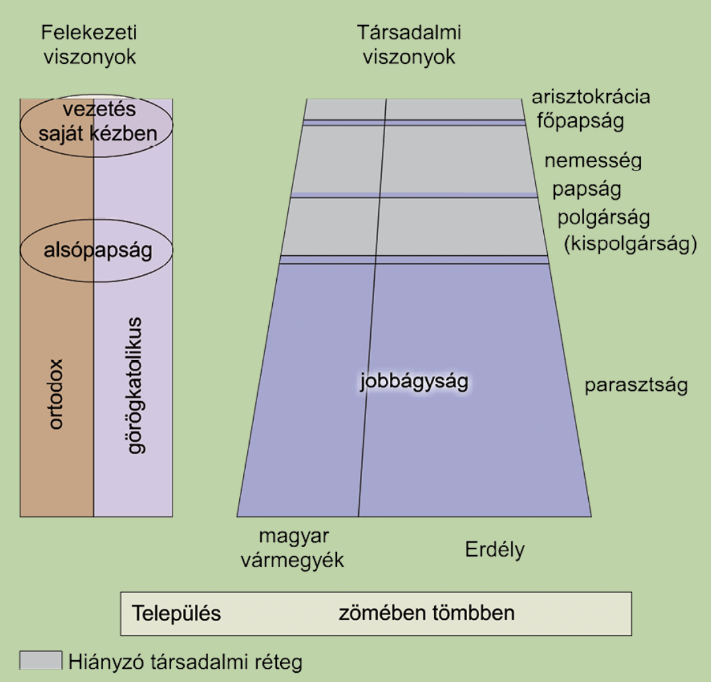
> A románok társadalmi és felekezeti viszonyai

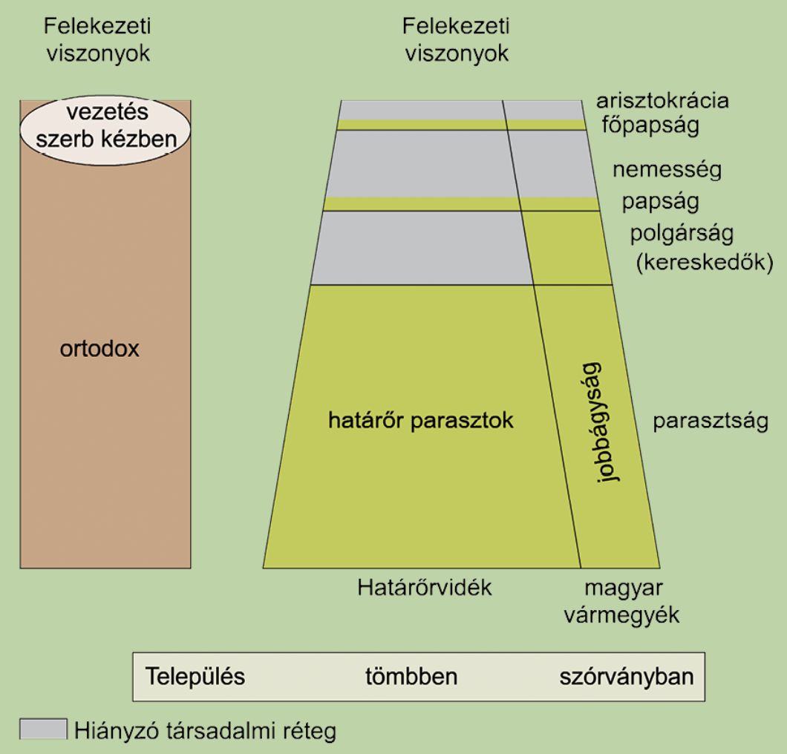
> A szerbek társadalmi és felekezeti viszonyai

- A cigányok/romák zömében továbbra is vándorló életmódot folytattak. A letelepült lakosságnak különböző kézműves munkákat végeztek (pl. kovács, teknővájó) és lókereskedelemmel foglalkoztak.A vándorló cigányságot a XVIII. század első felében a vármegyék időszakonként elüldözték területükről. A század második felében az uralkodók – a felvilágosult abszolutizmus szellemében – erőszakos eszközökkel akarták letelepíteni őket, de nem jártak sikerrel. (Az eredményekről azért sem kaphatunk pontos képet, mert sok esetben a letelepedő cigányokat már nem is tekintették cigánynak.)

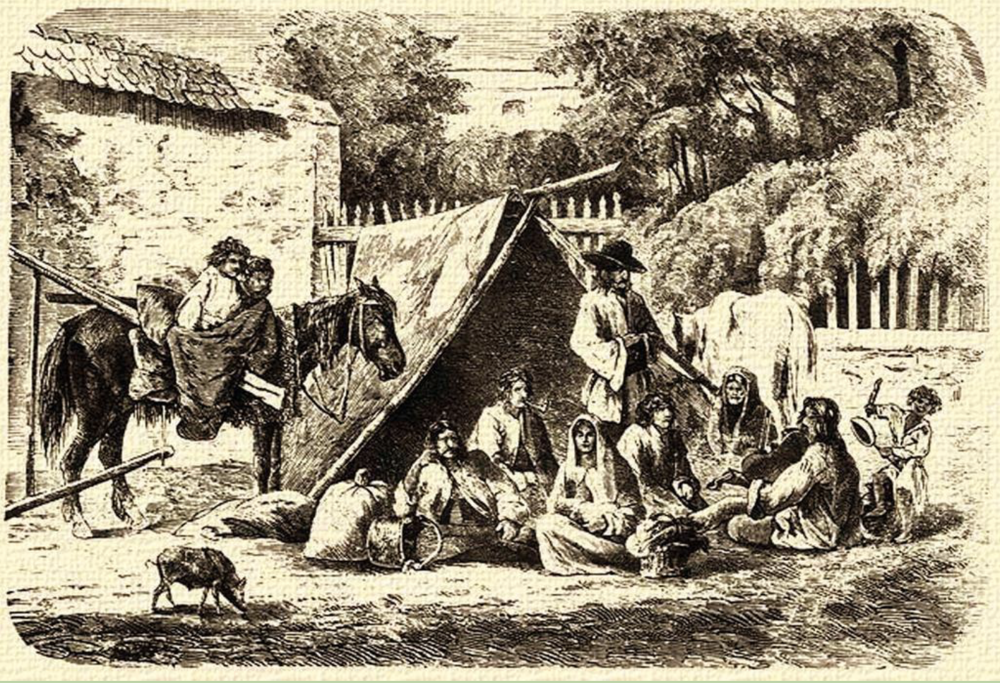
> Vándorcigányok Greguss János XIX. századi ábrázolásán

- A kultúra egy sajátos területén kiemelkedett a cigány/roma népesség. Már a török korban megfigyelhető a cigány muzsikusok jelenléte. A XVIII. században a toborzónóták és az ebből kifejlődő verbunkoszene elválaszthatatlanná vált tőlük. A század végére már nemcsak muzsikáltak, hanem mint zeneszerzők is megjelentek, mutatva a cigány és a magyar kultúra szoros összefonódását.

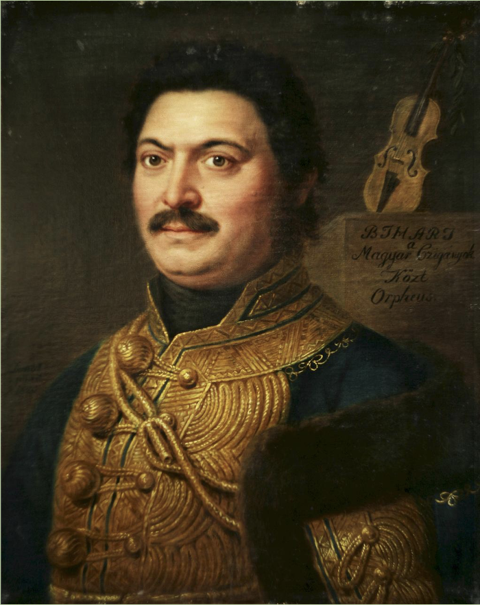
> Bihari János (1764–1827) cigány/roma zenész, a verbunkos, a csárdás mellett a XVIII. századi magyar népzene egyik legnépszerűbb előadója volt

- A zsidóság a középkorban és a török korban is jelen volt hazánkban. A török területeken élő, sokszor nyugatról ide menekülő zsidóság legjelentősebb közössége azonban Budán, az 1686-os ostrom idején elpusztult. Sokan a kivonuló törökkel együtt keletre távoztak. A XVIII. században létszámuk emelkedni kezdett. Módos kereskedők érkeztek az örökös tartományokból, s a XVIII. század végén szegényebb csoportok Galíciából, akik az üldözések elől menekültek. A magyar gazdaság kevésbé fejlett ágazataiból próbáltak megélni, így elsősorban a kereskedelemből. A mezőgazdasági terményeket felvásárló és nyugatra szállító zsidó kereskedők szerepe a magyar mezőgazdasági kivitel (export) fejlődése miatt gyorsan növekedett.

---

    
AZ ASSZIMILÁCIÓ

---

Egy népcsoport beolvadását az őket körülvevő nagyobb népközösségbe asszimilációnak nevezzük. Az asszimiláció jelen volt a XVIII. századi Magyarországon is. Erőszakról nem beszélhetünk, hiszen – leszámítva a dinasztia németesítő törekvéseit – a betelepítéseknél sem volt fontos szempont, hogy mely néphez tartozók pótolják a munkáskezeket. Az asszimiláció természetes módon történt. A vegyes népességű falvakban a pusztulás, elvándorlás vagy alacsony népszaporulat miatt kisebbségbe került csoportok beolvadhattak a többségbe. Ez történt néhány magyar faluval a Felvidék határterületein vagy a Sziget-hegység és Dél-Erdély több, korábban magyar falujának a magyarságával. A magyar államszervezet a század végéig közömbös volt az asszimilációval szemben.

---

    
AZ ÚJJÁÉPÍTÉS MEGINDULÁSA

---

- A török háborúk és a Rákóczi-szabadságharc befejeződésével megindulhatott a békés építés időszaka. Ez az ország számára évszázadok óta nem kínálkozó lehetőséget jelentett a felzárkózásra. Az újjáépítés, a fejlődés mást jelentett az ország különböző vidékein, hiszen eltérő szintről indulhatott meg a munka.
- Az ország legfejlettebb területét az egykori királyi Magyarország jelentette. A háborús pusztítás mértéke itt volt a legkisebb, és a fejlettebb örökös tartományok (osztrák tartományok, Cseh- és Morvaország) közelsége miatt kedvezőbb értékesítési lehetőségekkel rendelkezett. Az egykori hódoltság területén azonban sok mindent elölről kellett kezdeni, a földek feltörésétől a települések benépesítéséig. Erdélyt köztes helyzet jellemezte a kiindulási állapot tekintetében. A Habsburgok által külön kormányzott tartomány azonban távol esett az értékesítési lehetőségektől (Ausztriától), fejlődése a másik két országrésznél lassúbb ütemben zajlott.
- A XVIII. században Magyarországon – Európa többi országához hasonlóan – a mezőgazdaság jelentette a legfontosabb gazdasági ágazatot. A mezőgazdaság viszonyai határozták meg alapvetően az ország helyzetét.
- A volt királyi Magyarország területén a nagybirtokokon jellemző a majorsági gazdálkodás, mivel a birtokosok az örökös tartományokban értékesíteni tudták terményeiket. Így az udvar mellett a nagybirtokok jártak élen az új mezőgazdasági eljárások meghonosításában.
- Az állattartásban elterjedt az istállózás, és új, termelékenyebb fajták jelentek meg. A szürke marhát kezdték felváltani a nyugatról behozott, jobban tejelő fajták, az ősi magyar juhfajtákat a hosszú szálú gyapjat adó merinói juhok. A növénytermesztésben a háromnyomásos rendszer mellett megjelent a vetésforgó. A század végén teret hódító kapásnövényeket (kukorica, burgonya, dohány) ugyanis a korábbi művelési módoknál ugaron hagyott földbe vetették.

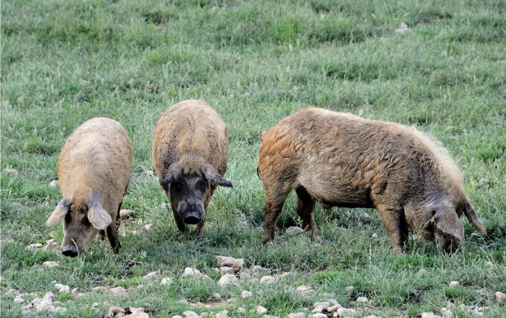
> Mangalica. A XVIII. században a hagyományos bakonyi és szalontai sertésekkel, balkáni fajtákkal és vaddisznókkal keveredve alakult ki az új zsírsertés. A korszak végére már uralkodóvá vált Magyarországon

- A nagybirtokokon alkalmazott újításokat lassan bevezették a paraszti gazdaságokban is. A kapásnövények elterjedése szerepet játszott a népesség gyarapodásában is, mivel a burgonya népélelmezési cikké vált, a kukorica pedig jó lehetőséget adott a sertéstenyésztésre. A munkaigényes szőlőtermesztés jellemzően paraszti tevékenységnek számított. A jobbágyok a nekik juttatott majorsági területen telepítettek szőlőt, melyért a termény egy részével adóztak (szőlődézsma).
- Az egykor törökjárta vidékeken (hódoltság) a földek ismételt feltörése hozott fejlődést. A kezdeti földbőség következtében talajváltó rendszer bontakozott ki. Később, a népesség növekedésével párhuzamosan vált uralkodóvá a két- és háromnyomásos gazdálkodás. A XVIII. század folyamán, az Alföldön továbbra is jelentős maradt a rideg állattartás (szarvasmarha, juh).

---

    
AZ IPAR HELYZETE

---

- A török kor az ipar fejlődésének sem kedvezett. A népesség csökkent, így megcsappant a munkaerő és a felvevőpiac. Ez akadályozta a tőkefelhalmozást. Emiatt az Európában korszerűnek számító üzemforma, a manufaktúra nem tudott elterjedni Magyarországon. A manufaktúrák döntő többségét a XVIII. század első felében nagybirtokosok vagy az uralkodócsalád alapította, s nem bizonyultak hosszú életűnek. Csak a század végére teremtődtek meg a manufaktúrák alapításának a feltételei.
- Magyarországon a XVIII. században az ipar jórészt céhes keretek között fejlődött. Az Alföldön a céhek megjelenése is óriási előrelépést jelentett. Az ország lakosságának túlnyomó többségét kitevő parasztság önellátó gazdálkodást folytatott, eszközei és használati tárgyai jelentős részét maga állította elő. A rendkívül szűk piac mellett a kézművesek számának gyors emelkedése (5000-ről 100-150 000-re) is a céhes rendszernek köszönhető.
- A középkorhoz hasonlóan a XVIII. században is kiemelkedő szerepet játszott Magyarországon a bányászat. Az arany- és ezüstbányászat (alsó-magyarországi bányavárosok, Erdélyi Sziget-hegység), valamint a só (Máramaros, Erdély) jelentősége csökkent, de a réz, majd a század második felétől a vas szerepe egyre nőtt.
- A bányászatban már túlhaladták a céhes kereteket, nagyobb vállalkozások jöttek létre. Ez elősegítette, hogy a korszak modern technikai eljárásai elterjedjenek. A víz kiszivattyúzását a bányákból Magyarországon is gőzgépekkel végezték. Selmecbányán állami bányatisztképző intézetet alapítottak (1735). Az itt végzett műszaki értelmiségiek később fontos szerepet játszottak Magyarország nagy építkezésein, például a mocsarak lecsapolásán és az útépítéseken. Ugyanakkor a fejlett technológia más ágazatokban nem tudott teret hódítani az országban.

---

---

    
A felvilágosult abszolutizmus reformjai

---

Kérdések:
- A Pragmatica Sanctio.
- A felvilágosult abszolutizmus céljai.
- Mária Terézia: együttműködés és reform.
- II. József reformpolitikája és kudarca.

---

    
AZ UDVAR ÉS A RENDEK ERŐVISZONYA

---

- A Habsburgok a spanyol örökösödési háborúban elvesztették a spanyol trónt. Hatalmuk súlypontja Közép-Európába került. A Habsburg Birodalom közép-európai nagyhatalom: területe a török kiűzésével jelentősen megnőtt, s emiatt Magyarország szerepe felértékelődött a dunai monarchián belül. III. Károly (1711–1740), hogy az ismétlődő magyar felkelések ne veszélyeztessék birodalma külpolitikai aktivitását, alapvetően megtartotta a szatmári békében ígérteket. Biztosították Magyarországon a rendi jogokat, s ezáltal elvileg Magyarország különállását a birodalmon belül. Ugyanakkor a dinasztia és a rendek között az erőviszonyok a dinasztia javára változtak.

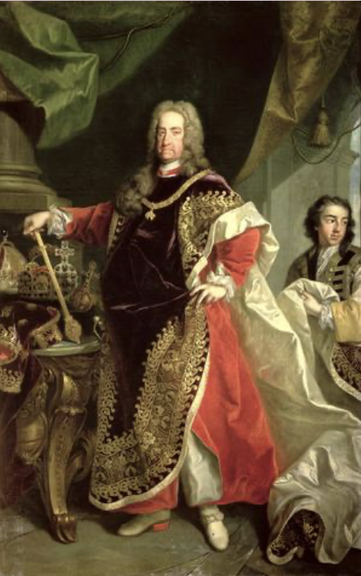
> III. Károly (1711–1740), a dunai monarchia uralkodója. Egyezségre törekedett a rendekkel

- Ez tükröződött a szatmári béke után megtartott első pozsonyi országgyűlésen is (1712–1715). A rendek megvédték alapvető kiváltságaikat, de adómentességük fejében lemondtak az önálló magyar hadsereg felállításáról. Megelégedtek azzal – a korántsem jelentéktelen – joggal, hogy az adók és az újonclétszám megszavazása révén megőrizték befolyásukat a kérdésben.
- A szatmári békében foglaltaktól leginkább a vallás terén tért el az udvar. Nem folytatódott a katolikus vallás nyílt és erőszakos terjesztése, de III. Károly a protestánsok helyzetét rendeletben szabályozta (Carolina resolutio, 1731). A rendelet csak meghatározott helyeken (az ún. artikuláris helyek) és korlátozott mértékben engedélyezte a protestánsok vallásgyakorlását, és tiltotta az áttérést a protestáns hitre. A politikai életben a protestáns nemesség részvételét akadályozta a katolikus dogmáknak megfelelő esküszöveg (ún. dekretális eskü).

---

    
A NŐÁGI ÖRÖKÖSÖDÉS ELISMERÉSE

---

- A szatmári megegyezést követően trónra kerülő III. Károlynak nem volt fiú örököse, ezért a Habsburg-ház a kihalás szélére jutott. Az uralkodó az európai hatalmakkal és országai rendjeivel jelentős engedmények árán elfogadtatta a nőági örökösödés szabályát, a Pragmatica Sanctiót.
- Az 1722–1723-as országgyűlésen a magyar rendek is így tettek. Ugyanakkor a nőági örökösödés elismerése fejében ismételten megerősítették rendi jogaikat és Magyarország különállását a birodalmon belül. Az esetleg bekövetkező török támadásra való tekintettel bevették az okmányba a közös védelem kötelezettségét, valamint hogy a két birodalomfél (Ausztria és Magyarország) csak együttesen öröklődik.

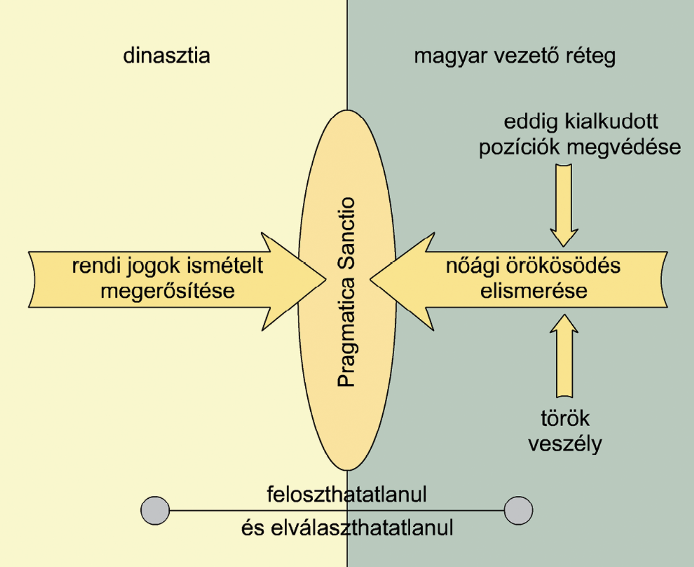
> A Pragmatica Sanctio és Magyarország. Ezt a családon belüli öröklést szabályozó rendeletet még 1713-ban hirdette ki a család feje, Károly

---

    
MÁRIA TERÉZIA ÉS A RENDEK EGYÜTTMŰKÖDÉSE

---

- III. Károly hiába próbálta szerződésekkel biztosítani leánya, Mária Terézia (1740–1780) trónját. Halála után a szomszédos államok kihasználták a kínálkozó alkalmat (a Habsburg-ház férfiágának kihalását), és rátörtek a birodalomra. Az osztrák örökösödési háborúban (1741–1748) II. (Nagy) Frigyes Poroszország királya seregeivel elfoglalta Sziléziát, a bajorok pedig Felső-Ausztriában és Csehországban nyomultak előre. Az örökös tartományok már elveszni látszottak.
- A birodalom létét veszélyeztető helyzetben Magyarország rendjei – akik néhány évtizede még a Habsburgok ellen lázadtak – a dinasztia mellé álltak, s megmentették a Habsburgok hatalmát. Megszavazták a háborúhoz szükséges újoncokat és adót, igaz, szabadságjogaikat (rendi jogaikat) is újabb törvénnyel bástyázták körül.

> A magyar nemességet döntésében alapvetően józan számítás vezette. Felismerték, hogy számukra nem a függetlenség lehetősége nyílik meg a bajor előretöréssel. Egy Bajorországgal megerősített birodalomban ugyanis a jogaik biztosítására kisebb esély kínálkozott. Választásukkal így a már kiharcolt kiváltságaikat erősítették meg, mely egyben az ország viszonylagos függetlenségének a megőrzését is jelentette.

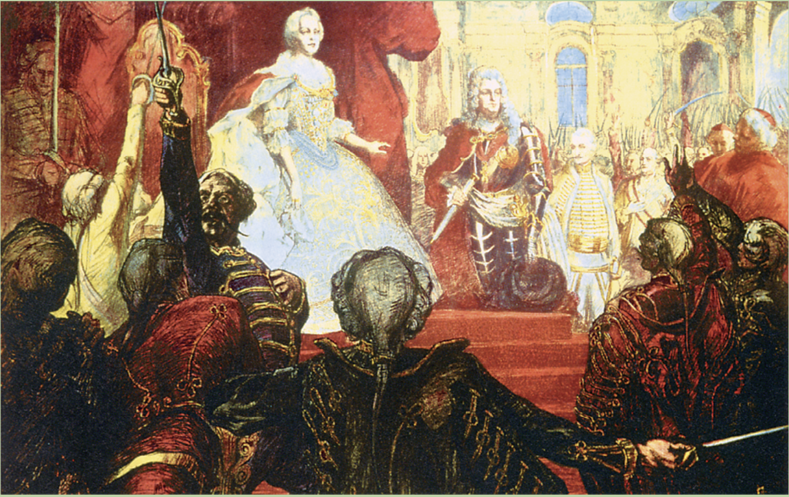
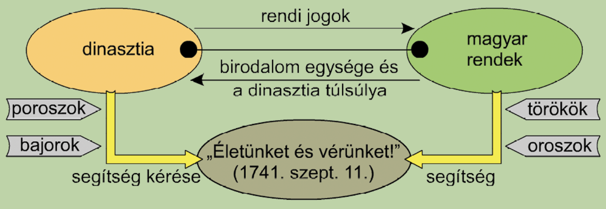
> "Életünket és vérünket!" képen és ábrán. Mária Terézia az 1741-es pozsonyi országgyűlésen a magyar rendek segítségét kérte, mire a rendek a fenti közfelkiáltással válaszoltak

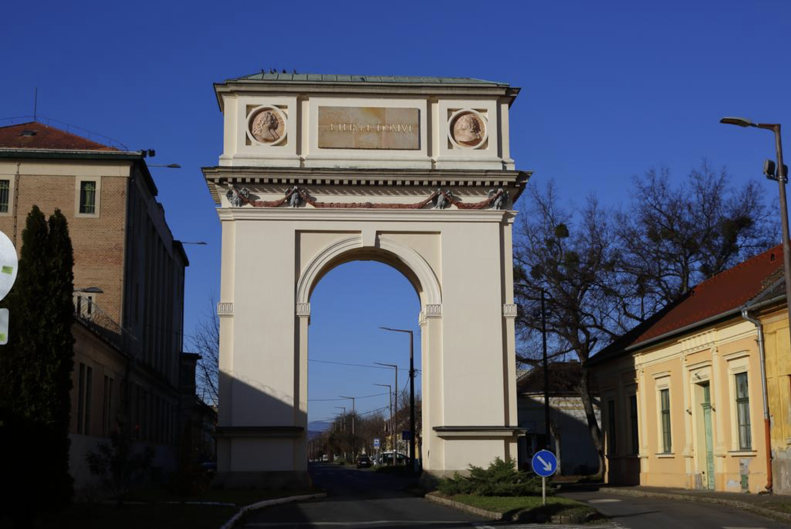
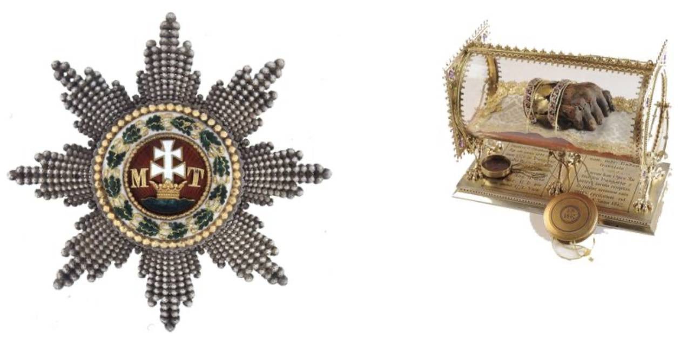

> A váci diadalív, a Szent István-rend és a Szent Jobb. A diadalívet az 1764-ben Magyarországra látogató Mária Terézia fogadására emelték. A Szent István-rendet Mária Terézia alapította (1764) a Magyar Királysághoz is kötődő érdemek elismerésére. A Szent Jobb, Szent István király ereklyéje, amely 1771-ben a királynő támogatásával Raguzából került hazánkba

---

    
MÁRIA TERÉZIA RENDELETEI

---

- A nagyhatalmi állást biztosító állandó hadsereg fejlesztése hatalmas összegeket emésztett fel. Égető szükséggé vált a bevételek erőteljes növelése. A feltörekvő Poroszország reformprogramja, a felvilágosult abszolutizmus megmutatta az utat.

> A felvilágosult abszolutizmus olyan kormányzást jelent, amikor az uralkodók önkényesen (abszolutista módon) vezetnek be országuk, birodalmuk modernizációját szolgáló reformokat. A reformok alapjául a felvilágosodás eszméi szolgálnak (pl. az uralkodó az állam, „a nép” első szolgája, vallási türelem, fellépés a babonák ellen, fontos a nép műveltségének emelése), de lényegük az állam erejének, egységének és az uralkodó hatalmának a növelése.

- A királynő engedett felvilágosult szellemű tanácsadóinak, és a reformok útjára lépett. Átszervezésekkel – szerény eredménnyel – olcsóbbá és észszerűbbé kívánták tenni az állam működését. A kor kívánalmaihoz igazodva Csehországban és Ausztriában bevezették a kiváltságos rétegek adóztatását. A Lajtán túl (az osztrák tartományokban és Csehországban) ugyanis az uralkodó abszolút hatalommal rendelkezett.
- Magyarországon a királynő kezét megkötötte az erős rendiség, a kiváltságaikat védő rendek az országgyűlésen (1751) visszautasították a nemesség adófizetését. A királynő továbbra is igyekezett együttműködni a rendekkel, de miután már nem kényszerült olyan mértékben a rendek támogatására (nem volt háború), apjához hasonlóan keményebb lépésekre szánta el magát, és rendeletek sorát adta ki. Az uralkodó így közvetett módon, 1754-es vámrendeletével csapolta meg a magyar nemesség jövedelmeit. Ezzel kettős vámhatár jött létre.

> A birodalom határain ipari védvámokat alakítottak ki. Ugyanakkor Magyarország és a birodalom között is megmaradtak a vámok, és ezek meghatározásával érvényesítették a birodalom gazdasági szempontjait a magyar érdekekkel szemben. A belső vámhatár így egyrészt elősegítette az örökös tartományok ipari és Magyarország mezőgazdasági jellegének fennmaradását, másrészt növelte Magyarország gazdasági különállását a birodalomtól.
>
> A rendeletek a Poroszország elleni visszavágásra való felkészülést is szolgálták. Ám a következő háborúban (hétéves háború, 1756–1763) a birodalom – bár évekig helytállt – végül vereséget szenvedett. Nem sikerült visszaszerezni az elvesztett gazdag tartományt, Sziléziát sem.

- A mezőgazdasági kivitel növekedése elsősorban a nagybirtokok majorságainak volt köszönhető. Emiatt a birtokosok igyekeztek növelni majorsági földjeiket a közös földek és a jobbágytelkek rovására. A majorságokat a jobbágyok robotmunkájával műveltették meg, ezért a majorságok terjeszkedése a robotterhek növelésével járt együtt. Az állam érdekeit komolyan sértette a telki állomány csökkenése, illetve a jobbágyok fokozott robotterhelése. A nemesi adómentesség következtében ugyanis a majorsági földek adómentesek voltak, s csak a jobbágytelkek (úrbéres földek) után szedték az adót. Így a majorságok terjeszkedése – a nemesi adómentesség fennmaradása miatt – veszélyeztette az adóalapot (az adózók száma csökkent). Miután az országgyűlés (1764–1765) visszautasította a kérdés törvényi rendezését, a királynő 1767-ben rendeletben maximálta a jobbágyi szolgáltatásokat. Az úrbéri rendelet (urbárium) szerint a jobbágy egész telek után heti egy nap igás (állatokkal végzett) robottal vagy két nap gyalogrobottal tartozott földesurának. A rendelet rögzítette a majorsági és az úrbéres földek arányát is. Ezzel gátat szabott a jobbágyi terhek emelkedésének, s egyben az adóalap csökkenésének.
- A modernizációt szolgálta a királynő tanügyi rendelete, a Ratio Educationis (1777). A rendelet kidolgozói egységes, a népiskolától az egyetemig felépülő iskolarendszert álmodtak meg. Államilag előírt tanterveket vezettek be; ezekben az oktatás célját az államhoz hűséges és hasznos polgárok nevelésében fogalmazták meg. Előtérbe kerültek a korszakban modernnek számító tantárgyak, mint a történelem és a földrajz, másrészt a gyakorlati ismeretek. Az oktatás a reform bevezetése után is jórészt az egyházak kezében maradt, de érvényesült az állami ellenőrzés. A rendelet a feltételek híján nem mondhatta ki az általános tankötelezettséget, de elősegítette, hogy minél több 6 és 12 év közötti gyermek járhasson iskolába.

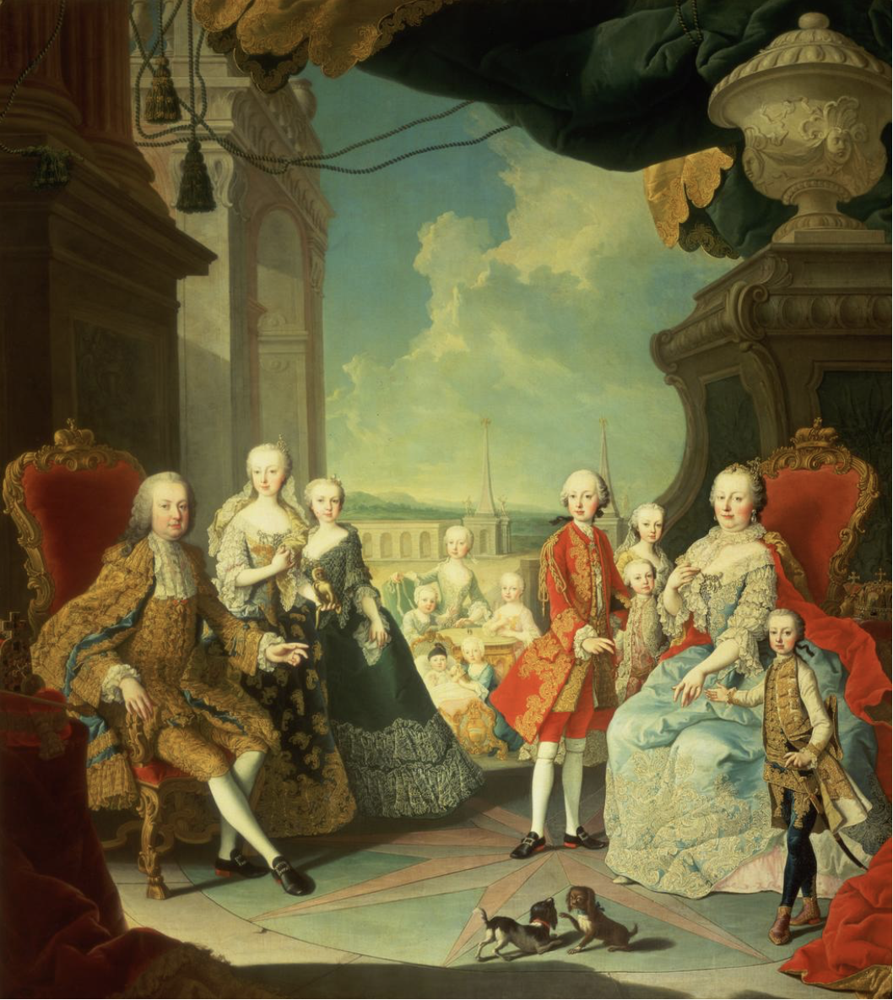
> Mária Terézia, 16 gyermek édesanyja, családja körében

---

    
II. JÓZSEF, A FELVILÁGOSULT ZSARNOK

---

- Mária Terézia fia, II. József (1780–1790) a felvilágosult abszolutizmus klasszikus képviselője. Célja a birodalom egységesítése és modernizálása volt, s nem riadt vissza a kemény, a hagyományokat sértő intézkedésektől. A felvilágosodás eszméitől áthatva, annak türelmetlenségével felvértezve, abszolút hatalmát felhasználva birodalmát alattvalói akarata ellenére is meg kívánta változtatni. Már édesanyja életében reformtervekkel ostromolta a kormányzatot. A királynő a radikális – a birodalom valós állapotait figyelmen kívül hagyó – elképzeléseket elhárította. A trónörököst hosszú utazásokra küldték. Országai helyzetét megismerve József újabb reformokkal állt elő. Amikor negyvenéves korában, a tettvágytól égve átvette a hatalmat, azonnal hozzálátott reformtervei megvalósításához. Nem koronáztatta meg magát magyar királynak, hogy ne kényszerüljön esküt tenni a rendi jogok biztosítására.

> II. József úgy vélte, abszolút hatalmát jó célokra használja fel. Egységes, az alattvalók számára jólétet biztosító birodalom lebegett a szeme előtt. Céljai megvalósítása érdekében rendeletek ezreit zúdította a birodalom népeire (tíz év alatt hatezret). Ezek végrehajtása megoldhatatlan feladatot jelentett a kor kis létszámú államapparátusa számára. A világmegváltók türelmetlensége jellemezte. Számos rendeletével feleslegesen sértette meg a nép hagyományait (pl. a drága koporsós temetést betiltotta, s a halottat vászonba csavarva kellett eltemetni; korlátozta az egyházi körmeneteket).

---

    
JÓZSEF RENDELETEI

---

- II. József nem volt vallásellenes, de az egyházat is reformjai szolgálatába kívánta állítani. A tanítással és betegápolással foglalkozó rendek kivételével feloszlatta a szerzetesrendeket, és vagyonukból oktatási alapot hozott létre. A nép körében élő plébánosok számát és jövedelmeit növelte.
- Türelmi rendeletében (1781) az evangélikusok, a reformátusok és a görögkeletiek számára a korábbiaknál szabadabb vallásgyakorlatot biztosított. Rendelkezését a felvilágosult gondolkodásra jellemző vallási türelem és az egységes birodalom kialakítására való törekvés vezérelte: fel kívánta számolni az alattvalókat elválasztó, illetve a birodalommal szembeállító akadályokat. Fontos, hogy ezután minden állami hivatal megnyílt a nem katolikus vallásúak előtt.

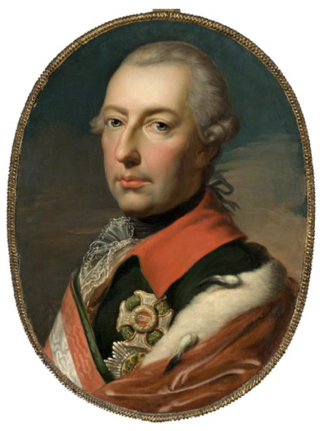
> II. József. Magyarországon kalapos királynak gúnyolták, mert nem koronázták magyar királlyá. A Szent Koronát mint „történelmi tárgyat”, Bécsbe vitette

> József a zsidóságra vonatkozóan külön rendeletet adott ki (1781). Számos területen nagyobb szabadságot biztosított számukra. Ha maguk művelték, paraszti telket bérelhettek, és számos szakmát is megnyitott számukra, mivel több céhbe engedélyezte belépésüket. A tanulás terén is utat nyitott számukra az értelmiségi pályák felé. Beilleszkedésük érdekében német vezetéknevek felvételére kötelezte őket (1787).

- II. József az Erdélyben kitört véres román parasztfelkelés (1784) tanulságait is levonva adta ki jobbágyrendeletét (1785). A rendelet megszüntette a jobbágyság röghöz kötését (bár ez Magyarországon a jobbágyoknak ekkor már csak kis hányadát sújtotta). A parasztok földesúri engedély nélkül is mesterséget tanulhattak. Ezzel az uralkodó az iparfejlődés számára kívánt szabad munkaerőt biztosítani.
- Az egységes birodalom eszméje és az észszerűség vezette Józsefet nyelvrendeletének kiadásakor (1784). A „holt” latin helyett a vezető réteg körében sokak által beszélt német nyelvet tette meg államnyelvvé. (Tehát nem a mindennapi életben, hanem a közigazgatásban kívánta bevezetni.) A nyelvrendelet nem várt felháborodást váltott ki a nemesség körében. Így József szándékaival éppen ellenkezőleg, nem az egységesítést szolgálta, hanem a magyar rendi ellenzékiséget közelítette a modern nemzeti azonosságtudat fontos eleméhez, az anyanyelvhez. Az anyanyelv kérdése a rendi ellenállás gondolatkörébe került, divattá és mozgalommá vált, ami jelentős politikai és anyagi támogatást jelentett a kibontakozó magyar nyelvművelés számára. A magyarságtudat a külsőségekben is megmutatkozott: terjedt a magyaros ruha és a magyar táncok is.
- A rendi jogokat megsértő uralkodóval szembeni ellenállás egyre erősödött. A nemesség megadóztatásának előkészítése érdekében elrendelt népszámlálást és birtokösszeírást (1784) a megyék megtagadták. Erre II. József a rendiség fő bástyája, a nemesi megyék önállósága ellen indított támadást. A megyék jogköreit elvéve az országot tíz igazgatási területre (kerületre) osztotta, amelyek élére királyi biztosokat nevezett ki (1785). Az 1780-as évek második felében az abszolutizmusnak ugyan még volt elég ereje az összeírás újbóli megkezdésére, de az ellentétek pattanásig feszültek a rendek és az uralkodó között.

---

    
II. JÓZSEF KUDARCA

---

- A XVIII. század második felében hazánkban is megjelent az új korszellem, a felvilágosodás. Magyarországon – sajátos helyzetünknél fogva – az állam, a dinasztia közvetítő szerepet játszott terjedésében.

> A felvilágosodás első magyar hívei a kormányzat szolgálatában álló arisztokraták lettek. Az új eszmékhez a nemesség számára is Bécsen át vezetett az út. A magyar felvilágosodás kezdetét a testőr író Bessenyei György Ágis tragédiája című művének megjelenésétől számítja az irodalomtörténet (1772). A kultúra felemelésén fáradozó alkotók hamarosan az anyanyelv fejlesztését tekintették fő feladatuknak.
>
> Ausztriában II. Józsefről Hunyadi Mátyásunkhoz hasonló kép alakult ki, ezzel szemben hazánkban csak a csekély számú felvilágosult nemesi értelmiségiből álló tábor támogatta (a jozefinisták, pl. Széchényi Ferenc, Kazinczy Ferenc), s nagy részük csak a nyelvrendelet bevezetéséig. Őket erősítette néhány nem nemesi értelmiségi (honorácior), mint például Hajnóczy József.

- A türelmi rendelet a katolikus egyházat, a rendi jogok megsértése a nemességet, míg a nyelvrendelet már József magyarországi reformer híveinek, a jozefinistáknak a jelentős részét is szembeállította az uralkodóval. Mikor II. József orosz szövetségben háborút indított a Török Birodalom ellen, a sikertelen háború terhei (újoncozás, élelmiszer-rekvirálások) nyomán az elégedetlenség szinte az egész lakosságra kiterjedt. Ennek ellenére az uralkodó eltökélten és rugalmatlanul folytatta reformjait. A szervezkedő rendek már a birodalom riválisával, a porosz udvarral is felvették a kapcsolatot.
- A válságot a francia forradalom híre tetőzte be, mely nyilvánvalóvá tette az uralkodó számára, hogy lezárult a felvilágosult reformokkal való kísérletezés időszaka. II. József tudta, hogy nem szállhat szembe a birodalom és Magyarország vezető rétegeivel, mikor Európa egyes területein már magát az uralkodói hatalmat kérdőjelezik meg, és a birodalomban is fölerősödnek az elszakadást követelő hangok. A török háborúban megbetegedő császár, hogy birodalmát mentse, halálos ágyán három kivételével (a türelmi, a jobbágy- és az alsópapság javadalmaival foglalkozó rendelet) minden rendeletét visszavonta. József azonban elkésett, a mozgásba lendülő politikai erők már többet akartak.

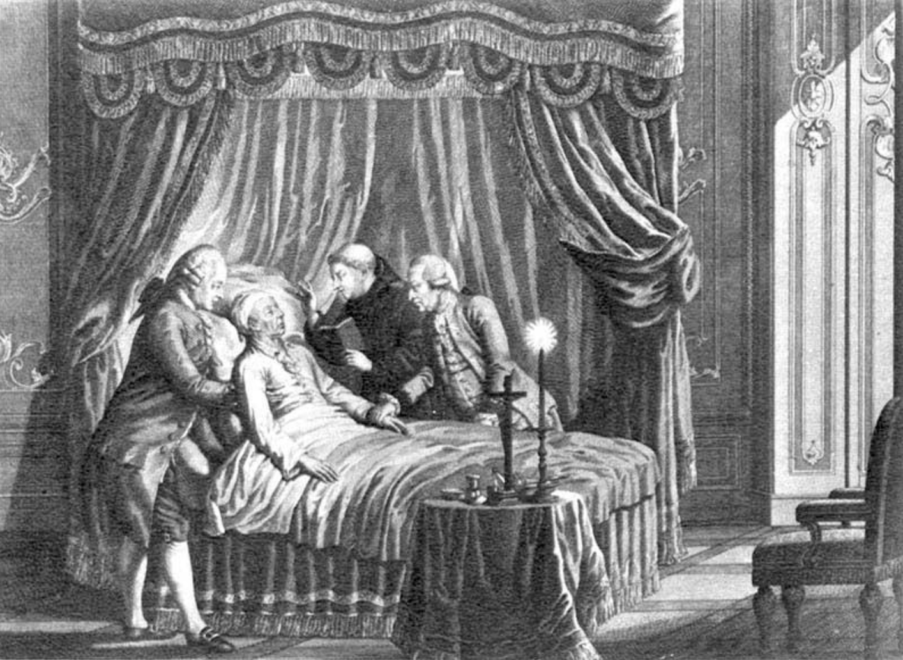
> A „nevezetes tollvonás”. II. József a halálos ágyán visszavonja rendeleteit

---

    
A RENDI DUALIZMUS HELYREÁLLÍTÁSA

---

- A trónra lépő II. Lipótnak (1790–1792) a jogaikban megsértett rendeket kellett leszerelnie. A rendek a korábbi biztosítékokkal nem elégedtek meg, a volt jozefinisták (pl. Hajnóczy József) a reformok polgári irányú továbbfejlesztéséről ábrándoztak. Az uralkodó egyik irányzat követelését sem teljesíthette. A külpolitikai helyzet is nyomasztóan alakult: a török háború elhúzódott, a poroszok mozgolódtak, a francia forradalom radikalizálódott.
- A jó taktikai érzékkel rendelkező II. Lipót – hogy szabad kezet kapjon a belpolitikában – engedmények árán leszerelte a poroszokat, és békét kötött a Portával. A magyar rendeket engedményekkel és fenyegetéssel kompromisszumra szorította. Egyrészt felajánlotta a nemességnek a rendi dualizmus Mária Terézia kori állapotának visszaállítását. Másrészt az általa felállított titkosrendőrségre támaszkodva a jobbágy- és a nemzetiségi mozgalmakat szította, melyek ellen csak az udvartól remélhettek támogatást a magyar nemesek. Így megszületett a kompromisszum: a dinasztia lemondott a rendeleti kormányzásról, a rendek pedig függetlenségi törekvéseikről.

---

---