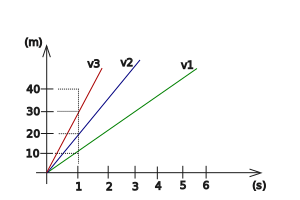

---

[Vissza](../fizika.md)

---

Egy testről akkor mondjuk, hogy egyenes vonalú egyeneltes mozgást végez ha pályája egyenes és egyenlő időközök alatt ugyanakkora utakat tesz meg.

Egyenes vonalú egyeneltes mozgás esetén a megtett út és a metételhez szükséges idő egymással egyenesen arányos, azaz hányadosuk állandó.

Ezt az állandót a test sebességének nevezzük. Jele: v

| $\vec{v} = \frac{s}{t}$ |  |
| :-- | :-- |
| Jelölés | Jelentés |
| $\vec{v}$ | sebesség |
| s | megtett út |
| t | idő |

$\vec{[v]} = \frac{[s]}{[t]} = \frac{m}{s}; \frac{km}{h}$

$3.6\frac{Km}{h} = 1\frac{m}{s}$&nbsp;&nbsp;&nbsp;példa: $72\frac{km}{h} = 20\frac{m}{s}$

### Mozgás grafikonok

- $v1 = 10\frac{m}{s}$
- $v2 = 20\frac{m}{s}$
- $v3 = 40\frac{m}{s}$

Egyenes vonalú egyenletes mozgást végző test út-idő grafikonja mindig egy olyan "félegyenes" amelynek kezdőpontja az origo és annál meredekebb, minél nagyobb a test sebessége.

---

[Vissza](../fizika.md)

---
