---

[Vissza](../foldrajz.md)

---

# A Tejútrendszer, a Naprendszer és a Nap

---

### Tejútrendszer (Galaxis, The milky way):
Oldalnézetben, mint két egymásra rakott mélytányér, átmérője 100ezer fényév, felülnézetben spirál, óramutató járásával ellentétes forgás.

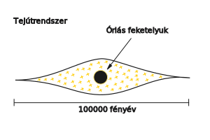

#### Alkotórészei:
- mag-kb.: 1013-on csillag, csillagközi anyag.
#### Fogalmak
- Csillag: gáz (plazma) állapotú, saját fénye és hőtermelése van
- Fényév: az a távolság, amelyet a fény 1 év alatt megtesz. $300000\frac{km}{s}$
- Parsec: 3.26 fényév
   - 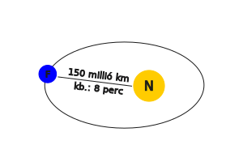
- Naprendszer: (ahol a Nap gravitációja érvényesül, kb.: 2 fényév sugarú gömb):
   - 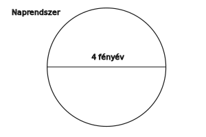
- 1 CSE (csillagászati egység): 150 millió km
   - Természetes tagjai: Nap, nagybolygók, kisbolygók, holdak, üstökösök, meteorok, bolygóközi anyag

- A Nap anyaga: gáz állapotú plazma, 73% hidrogén, 25% hélium, 2% nehéz anyag.
   - Energiatermelése: hidrogén alakul át héliummá, atommagreakcióban.
   - Szerkezete: Mag, légkör (fotoszféra, kromoszféra, korona).

- Kőzet vagy föld típusú (belső) bolygók:
   - Merkúr, Vénusz, Föld, Mars
- Gáz vagy Jupiter típusú (külső) bolygók:
   - Jupiter, Szaturnusz, Uránusz, Neptunusz

- Mesterséges tagok:
   - ember által felbocsájtott eszközök

:memo: **Jegyzet**:

*A Nap sugárzása*:
&nbsp;a Napból érkező sugárzás 7%-a ultraibolya és röntgen sugárzás, 46%-a a látható fény, 47%-a pedig infravörös. Alacsony Napállásnál a légkörön át megtett út hosszabb, ezért a sárga fény elvész és vörös-narancs színek láthatók. A rövidhullámú röntgen és ultraibolya sugarak nagy részét elnyeli a sztratoszféra ózonrétege, így megakadályozza az élő szervezetek sejtjeinek roncsolódását. A szivárvány színei, amelyek például akkor láthatóak, ha "esőfüggönyön" átsüt a Nap (a fehért bontják alkotó színeire a prizmaként viselkedő vízcseppek) sorrendben a következők: vörös, narancs, sárga, türkiz, kék, ibolya.

| Nagybolygók, törpe és kisbolygók, üstökösök, meteorok, meteoriterek és mesterséges égitestek |  |  |
| :-- | :-- | :-: |
| **Nagybolygók** |  |  |
| Név | Leírás | Kép |
| Merkúr | 300˚C, éjszakai oldal -180˚C, nincs légköre, sok rajta a meteoritkráter. | 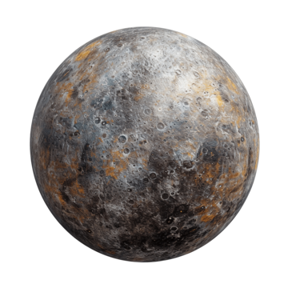 |
| Vénusz (esthajnal csillag) | visszavert fénye erős (97-98%-os albedo), óriási az üvegházhatás a sűrű felhőzet miatt, 500˚C van a felszínén. |  |
| Mars | két holdja van, sarki jégsapkák, 20km fölötti hegyek, vízmosta száraz völgyek, vörös szín a vasérctől, 1997 óta robotokkal kutatják. | 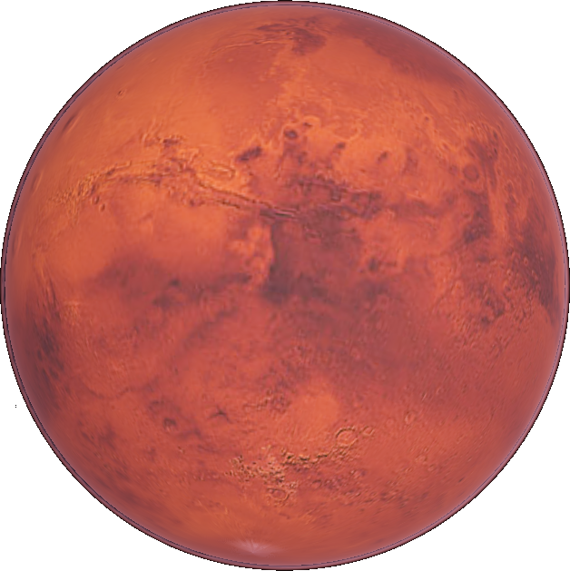 |
| Jupiter | legnagyobb, Nagy Vörös foltja van, külseje folyékony. | 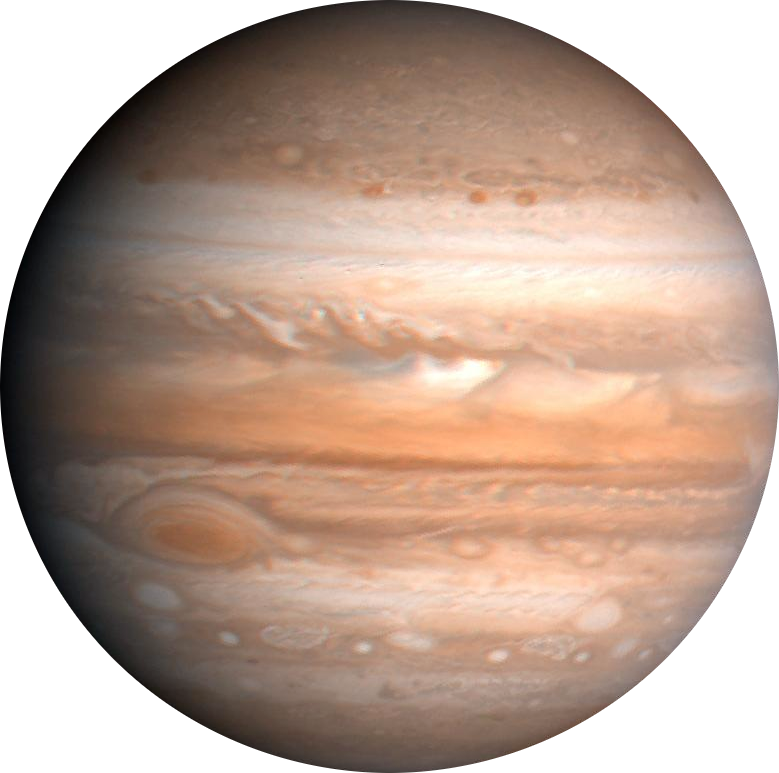 |
| Szaturnusz | szép a gyűrűrendszere, hidrogén és hélium építi fel. | 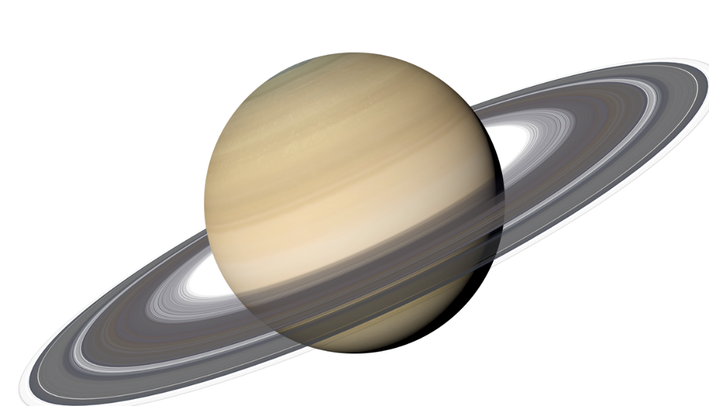 |
| Uránusz | dőlt helyzetben forog, szinte gurul a Nap körül, kicsi az albedója, -200˚C. | 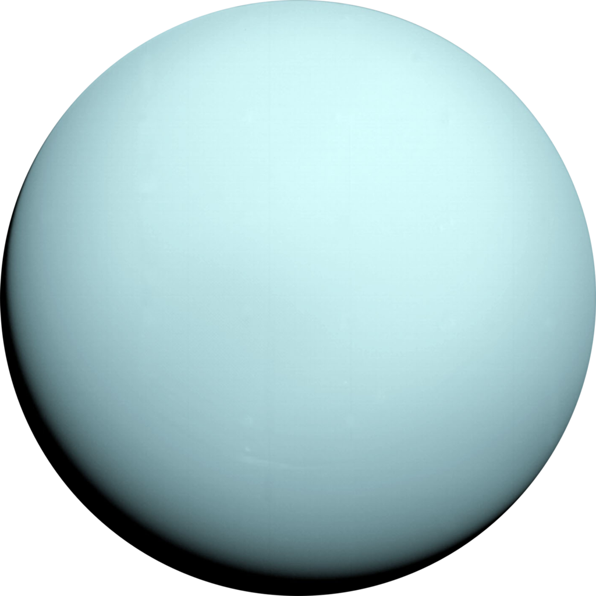 |
| Neptunusz | kékes színű a metántól, felhői vannak. | 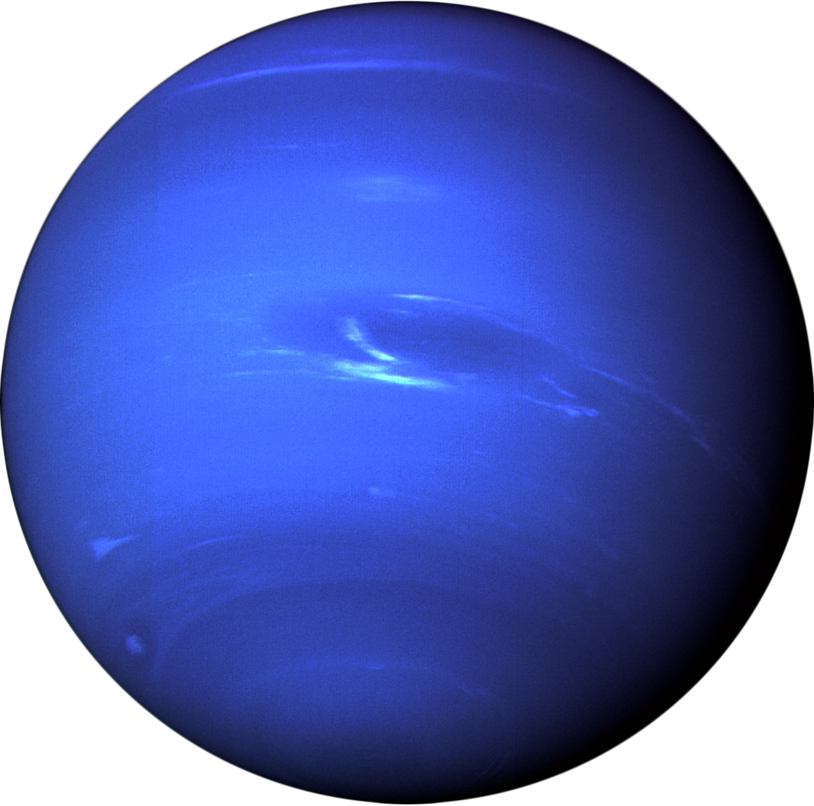 |

| **Kisbolygók belső övezete** |  |
| :-- | :-: |
| Mars, Jupiter és Szaturnusz között legnagyobb a Ceres (933Km átmérőjű törpebolygó) | 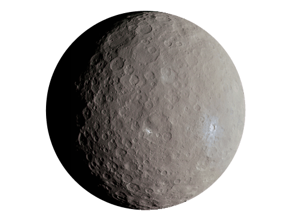 |

| **Kuiper-övezet** |  |  |
| :-- | :-- | :-: |
| Plútó | 2006-ban levették a bolygók névsorából, ma törpebolygó a törmelékövben, talán a Neptunusz holdja lehetett | 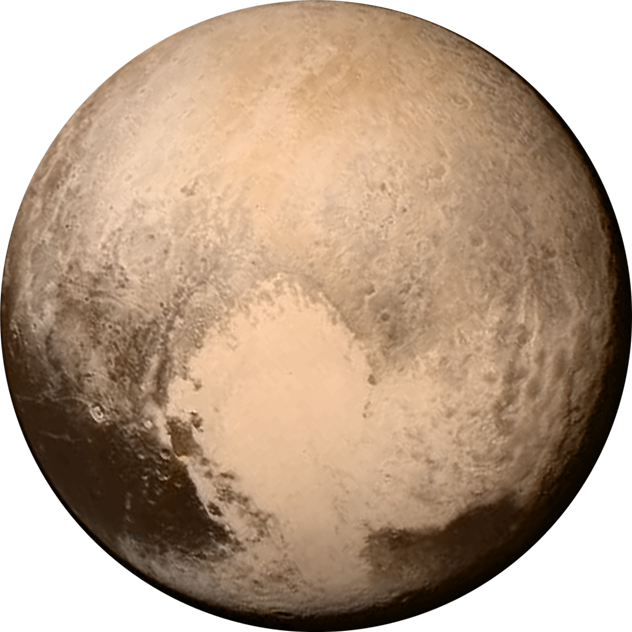 |

| **Üstökösök (kométák)** |  |  |
| :-- | :-- | :-: |
| Felépítésük: &nbsp;- mag &nbsp;-üstök &nbsp;-csóva | Leghíresebb a Halley, amely 76 évenként jön (1986-ban volt legutóbb). Parabolapályán mozognak. | 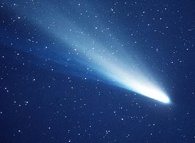 |

| **Meteorok** |  |
| :-- | :-: |
| Valószínűleg szétrobbant üstökösmaradványok, legtöbbjük a légkörbe érve felizzik és elég (hullócsillag, augusztus 11.-e körül az éves csúcspont). Földre hulló meteor a meteorit, amely krátert hoz létre. Legismertebb a 22000 éves Barringer kráter az USA-ban. 1908-ban meteoriteső Tunguszkában (Szibéria), meteorfelrobbanás 2014 Cseljabinszk (Oroszország). Magyarország: kabai meteorit, amely 3Kg-os. | 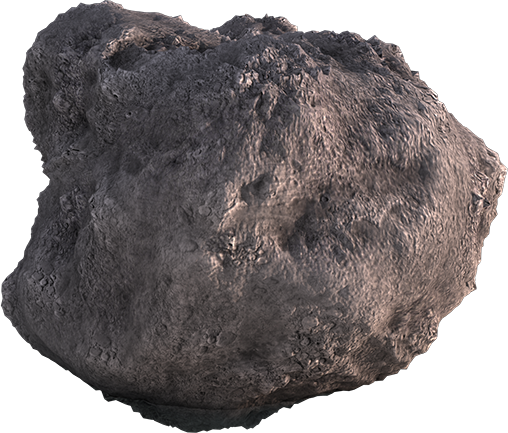 |

| **Mesterséges égitestek** |  |
| :-- | :-: |
| - műholdak - űrállomások - űrhajók -űrrepülőgépek - űrjárművek - űrszemét | 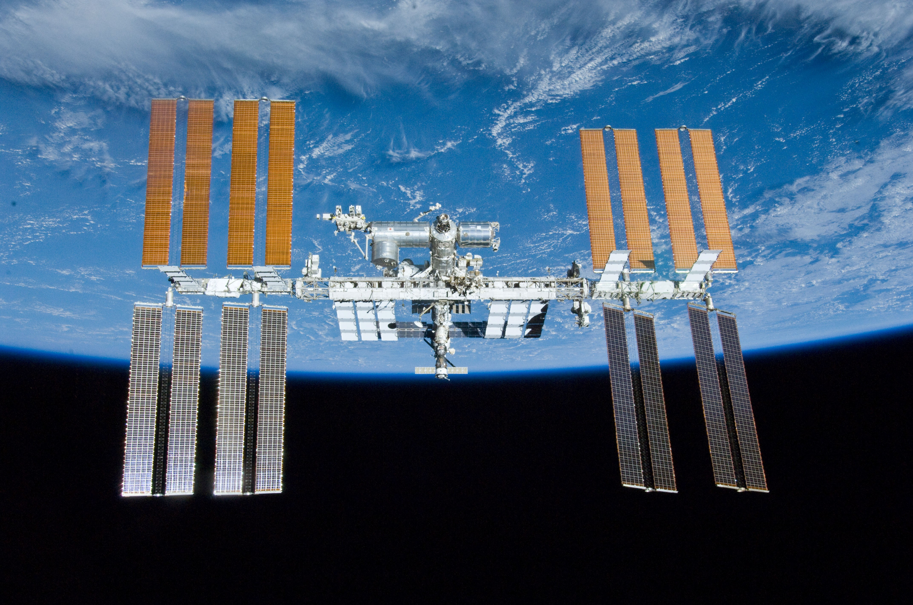 |

---

[Vissza](../foldrajz.md)

---
