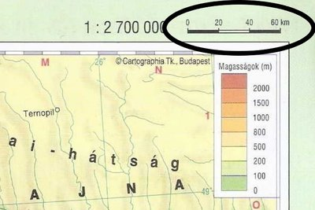

---

[Vissza](../foldrajz.md)

---

# Térképészeti alapismeretek

---

Térkép: a földfelszínnek vagy egy részének felülnézeti kicsinyített, egyszerűsített rajza. Egységes jelmagyarázattal jelölik a tereptárgyakat (domb, vasút, ...)

Atlasz: térképek gyűjteménye

Méretarány: 1:1425000

1cm = 14250m ~ 14.25km

| Mértékléc |
| :-: |
|  |

Térkép fajtái:
- földrajzi
- szaktérkép (temotikus térkép)
- helyszínrajzi

---

[Vissza](../foldrajz.md)

---
