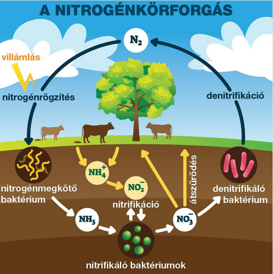

---

- [Vissza az előző oldalra](../kemia.md)
- [Vissza a főoldalra](../../../../README.md)

---

> # A nitrogén és az ammónia
> A nitrogén a periódusos rendszer 15. csoportjának (V. A főcsoportjának) első eleme. Az elektronjai két elektronhéjon helyezkednek el, elektronszerkezete: 2, 5. A vegyértékhéj elektronszerkezete: $2s^{2} 2p^{3}$.
>
> A nitrogén kétatomos molekulát képez, amelyben a két atomot háromszoros kovalens kötés tartja egyben.
>
> 
>
> A legnagyobb mennyiségben a nitrogén a levegőben található meg, annak közel
é teszi ki. Mennyisége közel állandó, mert körforgásban van.
>
> 
> ## A nitrogén
> ### A nitrogénatom elektronszerkezete
> A nitrogénatom alapállapotban három párosítatlan és két párosított elektront tartalmaz a vegyértékhéján.
>
> A vegyértékhéj elektronszerkezete: $2s^{2} 2p^{3}$.
> ### A nitrogén molekula- és halmazszerkezete
> A nitrogén kétatomos, lineáris, apoláris moleku­lák­ból áll. Az atomok között erős, háromszoros kovalens kötés alakul ki. Szilárd hal­mazállapotban molekularácsot képez, amit nagyon gyenge diszperziós kölcsönhatás tart össze.
>
> 
> ### Fizikai tulajdonságok
> Színtelen, szagtalan, igen nehezen cseppfolyósítható, a levegőnél valamivel kisebb sűrűségű gáz. Olvadás- és forráspontja nagyon alacsony. Vízoldhatósága még az oxigénénél is rosszabb.
> ### Kémiai tulajdonságok
> Az igen erős háromszoros kötést csak nagy energia hatására lehet felszakítani. Ennek következtében a nitrogén nagyon kis reakciókészséggel bír, inert gáz. 
Reakció oxigénnel
>
> A reakció csak nagyon magas hőmérsékleten (3000 °C felett) megy végbe. Ehhez ívfény vagy villámlás szükséges. A reakcióban nitrogén-monoxid keletkezik:
>
> $$
> \begin{aligned}
> N_{2}+O_{2} \rarr 2NO \\
> \end{aligned}
> $$
> ###  Előfordulás
> Elemi állapotban a levegő fő alkotója, annak ~78%-át teszi ki. A kötött állapotú nitrogén az élő szervezetekben előforduló fehérjék építőeleme. Emellett az ásványvilágban nagy mennyiségben található meg nitrátok formájában.
> ### Előállítás és felhasználás
> Csak az iparban állítják elő. Ekkor először a levegőt cseppfolyósítják, majd a folyadékot frakcionált desztillációnak vetik alá.
>
> Felhasználják inert reakcióközegként olyan reakciók esetében, ahol a levegő oxigénje hátráltatja a reakciót. Cseppfolyós állapotában hűtőfolyadék, akár fagyasztásra is alkalmas. Az iparban ammónia, salétromsav és mű­trá­gya gyártására is használják.
> ## Az ammónia
> ### Molekula és halmazszerkezete
> Az ammónia trigonális piramis alakú, poláris molekulákból áll.
>
> 
>
> A molekulában 107,3°-os kötésszög mérhető.
>
> Szilárd halmazállapotban molekularácsot képez, amelyet a molekulák között működő erős hidrogénkötések tartanak össze.
> ### Fizikai tulajdonságok
> Színtelen, szúrós szagú, a levegőnél kisebb sűrűségű gáz. Olvadás- és forráspontja a hidrogénkötések miatt a moláris tömeghez képest magas, ezért viszonylag könnyen cseppfolyósítható. Kiválóan oldódik vízben, aminek következtében ammóniával is elvégezhető a szökőkútkísérlet. A vizes oldatát szalmiákszesznek nevezzük.
>
> 
> ### Kémiai tulajdonságok
> Az ammónia egy viszonylag reakcióképes anyag.
> ### Égése
> Tiszta oxigénben meggyújtható:
>
> $$
> \begin{aligned}
> 4NH_{3}+3O_{2} \rarr 2N_{2}+6H_{2}O \\
> \end{aligned}
> $$
>
> Platinakatalizátort is alkalmazva a reakció nitrogén-monoxid képződéséhez vezet:
>
> $$
> \begin{aligned}
> 4NH_{3}+5O_{2} \rarr 4NO+6H_{2}O \\
> \end{aligned}
> $$
> ## Reakció vízzel
> Az ammónia vízben történő nagymértékű oldódását reakció is kíséri. Az oldat a keletkező hidroxidionok miatt lúgos kémhatású lesz.
>
> 
>
> Az ammónia a vízzel szemben gyenge bázisként viselkedik. 
> ### Reakciók savakkal
> Mind a hidrogén-klorid-gázzal, mind a sósavval reakcióba lép. Gázfázisban sűrű, fehér füst képződik. Ez az ammónium-klorid, vagy más néven szalmiáksó:
>
> > $$
> \begin{aligned}
> N_{3}+HCl \rarr NH_{4}Cl
> \end{aligned}
> $$

> $$
> \begin{aligned}
> \end{aligned}
> $$

---

- [Vissza az előző oldalra](../kemia.md)
- [Vissza a főoldalra](../../../../README.md)

---