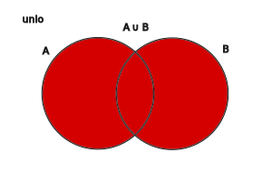
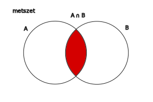
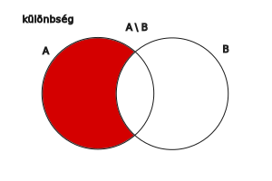
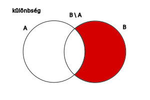
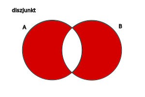
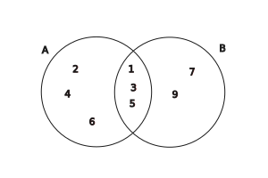

---

[Vissza](../matematika.md)

---

Halamazok megadása:
 - elemek felsorolásával: {1,2,3,5,7}
 - megadott utasítással: {10-nél nagyobb páros számok}{12,14,16,...}

Jelölése:

A,B,C halmazok

halmazok elemei: a,b,c

Halmazok elemszám jelölése: $|A|$

|  |  |
| :-- | :-- |
| $\in$ | eleme |
| $a \in A$ | a kis 'a' eleme nagy 'A'-nak |
| $a \notin A$ | a kis 'a' nem eleme nagy 'A'-nak |
| ∃ | létezik |
| $\forall$ | minden |
|  |  |
| **Részhalmaz** |  |
| $B \subset$ | B részhalamaza |
| $B \subset A$ | 'B' részhalmaza 'A'-nak |
|  |  |
| **Számhalmazok** |  |
| Természetes számok | N = {1,2,3,4,5,...} |
| Egész számok | Z = {...,-2,-1,0,1,2,3,...} |

| Halmazműveletek |  |  |  |
| :-- | :-- | :-- | :-- |
| Jelölés | Jelentés | Leírás | Ábra |
| $A \cup B$ | A&nbsp;unió&nbsp;B | mindkét halmaz |  |
| $A \cap B$ | A&nbsp;metszet&nbsp;B | két halmaz közös része |  |
| $A$ \ $B$ | A&nbsp;mínusz&nbsp;B | B halmaz kivonása A halmazból |  | 
| $B$ \ $A$ | B&nbsp;mínusz&nbsp;A | A halmaz kivonása B halmazból |  |
| Diszjunkt halamazok | ha a metszetük üres, nincs közös elemük. |  |  |

***Példák***:

$$
\begin{aligned}
A &= \{1,2,3,4,5,6\} \\
B &= \{1,3,5,7,9\}
\end{aligned}
$$

$$
\begin{aligned}
A \cup B &= \{1,2,3,4,5,6,7,9\} \\
A \cap B &= \{1,3,5\} \\
A \ B &= \{2,4,6\} \\
B \ A &= \{7,9\}
\end{aligned}
$$

---

[Vissza](../matematika.md)

---
